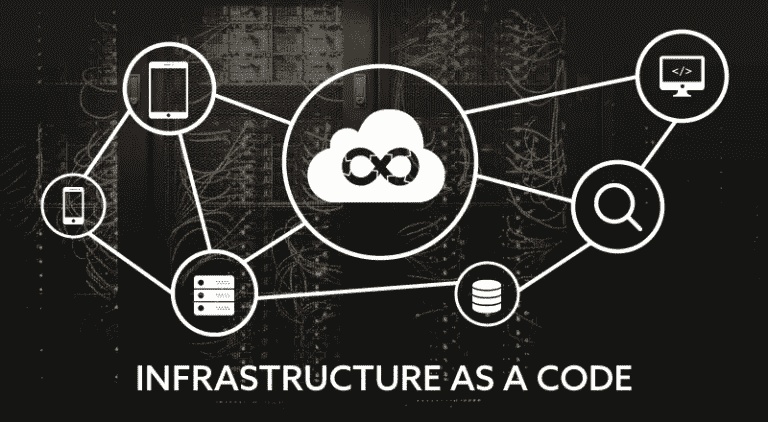

# 物联网到 AIML 基础设施即代码。部署时间从 3 周缩短到 3 小时！

> 原文：<https://medium.com/codex/iot-to-aiml-infrastructure-as-code-deployment-from-3-weeks-to-3-hrs-99555a86423d?source=collection_archive---------8----------------------->

在今天的文章中，我们将带您了解我们的基础架构部署流程，其中(如标题所述)我们使用 [**AWS 服务目录**](https://aws.amazon.com/servicecatalog/?aws-service-catalog.sort-by=item.additionalFields.createdDate&aws-service-catalog.sort-order=desc) 从 3 周到 3 天再到 3 小时完成了部署。我们的物联网到 AIML 平台即服务在水利和国防项目中久经考验，体现了最佳实践，因此数据科学家可以快速创造决策优势。

# 开始:3 周(2019 年)

起初，至少可以说，将我们的物联网部署到 AIML 参考架构是一个乏味的过程。尽管我们已经对基础架构进行了模块化，但这仍然是一个手动的点击、输入命令和配置、测试的过程，如果某项服务或组件不能按预期运行，我们还会参考我们的内部环境并比较配置等。

**这个过程平均花了我们 3 周时间来完成**，以及端到端的测试。

# 第一轮:3 天(2021 年)

就在一年多前，我们决定在一定程度上自动化部署过程，这不会是一个完全成熟的自动化项目，因为我们没有足够的时间或资源投入到这样的项目中。我们只能分配 5 天时间和单一资源，并着手将基础设施部署转换成脚本( [**AWS CLI**](https://docs.aws.amazon.com/cli/latest/userguide/cli-chap-welcome.html) )。

这个过程很简单(在较高层次上)，只需参考体系结构中实现的每项服务

*   将部署转换成一个 [**AWS CLI 脚本**](https://docs.aws.amazon.com/cli/latest/index.html)
*   尽可能参数化，这将允许定制部署
*   测试它，修复任何问题，进行增强
*   将脚本转换成批处理文件

文件

*   版本控制
*   先决条件
*   预期投入和产出
*   任何问题，比如确保在执行脚本之前本地配置了正确的 AWS 概要文件和区域，等等

在使用上面的清单转换了几个服务之后，过程就清楚了。我们成功节省了大量时间，将参考体系结构部署时间**从 3 周减少到 3 天。**

# 第二轮:3 小时(2022)

在过去的 12 个月中，我们的物联网到 AIML 参考架构经历了多次更新 ***(重大更新即将推出)*** ，在潜在风险方面，我们发现了以下情况

*   随着服务数量的增加，体系结构的复杂性也在增加
*   增加配置步骤的数量
*   加强安全、监控和管理的要求。
*   多个项目，每个客户都需要多个环境

是时候再次尝试改进我们的流程了，这一次不仅仅是为了缩短部署时间，而是为了能够管理基础设施的修复、更改和增强。我们研究了基础架构即代码(IaaS)和可用选项，并确定了 [**AWS 服务目录**](https://aws.amazon.com/servicecatalog/?aws-service-catalog.sort-by=item.additionalFields.createdDate&aws-service-catalog.sort-order=desc) 作为解决方案。它已经存在很多年了，对于我们的需求来说已经很成熟了。

*   **基础知识**——了解背后的基础知识可以节省你几个小时甚至几天的时间，让你不必为了让事情运转起来而跑来跑去。AWS 在线内容有许多 YouTube 频道，提供关于 AWS 服务目录的精彩内容。
*   **服务目录**是一种利用**云信息**部署基础设施即代码(IaaS)的服务
*   **产品—** 可以部署一个或多个服务的云架构堆栈
*   **语言** — **YAML** 或 **JSON** ，我们推荐 YAML 除了完全兼容 JSON 之外，它还支持注释，注释可以用来分解各个部分并解释每个部分的作用。这对将来的参考很重要
*   **版本** —每个产品可以有多个版本，用于发布修复、增强和更新
*   **支持详情** —用于提供有关产品、支持电子邮件和链接的信息..等等
*   **产品组合** —产品的集合
*   **约束—** 应用限制、治理和成本控制
*   **标签** —可用于存储关于每项服务的元数据，标签还可用于计算详细的成本
*   **共享** —通过与其他 AWS 帐户、ou、组、角色和用户共享投资组合来控制访问
*   **沙盒环境** —通过建立一个单独的 AWS 帐户，拥有一个隔离的环境来测试你所学到的东西是很关键的。一旦你完成测试，终止所有的服务，如果需要，关闭帐户
*   有人可能会说，让它工作起来，又快又脏
*   担心清理代码，添加标签..等主要代码按预期工作后
*   尝试多种测试场景
*   终止一切，再试一次，直到你对结果满意为止
*   不要忘记在进行过程中更新文档
*   **产品主页** —这是配置产品(在我们的例子中是参考架构)的环境，任何更新、修复和增强都将在沙盒环境中进行测试，然后在产品主页中实施，再分发给其他内部或客户环境
*   **部署测试环境** —这是测试产品最终部署的地方。一旦代码在产品家庭环境中被清理和设置，它就与部署测试环境共享，在部署测试环境中整个架构被端到端地部署。这将暴露部署过程、文档..部署完成后，您将执行一个端到端的测试流程，从而完成整个流程。

整个演习花费了我们大约 10-12 天的时间来完成，我们成功地将部署时间从**的 3 天缩短到了 3 小时。**

# 主要优势和要点:

*   经过真实世界测试的基础设施的快速部署*(类似于快速入门包)*
*   降低专业服务的成本，腾出更多时间/预算来专注于为我们的客户解决数据科学问题
*   几乎无缝地接收更新、修复和增强
*   跟上最新的技术，过去的方法和工具可能已经不够好了
*   总有更好的方法来完成同样的任务，关键是确定何时开始使用更好的方法
*   永远要比较努力和收益，而不仅仅是技术收益，客户也必须从中受益

感谢阅读。敬请关注我们即将推出的 IoT 至 AIML 参考架构的下一次重大更新！