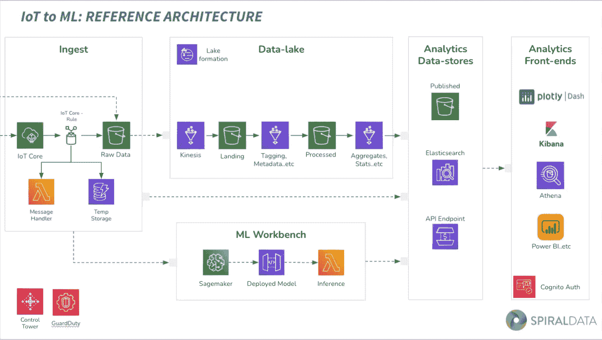

# 物联网至物流参考架构

> 原文：<https://medium.com/codex/iot-to-ml-reference-architecture-97d665c3b184?source=collection_archive---------18----------------------->

*CTO Chris Jansz 在 AWS meetup 上展示了 SpiralData 的机器学习工作台*

SpiralData 的 ML DevOps 参考架构

SpiralData 在阿德莱德的亚马逊网络服务会议上展示了“数据分析的好、坏和架构”。首席执行官 Kale Needham 和首席技术官 Chris Jansz 展示了用于预测性维护的[实时机器学习示例](https://spiraldatagroup.com.au/resources/real-time-machine-learning-for-predictive-maintenance/)，SpiralData 的物联网到 ML 参考架构以及如何克服数据分析项目中的挑战。

观看下面演示的第二部分，包括文字摘要:

SpiralData 自 2017 年以来一直致力于实施物联网和机器学习架构，从一个基于 GPS 的跟踪 150 辆汽车的解决方案开始。然后，我们转向谷歌地图，使用机器学习和自然语言处理进行线索生成。最近，我们与 SAGE Automation 合作，使用机器学习模块识别管网中的堵塞，从泵钻机中获取数据。

基于现实世界的经验，架构本身已经经历了多次修改和迭代。对于 SpiralData 实施的每个项目，我们都有最佳实践回顾，并使用 AWS 架构良好的框架进行持续审查。

SpiralData 的参考架构有两个关键特性。首先，它是一种模块化设计，客户不需要从第一天起就实现所有的服务。SpiralData 举办联合设计研讨会，以确定客户的需求和要求。我们对他们进行了关于架构、安全状况和 UI 设计的问卷调查。本次研讨会的成果是对要求、我们需要实施的模块、安全指南和任何合规性要求的清晰理解。第二个特征是良好架构的框架，用于评估架构中使用的所有服务，以及我们如何实现它们。

转到架构本身，我们从摄取模块开始。摄取模块的目的是从物联网传感器、企业系统、金融或销售系统摄取任何类型的数据，能够以接近实时的方式处理成千上万的设备，同时将成本保持在可管理的水平。SpiralData 使用的服务之一是 IoTco，它管理所有传入的数据、安全性、连接性和实时数据流。我们有 IoTco 规则，处理数据在哪里着陆。为了进行实时监控，我们将其发送到 Elasticsearch 或 S3 桶，我们将它们用作原始存储设备。稍后，如果客户想要分析过去六个月收集的数据，我们不必等待另一个数据集的到来。Lambda 用作中间步骤来处理并将其推送到其他目的地，而 DynamoDB 用作 ML 推理的临时存储。

第二个模块是数据湖，这是一个可扩展的解决方案，用于处理、链接和存储海量数据以进行分析。它不受数据源、类型或结构的限制:它可以是物联网、企业系统，甚至是公共 API。我们使用湖形成来管理数据湖的安全性、目录和标签。Kinesis Firehose 用作处理数据的 ETL 工具，S3 用于多级数据存储。我们有多个用于发布数据的 S3 存储桶，可以在其中执行即席分析。

另一个模块是基于客户需求的分析数据存储。当我们开展联合设计研讨会时，我们会根据需求、预算和时间表确定他们想要实施的服务。例如，我们可以设置一个 S3 存储桶，这是一种非常经济高效的分析即席数据的方法。我们使用 Elasticsearch 进行实时时间序列分析和高级搜索功能，使用 API Gateway 让内部和外部应用程序访问实时数据和机器学习推理。

下一个模块是前端。说到前端 BI 工具，选择是无穷无尽的。SpiralData 增加了一个服务子集，主要关注时序用例。直到最近，我们一直使用 Elasticsearch Kibana 作为前端分析可视化，但当客户需要非常定制的仪表板时，它有其局限性。我们对可能的解决方案或工具进行了内部评估，并选择 Plotly Dash 作为高度定制前端的默认可视化。我们仍然使用 Elasticsearch Kibana，它具有对 SMS、电子邮件、Slack 频道或任何其他支持网络图书的解决方案的实时监控和警报系统。如果最终用户需要专门的分析或查询，那么可以实现 Athena，以及一个用于仪表板的快速站点。我们的一些客户已经实施了微软许可，并且不想投资另一个前端工具，所以我们使用 API 端点，允许他们访问 Power BI。总的来说，我们使用 Cognito 作为认证服务和授权。对于拥有 Power BI 的客户，我们将 Azure Redis 与 Cognito 集成。

最后一个模块是 ML 工作台。多年来，我们已经了解到，我们的客户希望在进入其他领域之前专注于 ML 本身，因为机器学习让他们能够非常快速地洞察他们所面临的问题和分配预算的能力。使用 SpiralData 的模块方法，我们可以简单地实现摄取和 ML 模块，由客户为未来的项目分配预算。

在本模块中，我们始终使用 SageMaker。SageMaker 用于模型训练和部署，它还在云上提供 Jupyter 笔记本，与 GitHub 集成进行版本控制。它还提供了快速设置开发人员环境的能力，而不需要在本地机器上安装 Python 包。如果需要持续的模型培训和部署，那么可以根据特定的标准，将模型设置为预定的再培训和重新部署。如果我们有更多的数据，用扩展的数据集训练它并重新部署它，我们可以提高一些模型的效率或准确性。推理连接到 API 网关，允许外部应用程序使用机器学习推理功能。至少，我们使用 AWS 控制塔和 GuardDuty 进行安全治理和监控，但也可以根据客户的安全需求实施其他服务。

SpiralData 目前使用云形成和自动化脚本的组合。云的形成建立了一组特定的服务，自动化脚本用于创建用户配置文件、设置 SageMaker 和其他配置。

关于 SpiralData:

SpiralData 是一家提供全面服务的数据分析机构，为希望做出基于数据的决策的各种规模的组织提供数据战略、企业技术、数据科学和定制人工智能解决方案。了解有关 SpiralData 如何使用数据分析帮助创建更智能的组织的更多信息:[https://spiraldatagroup.com.au/](https://spiraldatagroup.com.au/)