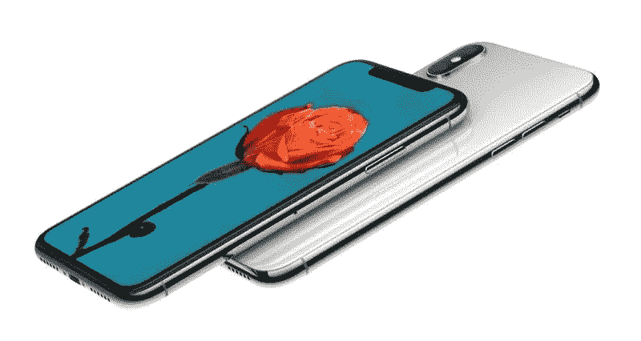

# iPhone 14 泄露& CADS、有机发光二极管为 iPad 屏幕& WWDC 新闻

> 原文：<https://medium.com/codex/iphone-14-leaks-cads-oled-screens-for-ipad-wwdc-news-5f05a6fc4ced?source=collection_archive---------18----------------------->

## 苹果视图综述

## 2022 年 4 月 4 日至 4 月 8 日

苹果账户卡

本周苹果之地的新闻不多，但以下是这几周的亮点综述。

棒球直播 Apple TV+

## 棒球来了

是的，它终于来了。自从上个月的事件以来，我一直在给你们更新。嗯，检查我的电视+应用程序，游戏现在显示。应用程序上有一大堆游戏，但本周末只有两个。你可以看*大都会队对国民队*或者*太空人队对天使队*。在这个赛季的前 12 周，你可以不订阅而观看。随后，你需要为 Apple+订阅付费。苹果电视+是我新发现的玩具。吃了*早间秀*，我现在深陷于*我们撞了*和*慢马*。如果我在这里安静一会儿，你就知道为什么了！

 [## 我讨厌正确！

### 让我们把六月的 WWDC 看得更远一点

medium.com](/codex/i-hate-being-right-49073d66cb) 

Twitter 即将推出编辑功能

## Twitter 上的编辑即将到来

Twitter 是我研究许多博客文章的首选来源。我也定期在 Twitter 上发帖。在这种情况下，我最大的不满之一就是注意到一条很棒的推文中的错误或打字错误。好吧，谢天谢地，大众终于被听到了，Twitter 即将包含一个编辑按钮。终于来了！周二，埃隆·马斯克(Elon Musk)成为 Twitter 9%的最大股东，并向他的粉丝发推文说，“他们希望包含编辑功能吗？”压倒性的 *73%* 说是！最初，它将只对 Twitter 蓝色用户开放，直到所有的错误都被解决。此后，它将提供给每个人。不过，我确实想知道他们会如何处理这个编辑想法。如果，我转发了你的一条推文，然后你编辑了那条*原文*的推文，包含粗鲁、辱骂或令人憎恶的观点，我不想与这些观点联系在一起，这怎么能被控制呢然而，他们需要确保编辑过的推文被标记出来。可能和 Reddit 差不多。

iOS 15.4 更新

## iOS 15.5 发布测试版

老实说，这似乎不值得，但苹果刚刚发布了测试版的当前 iOS 的最终更新。开发者现在可以使用 15.5 版本。15.4 几周前才发布，有很多很棒的功能，包括*通用控制*和 *Face ID* (现在有了遮罩识别)。似乎他们渴望在六月的 WWDC 发布 iOS 16 之前，为 iPhone & iPad 两部手机都下载 iOS 15。我真的希望现在无聊又古板的操作系统能有一些重大的改变。你呢？

 [## 为什么我要去麦克斯？

### 不是 M1，不是 M1 专业版，但对我来说是马克斯。为什么？

medium.com](/codex/why-did-i-go-max-e5e27a6ff1b1) 

苹果钱包的新功能

## 15.5 版本中的一个变化是…

在筛选最新的测试版时，我发现了一个大的变化。如果你以前买过苹果礼品卡，它会显示在你的苹果账户里。现在，一切都变了。这些积分现在将出现在你的*钱包应用*的*苹果账户卡*上。虽然它正在测试版中展示，但要到今年夏天晚些时候操作系统正式发布时才会上线。至少当你给我钱的时候，我会知道去哪里找。

有机发光二极管显示器即将登陆 iPad

## 有机发光二极管来了

配备有机发光二极管屏幕的 iPad 即将到来，这是肯定会出现的。据 elect 消息，中国 BOE 将在其四川 B16 工厂开始生产 8.6 代有机发光二极管显示屏。BOE 目前正在测试一项名为*‘双栈串联’*的技术，这项技术可以同时增加亮度和寿命。第一批有机发光二极管 iPads 将于 2024 年发货。 ***而这就是我，依然开心的抱着我的小 iPad Mini！***

新的 AirPod Pro 即将推出

## 典型！

我等了这么久，终于给自己买了一双 AirPod Pro，但它们即将过时！根据 Ming-Chi Kuo 的说法，苹果将在今年下半年推出 AirPod Pro 2，目前的型号将停产。在某种程度上，这一决定是在 AirPod 3 的销售数据表现不佳后做出的，原因是产品细分不佳。 ***我用 AirPod Pro 其实是欣喜若狂。它们更舒适，我也喜欢降噪功能。***

Face ID 维修 iPhone X

## iPhone X 用户的好消息

苹果公司目前运行的程序，即你可以在不更换整个手机的情况下维修 iPhone 的 Face ID 元件，现在已经扩展到 iPhone X 用户。最初，这项服务仅适用于 iPhone XS 及更高版本，但上周苹果允许授权维修中心仅更换 *TrueDepth* 相机系统。这样做，这意味着所有带有 Face ID 的 iPhone 现在都可以修复，因为 iPhone X 之前的机型根本没有 Face ID。

苹果手表在青少年中流行

## 哦，现在做一个青少年

不久前，我写了一篇关于美国青少年使用 iPhone 而非 Android 的惊人流行的文章。最新数据显示，这种趋势几乎没有减弱的迹象。87%的美国青少年已经拥有一部 iPhone，还有 87%的人希望他们的下一部手机是苹果手机。73%已经拥有 AirPod，42%拥有 Apple Watch。在结账时，23%的人表示他们将 Apple Pay 作为电子支付的首选。这些发现是*派珀·桑德勒*调查*盘点青少年*的一部分，其中 7100 名青少年接受了调查。当我还是个孩子的时候，互联网甚至还不存在——天啊！

 [## 戴森区——真的吗？

### 这可能是有史以来最精心制作的笑话之一，或者是一个杰出的创新。你决定吧。

medium.com](/codex/the-dyson-zone-for-real-cc26172f523b) 

iPhone 14 最新 CADS

## iPhone 14 CADS

随着我们越来越接近 9 月，这些谣言和泄露无疑会越来越频繁。最新的图像显示了与我们已经看到的非常相似的设计，因为生产将很快增加以满足预期的需求。摄像头凸起将比以往任何时候都大，有利于 48MP 摄像头，并且专业手机上的凹口将被取代，有利于“药丸和打孔”布局。本周的泄露，由 tweeter [ShrimpApplePro](https://twitter.com/VNchocoTaco) 描绘了轻微移动的按钮和新的 SIM 托盘和 5G 天线设计。泄露也给出了手机非常详细的尺寸。这位泄密者是第一个在推特上发布 iPhone 14 新的双孔打孔设计的人，所以应该认真对待。实际上，我正在考虑攒钱，今年第一次直接买一部 iPhone。在两年多的时间里，我在航母升级上省了一大笔钱。你是怎么拿到你的 iPhone 的？

WWDC 2022——代码的呼唤

## 咚咚来了

当你读到这篇文章的时候，关于今年的开发者大会，已经有很多文章和言论了。WWDC 将于 6 月 6 日星期一举行，主要是在线活动。邀请函上说*完全在线*，但那实际上是*的小*误导，作为少数记者，开发者&的学生可以亲自申请到场。作为一个开发者大会，它的主要焦点是软件。我们几乎可以肯定会看到和听到关于 iOS & iPadOS 16、Watch OS 9、macOS 13 以及最新的 tvOS 的所有信息。我们也有可能对一些硬件有所了解。全新的 *AR/VR* 耳机第一次见到了曙光。我预计它要到明年才能上市，但让开发者可以使用它似乎是有意义的，因为它将拥有自己的应用商店。苹果硅胶过渡的最后一环也将揭晓。Mac Pro*是目前最后一款采用英特尔芯片的机器，可能会在今年夏天首次亮相。这并不是前所未有的，因为当前的 Mac Pro 阵容于 2019 年在 WWDC 首次亮相。尽管我确信苹果公司更愿意把这些展示给现场拥挤的观众，但这只是可能的，时间尺度会打败他们。那台 Mac Pro 会有多快？*

乐章结尾部

## 最后

我知道我这周提到过几次苹果电视，但那是因为我被迷住了！这里有一个罕见的，非常真实的苹果在美国，法国和日本的排名。与这些国家最受欢迎的流媒体服务相比，这是一个有趣的观点。苹果公司显然是认真的，要成为流媒体领域的主要参与者。 ***对了，昨晚在 Apple TV+看了 CODA。拜托，拜托，请抽空看看这位奥斯卡得主。这是一部催人泪下的电影，但完全-莫莉，多么了不起的电影。让我知道你对它的看法。***

苹果电视+统计

如果我错过了什么新闻，请告诉我，我会在下周报道——当然，这要归功于你自己！

## 在你走之前

我只是高端博客网站 Medium 的众多作者之一。它是如此物有所值，你可以在这里加入 https://medium.com/membership

加入我的幕后邮件列表[https://www.talkingtechandaudio.com](https://www.talkingtechandaudio.com)

最初发表于 2022 年 4 月 8 日 https://www.talkingtechandaudio.com/blog。