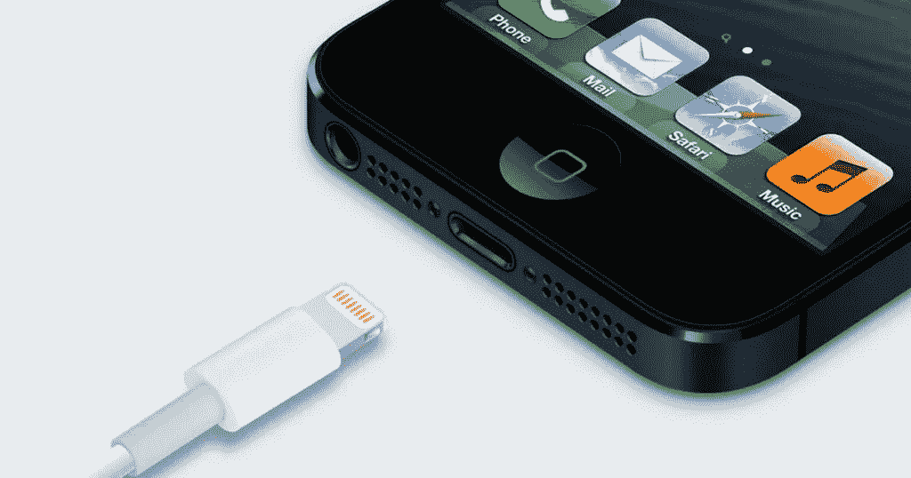

# iPhone 14——最新独家新闻

> 原文：<https://medium.com/codex/iphone-14-the-latest-scoop-f1ffb021d571?source=collection_archive---------20----------------------->

## 颜色，相机，电缆，什么都没有！

所以，这个周末，我在想，在最近的博客和视频中(是的，我有一个[***YouTube***](https://www.youtube.com/c/DavidLewistalkingtechandaudio)***频道)，我报道了一些关于我们最喜欢的苹果产品的谣言、泄密和故事。所以，我想我今天要做的，就是把它们都放在一个博客里。以下是我认为我们目前对今年 iPhone 14 的所有了解。***

负十六播客

## 早期的神话

iPhone 14——我们知道什么？

甚至在去年推出 13 之前，就有关于 14 的传言。早期，我们听说会有一个激进的重新设计；嵌入式摄像头，屏幕下的 Face ID，甚至还有复古的 iPhone 4S 的感觉。虽然一些激进的新设计功能可能已经消退，但我们仍然期待更好的相机，更大的相机凸起，新的颜色，更好的前置摄像头和更快的闪电电缆。所以，14 日的比赛可能会比我们担心的更令人兴奋。

 [## HomePod 成为一个收藏家的项目&一些好的闪电电缆新闻！

### 苹果视图综述

medium.com](/@Davidtalkingtech/homepod-becomes-a-collectors-item-some-good-lightning-cable-news-76b0399bbb14) 

## 设计

更大的相机颠簸是不可避免的(礼貌@LD_Vova)

由于 CADS 最近泄露的原理图和案例，我们已经对今年手机的外观和尺寸有了一个很好的想法。这两个都证实了我们早些时候听到的消息，即今年的阵容中将不再有迷你。这意味着今年晚些时候我们将只有四款手机，两款 6.1 英寸屏幕(14 和 14 Pro)，两款 6.7 英寸型号(14 Max 和 Pro Max)。泄露的图像也向我们展示了摄像头撞击的规模有多大。[郭明志](https://twitter.com/mingchikuo)在推特上表示，今年手机的凸起将从 3.6 毫米增加到 4.17 毫米，整体厚度超过 11 毫米，比第一代 iPhone 更厚。虽然不理想，但代价是相机将会有巨大的改进。我们听说它将是 48MP *和*我们将能够录制 8K 视频，将手机的规格提升到我们预计的 2022 年的水平。此外，这将是该相机自 2014 年 6S 以来的第一次大幅提升。伊恩·泽尔博制作的渲染图显示整个设计更加圆润，边框现在第一次跟踪了车身的半径。

 [## wi-fi 去哪了？

### 苹果有许多依赖 wi-fi 的产品，但他们不再有路由器。为什么？

medium.com](/codex/where-did-the-wi-fi-go-15ecea31a89e) 

## iPhone 14 的正面

图片由伊恩·泽尔博提供

事实上，凹口已经被小孔设计所取代。这个洞将用于改进的自拍相机，而打孔将用于 Face ID 探测，因为屏幕下技术仍有一段路要走。我以前写过很多次，刻痕从来不是我失眠的原因。在我能亲自看到这个新的布局之前，我不能完全确定它是否会合我的意。

值得记住的是，到目前为止我所经历的所有变化，只适用于两款 Pro 手机的*。这两款普通手机将只有一个更新的 12 MP 摄像头，从 13 Pro 提升，减去长焦镜头，也保留了缺口。此外，值得一提的是，今年，我们将在 Pro 系列的常规 14 上运行不同的芯片。A15 芯片，拥有完整的 CPU 计数，似乎有可能在非专业手机中使用。A16 将*只有*会出现在专业版 iPhone 中。*好主意还是坏主意？你怎么想呢?**

然而，我所说的新的、改进的前置摄像头将适用于整个系列。他再次提到郭明志，告诉我们相机将从 f2.2 光圈更新到 f1.9 光圈，允许自拍具有模糊的背景和更好的弱光功能。

## **依然闪电— *但更好***

希望改善闪电电缆传输

我们都希望 lightning 连接器成为过去，并被 USB-C 取代。遗憾的是，这在短期内不会发生，*但*手机的传输速度看起来可能会得到提高— *范围很广*。与 iPad Pro 不同，iPhone 的连接器运行 2.0 USB，这意味着传输速度很慢，约为 480 兆字节。苹果的工程师们意识到这一点并不成熟，所以他们正在努力在今年所有的手机上安装 USB 3.0 连接器。记住，专业手机可以拍摄 8K 视频，从这些设备需要查看的中获取文件*。虽然不完美，但至少是一个进步。3.0 USB 速度将大幅提升，通过 lightning 电缆传输速度将达到 5Gbs。*

 [## 九台新的 M2 苹果电脑

### 和四种不同版本的 M2 芯片。是时候让我们看看了！

medium.com](/codex/nine-new-m2-macs-1415cfa37ac5) 

## 旗帜

图片来自 [@LD_Vova](http://twitter.com/LD_Vova)

一般来说，更有趣、更鲜艳的颜色是留给非职业选手的。我想理论是，在职业环境中，颜色不太合适！然而今年，他们可能会打破传统。希望整个系列都有深紫色。以前也有过紫色，但只是 iPhone 12 上的一种柔和的春季升级色。

## 思想

图片来自 [@LD_Vova](http://twitter.com/LD_Vova)

虽然我承认这两款普通手机看起来不会有太大变化，但对于专业手机来说，这是一个完全不同的故事。一个新的芯片，大幅改进的摄像头和无凹槽设计实际上加起来是一个相当大的设计变化。这是我甚至可能会审视自己的东西，特别是传闻中的 8K ProRes 视频，48 MP 摄像头和更快的传输速度，Pro 或 Pro Max 可能正是我所追求的。

那么，你呢？你觉得这两条线之间出现这样的差异是一种耻辱吗，或者，你觉得这不仅仅是合理的吗？我们已经在 Mac 电脑上看到了这种情况，当然，iPhone 走上同样的道路只是时间问题。

**我很想听听你的想法。**

我只是高端博客网站 Medium 的众多作者之一。这是如此好的价值，你可以在这里加入 https://medium.com/membership

加入我的幕后邮件

**原载于 2022 年 4 月 25 日 https://www.talkingtechandaudio.com/blog****[**。**](https://www.talkingtechandaudio.com/blog)**