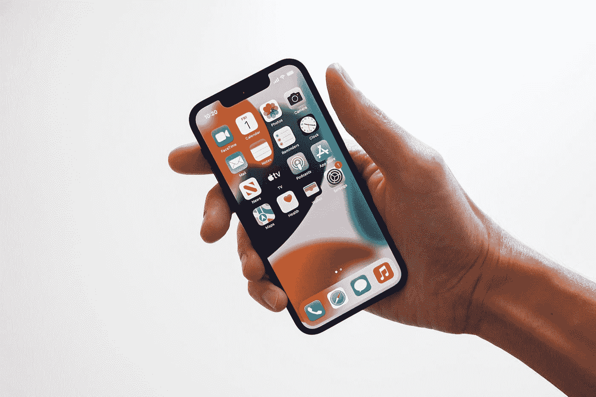

# iPhone 14 将与去年的 iPhone 具有相同的规格！原因如下？

> 原文：<https://medium.com/codex/iphone-14-will-have-the-same-specs-as-last-years-iphone-here-s-why-cbe71de2aba4?source=collection_archive---------25----------------------->

不，这不是点击诱饵，**苹果**正在将去年的 **A15 仿生芯片组**回收到新的 **iPhone 14** 中，这不是你想的原因。TF 国际证券的技术分析师发来的一条快速推文 **Ming-Chi Kuo(72.5%的准确率)**暗示，只有 **Pro** 型号将获得芯片升级，而像 **iPhone 14** 和 **iPhone 14 Max** 这样的基本型号不会。

杰里米·贝赞格在 [Unsplash](https://unsplash.com?utm_source=medium&utm_medium=referral) 上拍摄的照片