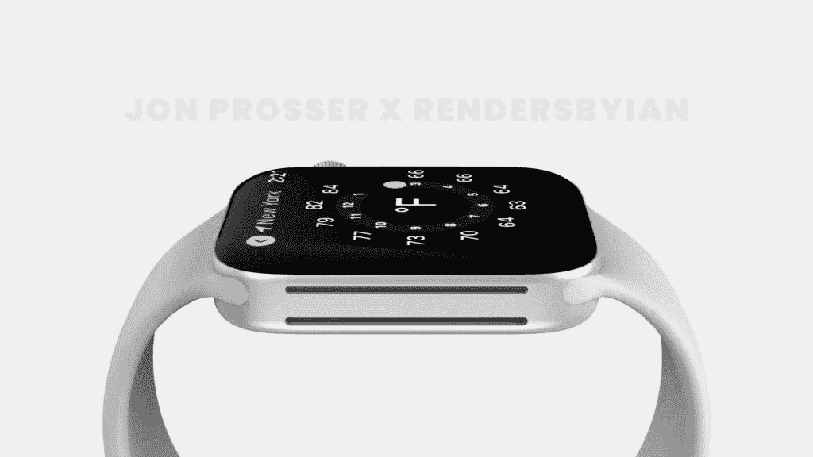

# iPhone 15 泄露，手表&推特

> 原文：<https://medium.com/codex/iphone-15-leaks-watches-twitter-883352275393?source=collection_archive---------18----------------------->

## 苹果视图综述

Apple Watch 8 上的更多传感器

## 2022 年 4 月 11 日至 4 月 15 日

对于我们这些苹果粉丝来说，又一次新闻稀少，但是不管有什么，我已经在本周的苹果观点博客中为你收集了

AR/VR 耳机——我们听说即将推出

## **WWDC 更新**

我上周报道了确定的日期，6 月 6 日星期一，被预留给今年夏天的***【WWDC】***。至于我们希望在开发者大会上发现什么，我们现在有了更多的细节。作为一个主要的软件事件，我们肯定会宣布大量的 iOS 更新。马克·古尔曼报道称，目前代号为*‘Sydney’*的 iOS 16 充满了对 *AR/VR* 耳机及其与 iPhone 互动的引用。所有这些都表明，尽管这款耳机可能不会在今年夏天亮相，但它将在 iOS 16 周期内推出。可能，我们会看到一些虚拟现实软件，或者至少是耳机的操作系统。

古尔曼继续在他的 [Power On](https://twitter.com/markgurman) 时事通讯中报道，两款新的 Mac 电脑将在年中左右上市。一个是色彩鲜艳、重新设计的 MacBook Air，今天，我们发现了另一个。隐藏在工作室显示器固件中的是*“MAC Minin 10，1”*。不过，对于 mini，我们还有几点不确定。里面会是 M1 Pro 还是 M2 芯片组，外观会不会焕然一新？[郭明志](https://twitter.com/mingchikuo)认为外形将保持不变，而[乔恩普罗瑟](https://twitter.com/jon_prosser)则表示，它可能会有更多的端口和玻璃顶部。这证实了苹果已经透露 Mac Mini 100%即将到来。那么，这似乎就是我们今年夏天的 Mac 产品阵容了。 ***这是我还在等待我的 16 英寸 MacBook Pro 的到来！你对 VR 感到兴奋吗？***

 [## 什么时候，够了，够了？

### M1 芯片改变了一切。我们一度很快乐，但要求更多。但它止于何处？

medium.com](/codex/when-is-enough-enough-d66ad10a049b) 

apple Watch Series 8——将包括哪些内容？

## 体热

看起来有可能某种形式的体温传感器*将会出现在 Apple Watch Series 8 上。其他健康功能，如血糖监测和血压传感器仍需数年时间，但某种形式的温度传感器*可能会在下一款手表上发布。我说*是某种形式的*，因为它实际上不会告诉你身体的温度，而且，它只对女性有助于生育计划。因此，虽然我为这一努力喝彩，但对我来说，这似乎有点半生不熟。数据显然是要与用户共享的，但他们却避而不谈，这实在令人遗憾。苹果可以选择在这方面做出真正的改变，但却选择不去完全贯彻。只要再推一把，Apple Watch 就可能成为可穿戴医疗保健市场的主要参与者。 ***真搞不懂。如此接近创新和有意义的东西。加油，伙计们——回到你们最擅长的地方，在别人抢走你们之前领先一步。*****

一种新的低功耗模式可能即将到来

## 一边说手表

下一代 watchOS 可能会包括一系列新功能以及上述温度传感器。它可能包括一个新的*低功耗模式*。用户不必手动决定使用电源储备模式，或者等待电池电量下降到 10%以下，新的操作系统将为您完成这项工作。据彭博新闻报道，低功耗模式将允许某些应用程序继续运行，而不仅仅是像 OS 8 那样。与往常一样，一些新的手表表面也将捆绑到最新的 watchOS 中。 ***没有苹果手表，感觉被严重冷落。我错过了很多吗？***

 [## 被遗忘的苹果宝石

### 家庭共享以及为什么您应该使用它

medium.com](/codex/the-forgotten-apple-gem-817f2c38e8eb) 

因为更小的挡板真的很重要！

## iPhone 14——当然

如果边框让你担心，并且你经常因为 iPhone 屏幕上的边框有多大而失眠，那么，我有一些好消息！根据 ShrimpApplePro 的消息，iPhone 14 的边框将会变得更小。在 Pro 系列手机上，边框将从 2.42 毫米减少到 1.95 毫米。永远不要说我不喜欢你，给你所有你想要的苹果细节！T21:嗯——真的有人关心这些边框吗？

iPhone 15 可能会有望远镜摄像头

## iPhone 15！那是……对，iPhone 15 新闻！

此外，传闻中的潜望镜镜头的故事，似乎正在加快步伐。虽然它不会出现在 iPhone 14 上，但据说苹果已经与韩国家化电子公司达成协议。*Elec*报道称，Cupertino 公司已经投资 1.55 亿美元，以确保其工厂的空间，从明年开始生产*光学图像稳定*致动器(OIS)。 ***这样，弹出式照相机就可能成为现实。激动人心的时刻。***

 [## AirPod Pro 2 来了

### 我们能从他们那里期待什么？

medium.com](/codex/airpod-pro-2-are-coming-c93d56f371e2) 

YouTube 上的画中画

## 在画中；牵涉其中

几天的差别。本周初，YouTube 报道称，对 iOS 的画中画支持将在未来几天推出。这是为了让所有用户，无论是付费用户还是非付费用户，即使关闭了 YouTube 应用程序，也能继续观看视频。然而，现在 YouTube 已经收回了新闻稿，声明该评论是指 *YouTube TV，*而不是 YouTube。 ***这几天我看 YouTube 的次数还是比其他任何内容都多。你呢？***

iOS 16 将于今年 6 月发布

## iOS 16

简单问一下…你真的希望在今年的 iOS 中看到什么？Widgets？更多互动图标？重新设计的控制中心？如果今年我们有一些超级新鲜和不同的东西可以玩，那不是很好吗？

又一家新店——这次是在武汉

## 又一家新店

记得那个叫武汉的地方吗？我想你可能会。根据这个页面，他们很快就会有自己的苹果商店了。 ***苹果的进军从未停止。就这一点而言…***

高端产品的延迟

## Mac 出货量仍在增长

虽然全球、疫情的电脑热潮可能最终会消退，但苹果的销售却并非如此。刚刚发布的数据显示，苹果的销售额同比增长了 4.3%，而其最大的竞争对手惠普的销售额却下降了近 18%。去年第一季度，苹果公司出货了 720 万台台式机和笔记本电脑，高于上年同期的 690 万台。不管你怎么说苹果，但他们总是做对一些事情！

马斯克——打算收购 Twitter

## 回到 Twitter 的潮流中

上周的这个时候，我报道了因特斯拉而出名的埃隆·马斯克(Elon Musk)购买了足够多的 Twitter 股票，持有该公司 9.1%的股份。我猜他喜欢会议室。在今天提交给美国证券交易委员会的一封信中，马斯克提出以每股 54.20 美元的价格收购整个公司，这意味着该公司的估值为 430 亿美元。他在信中继续说道，他相信这个社交平台拥有*“非凡的潜力，我将释放它。”*不过，马斯克指出，这是他的*“最好的&最终报价”*，如果不被接受，他将*重新审视自己目前作为股东的地位*。这个层次的商业让我兴奋，也让我害怕。你能想象到底发生了什么吗？

苹果公司——对环境的严肃计划

## 苹果与环境

本周，苹果公司宣布，在过去的一年里，他们的供应商已经将清洁能源的使用量增加了一倍。仅在过去的 12 个月中，他们的可再生能源计划就避免了 1390 万公吨的碳排放，并在每年使用的近 1600 万千瓦中使用了超过 1000 万千瓦的清洁能源。苹果对环境的承诺仍在继续，仅在中国和日本就有近 500 兆瓦的太阳能可再生能源。 ***做出严肃且急需的环保声明。***

 [## iPhone 14 泄露& CADS、有机发光二极管为 iPad 屏幕& WWDC 新闻

### 苹果视图综述

medium.com](/codex/iphone-14-leaks-cads-oled-screens-for-ipad-wwdc-news-5f05a6fc4ced) 

多端口充电

## 给我力量

很难对一个充电器过于激动，但这是我的工作，所以要做！我们早就知道苹果正在研发一款双端口类型的充电器。当然，这些年来有很多第三方版本，但这是苹果的第一次。图像显示，它将有可折叠的插脚，并将有两个 USB-C 端口并排出现。预计将于今年某个时候发布，功率将为 35W，因此适合为一系列产品充电，包括 iPhones，iPads，HomePod Mini 和最新的 MacBook Air。不管我怎么努力，我都不能为你打扮这件衣服！

新款 Mac Mini 即将上市？

## 让我痛苦的是，我知道这是真的

我每天都在查看，但我的 16 英寸 MacBook Pro 的发货日期仍然是 5 月中旬。我们再一次求助于分析师 Ming-Chi Kuo，他报告说，由于中国持续的封锁导致零部件短缺，苹果正在经历延长的交货时间。直接从苹果，M1 最大和 M1 专业机器显示 6-8 周的交货时间，甚至更长的*延迟在店内经历。 ***真倒霉！****

无柄 AirPod Gen 2？

## 最后

这是 AirPod Pro Gen 2 的外观吗？有茎还是没有茎。你喜欢什么？还有 Mac Pro。你认为这件事什么时候会曝光？我们非常清楚地知道，那是*“改天”*，但是那一天会是 6 月 6 日吗？

我们会在 WWDC 看到 Mac Pro 吗？

如果我错过了什么新闻，请告诉我，我会在下周报道——当然，这要归功于你自己！

## ***出发前***

你订阅媒体了吗？

我只是高端博客网站 Medium 上众多作家中的一员。这是如此好的价值，你可以在这里加入[https://medium.com/membership](https://medium.com/membership)

[加入我的幕后邮件列表](https://www.talkingtechandaudio.com/)

*原载于 2022 年 4 月 14 日 https://www.talkingtechandaudio.com**T21*[。](https://www.talkingtechandaudio.com/post/iphone-15-leaks-watches-twitter)