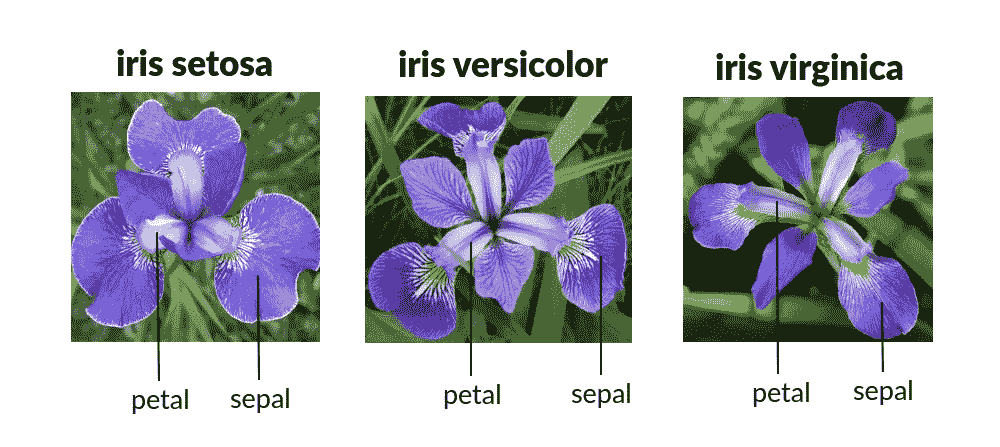
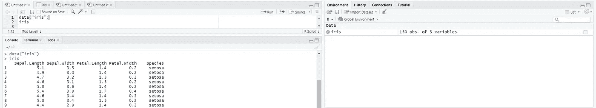
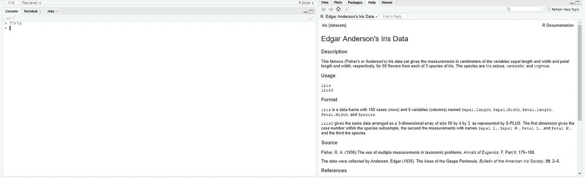
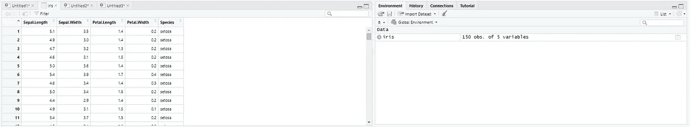
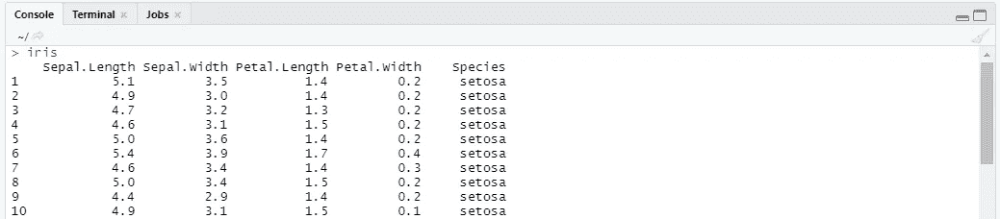
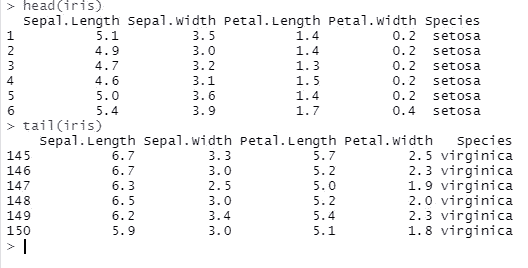
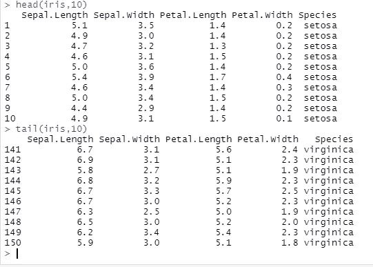
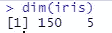
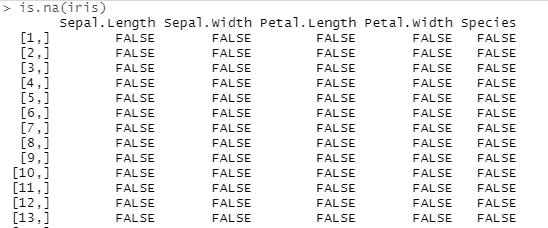
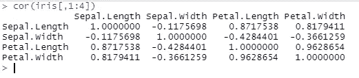

# Iris 101 —数据集采集和理解

> 原文：<https://medium.com/codex/iris-101-dataset-acquisition-and-understanding-73e8b271704c?source=collection_archive---------8----------------------->


马库斯·斯皮斯克在 [Unsplash](https://unsplash.com?utm_source=medium&utm_medium=referral) 上的照片

## 数据分析初学者指南



鸢尾花及其变种

世界上大多数机器学习问题都基于两件事——分类和回归。要开始机器学习的旅程，需要理解和分析数据。在这个主题和接下来的主题中，我将主要通过在 R 中对 Iris 数据集的一些实际操作来讨论一些见解。

# **了解数据**

分析的第一步在于查看数据，吸收列中的知识，查看每个属性取什么类型的值。所以，我们来看看数据。(快照是在 RStudio 中拍摄的)。



导入数据

这里，第一个命令" **data("iris")** "将导入数据，随后的" **iris** "命令将给出控制台中 iris 数据集的概述。另一个可以找到更多相关信息的地方是通过键入“**？控制台中的光圈**。



理解数据

在这里，可以找到关于数据集的更详细的信息，这有助于关于数据集的域的分析或信息收集。从文档中可以看出，它包括 150 个记录，具有花的 4 个特征和一个告诉我们花的种类的分类列。

# 看到数据

一旦收到数据的背景信息，查看数据是必不可少的。在 R 中，有多种方法可以查看数据。然而，由于我们处理的是一个非常小的数据集(只有 150 行)，我们可以看到整个数据集。这可以从以下几个方面看出来:

*   单击右上角环境选项卡中的 iris 变量。



直接看到数据

*   在控制台中写入“**光圈**命令。



查看来自 1 命令的数据

*   编写“ **head(data，n)** ”或“ **tail(data，n)**”**函数，其中 data 是所讨论的数据集，n 是要查看的行数，默认设置为 5。使用这些命令，您可以在任何给定的时间点看到数据集的顶部或底部。这让我们对数据有了一个基本的了解。**

****

**头()和尾()没有行数**

****

**头()和尾()的行数**

*   **还需要检查数据集的行数和列数。这可以通过两种方式实现:(a)使用`**nrow()**` 和`**ncol()**` 分别获取行数和列数，或者(b)使用 ***dim()*** 以行和列的格式给出数据集的维度。**

****

**虹膜数据集的维度**

*   **用函数`**is.na()**`检查 R 中的 NAs 或 NULLs。然而，一个缺点是这个函数检查每个值，并根据情况返回 TRUE 或 FALSE。要检查空值或 NAs 的总值，建议对所有这些值进行`**sum()**`。**

****

**在这个玩具数据集中，没有空值或 NAs。所以`**sum()**`返回 0 值。如果您想查看空值出现的位置，那么您可以这样做:`**iris[is.na(iris)]**`**

*   **要弄清楚每个属性的 ***类*** 以了解要进行的下一步处理，有两种方法可以做到:(a)对每一列单独使用`**class()**`，或者(b)对***【class()***函数使用`**sapply()**`以一次性获得所有属性的详细信息。**

**带有`**sapply()**`的代码看起来像这样:`**sapply(iris, class)**`**

*   **接下来，我们需要弄清楚目标属性的分布，即我们试图弄清楚的变量。这可以很容易地从 **table()** 函数中找到。但是， ***百分比*** 看不出来，这一点很重要。这可以通过一个简单的表达式找到:**

```
**cbind(freq=table(iris$Species), percentage = prop.table(table(iris$Species))*100)**
```

**对于那些对它的作用有些困惑的人来说，`**cbind()**`只是列的连接。`**freq**` 是鸢尾属物种属性(目标)表的第一列名称。第二部分(`**prop.table()**`)给出了各个阶层的百分比。由于都有 50 条记录，因此百分比为 33.33%。**

*   **可以使用`**mean()**`、`**median()**`、**、*、*、**和`**quantile()**`、**、、**来分离每个属性的平均值、中值和四分位数的计算，但是可以在整个数据集上使用`**summary()**`函数一起完成这些计算。它将给出整个数据集的细节。**
*   **在 SD(标准差)中，这在 summary()函数中不存在。还得单独计算。我们也可以在这里再次使用`**sapply()**`。然而，使用`**sd()**`时要小心，因为它只适用于数字类，而不适用于字符或“因子”类。**

**这就是为什么知道您正在处理什么列或属性是很重要的。在这种情况下，除了最后一列(这是一个因子)，其他都是数字，可以计算出`**sd()**`。**

**要使用的代码是`**sapply(iris[,1:4], sd)**`**

*   **数据的偏斜度也是一个需要考虑的重要因素。可以减少或增加数据的偏斜度，使其表现得更像高斯分布或正态分布。为了找出偏斜度，我们需要安装包 e1071。这个包是必不可少的，因为这里有许多统计函数。**

**这是下载和安装后包含 e1071 的代码:**

```
**library(e1071)**
```

**对于每个数字列的偏斜度，使用以下公式:**

```
**apply(iris[,1:4] ,2, skewness)**
```

*   **同样，使用`**cor()**` 函数也可以找出相关性。**记住这里只使用数字列。****

```
**cor(iris[,1:4])**
```

****

**除目标之外的所有属性之间的相关性**

**你可以看到花瓣。长度和花瓣。宽度高度相关。同样，它们与萼片长度高度相关**

# **最后的想法！**

**通过这些，我给出了如何从像 Iris 数据集这样的小数据集得出统计推断的一个小概述。可以完成更多的统计元素，如模式、异常值和其他映射。许多客户和顾客不理解这些数字，倾向于更强调 ***视觉探索性分析*** 。在下一篇文章中，我将做一个**单变量的图形可视化**。许多重要而令人惊讶的事实将会出现。对这些事实进行逻辑推理也是极其重要的，否则我们可能会以追逐幽灵而告终。下一篇文章再见。再见，朋友们…**

**P sst 你可以在这里看到更详细的解释[。喜欢内容请点赞、分享、订阅。也请给我一些我能涉及的话题。非常感谢你的时间和耐心。](https://youtu.be/dzOBzEgkVTI)**