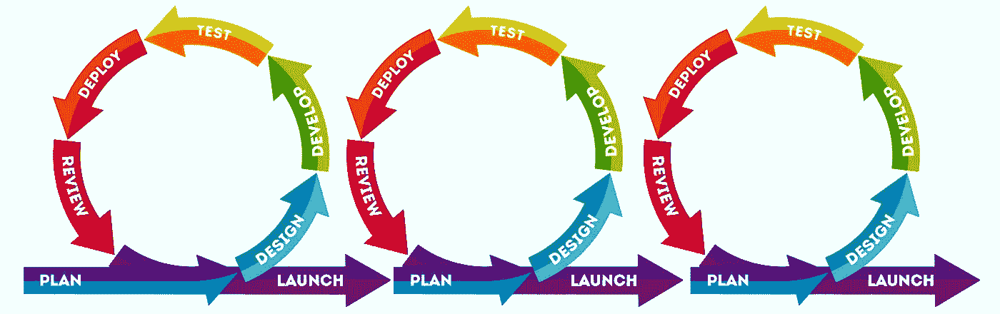

# 敏捷是扯淡吗？差不多了。这是人的问题！

> 原文：<https://medium.com/codex/is-agile-bullshit-almost-its-a-people-problem-1a8014e58800?source=collection_archive---------1----------------------->

两部分中的第一部分

他们说通往地狱的路是由善意铺成的。生活常常像是一条拥挤的高速公路，懒人宁愿无知地骑一整夜，也不愿花一分钟的时间做有氧运动来爬楼梯。一盎司的汗水可以节省一加仑的血液，这种想法被认为是谣言和神话。