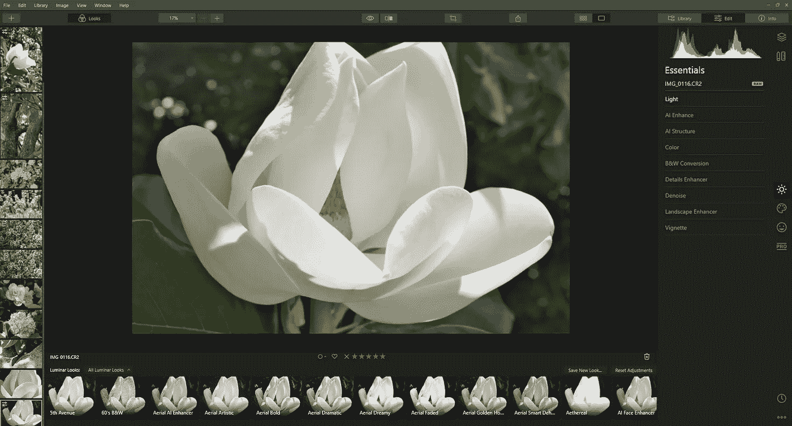

# AI 照片编辑软件真的值得吗？

> 原文：<https://medium.com/codex/is-ai-photo-editing-software-really-worth-it-cbf55b2b39e7?source=collection_archive---------18----------------------->

Luminar 4 软件

想象一下，如果能够将一张照片上传到您的计算机上，它几乎可以立即清除瑕疵，修复任何照明错误，增强面部特征，甚至可以创建原始图像中没有的模糊天空风景。随着技术的快速发展，人工智能照片编辑使这成为可能。