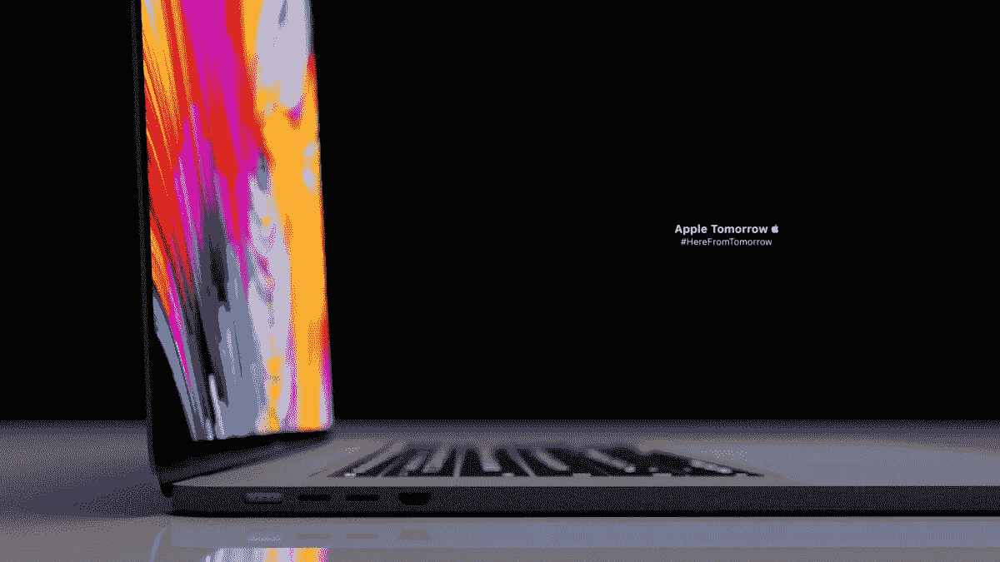

# 苹果的新 M1 MacBook Pro 是今年最好的科技投资吗？

> 原文：<https://medium.com/codex/is-apples-new-m1-macbook-pro-the-best-tech-investment-this-year-be77a118d847?source=collection_archive---------0----------------------->

它很贵，但是如果 10 年后它仍然值得呢

我总是说苹果多么喜欢感谢你买了他们的设备。是的，他们创造的产品大多(太)贵，有时甚至没有必要，为镜片的位置和两种全新的颜色争论不休，都是为了更高的价格——对不起，有人说 iPhone 13 吗？Ipad Mini 真的有存在的必要吗？

图片:[https://www.apple.com](https://www.apple.com)

然而，有一个类别我准备为苹果辩护，那就是电脑。虽然我不是电脑极客，但我知道当我说苹果的目标不是这些奇妙机器的最高利益，而是尽可能最好的用户体验时，我是从哪里来的。

## 暂时回到基本问题

当我说苹果喜欢感谢你购买他们的设备，更具体地说，他们的电脑，我的意思是他们创造的这种电脑提供了一种几乎不折不扣的体验，你可以享受比竞争对手提供的更长的时间。举个例子，MAC 电脑是由坚固的铝制底座制成的。我们已经习惯了这个功能，但这意味着尽管在它的生命周期中遇到了一些碰撞和跌落，而其他不同品牌的电脑会在大多数时间里受到影响并需要维修，但苹果不会。

照片:【https://br.atsit.in/fr 

随着 MAC 电脑的出现，它将经历相当多的撞击和跌落，就像它现在变得越来越罕见一样，它将持续很长时间，不需要任何维修或更换部件，可以轻松使用 8 年。例如，今天你买的是英特尔或戴尔，估计它的使用寿命为 2 到 4 年。我妈妈处理她的 2015 款 MacBook Pro 的唯一办法是一年前更换电池，从那以后，她的无病毒、功能良好的电脑一直保持着良好的工作状态。

我并不是说苹果不玩计划淘汰，但他们肯定会让你享受很长很长时间的昂贵购买。是的，它们很贵。但是要考虑到，你不需要在 4 年后的 8 年或更长时间里购买一台新电脑。最终，苹果电脑有望成为明智的投资。所以就耐用性和可靠性而言，MAC 电脑在技术上是物有所值的。但是，假设 10 年后，技术将变得更加疯狂，你现在拥有的电脑将变得一文不值，那么拥有一台寿命如此之长的电脑有什么意义呢？

## M1 MacBook Pro 的梦幻派对作品

照片:【https://www.frandroid.com 

在没有进入官方展示中为我们准备的所有数字的情况下，很容易恢复最新一代最专业的 MacBook 的卓越性能。M1 专业版和 M1 Max 相当简单地把酒吧放在竞争对手的前面好几个月，甚至可能是几年。它们的速度、能力和性能将 14 英寸和 16 英寸的紧凑型车变成了专业武器。它们的设计目的是提供更多的功能，处理更多的东西，例如，大大改善了通风，这是 MAC 电脑的一个普遍问题。

图片:[https://www.macg.co](https://www.macg.co/)

真极客的照片: [https://www.tomsguide.fr](https://www.tomsguide.fr)

苹果还通过这款最新的电脑听取了公众的意见:HDMI、耳机和 thunderbolt 端口、SD 插槽，以及完全物理键盘，这意味着典型的专业用户会对这款 MacBook Pro 的“全能”因素感到满意。事实上，你可以直接用它运行三台 iMacs 和一台 8k 电视，这已经很说明问题了。这些我们不能错过的端口的回归对用户也有好处，因为他们不必出去购买适配器或无线 AirPods，只是为了舒适地使用他们已经花了很多钱的设备。

图片:[https://www . laptopspirit . fr](https://www.laptopspirit.fr)

最后，苹果在演示中热衷于指出的重要一点是，他们的设备在提供优于竞争对手的性能的同时，有望实现多高的能效。一个常见的事实是，当用户不为电脑充电时，电脑的性能会大幅下降，即使我们听不到太多声音，M1 Pro 和 Max 正在改变这一点，因为无论 Mac 电脑是否通电，统计数据都不会有太大变化。

图片:[https://www.macg.co](https://www.macg.co)

这些无与伦比的功能意味着两件事:首先也是最重要的，这意味着苹果可以证明要价高达 2400 美元一台是合理的，其次，这是本文的全部观点:这是今年迄今为止最好的技术投资。结合其耐用性、可靠性和惊人的性能(无疑将在未来几年内跟上最苛刻的软件)，这款 MacBook Pro 现在和未来许多年都可以做到这一点。很难想象，即使在十年内，任何程序或任何任务都将需要比最新产品设计处理的能力更高的能力。

## 总结一下…

最新的 MacBook Pro 非常非常贵。但它在计算机性能方面也处于领先地位，同时又是一款轻薄的设备，可以很容易地从家里转移到工作场所。由于苹果公司著名的耐用电脑，它将同样保持自己在一起。那么，为什么它不是 2021 年最佳科技投资呢？

如果你同意或不同意这种对新 M1 MacBook Pro 的看法，请在下面留下评论，并感谢您的阅读。

喜欢这个故事吗？考虑成为一名正式的中级会员，这样你就可以阅读有趣的文章，同时也可以大力支持我:[https://medium.com/me/settings/promote-memberships](/me/settings/promote-memberships)

照片:【https://www.youtube.com 