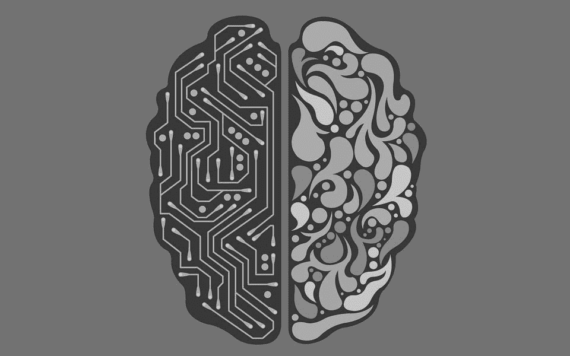

# 人工智能是奴隶制吗？

> 原文：<https://medium.com/codex/is-artificial-intelligence-slavery-bc3d5f0eab73?source=collection_archive---------9----------------------->

人工智能是计算机、机器和机器人在技术上假设拥有的智能或思想。人工智能在现实世界中可能是不可避免的，但随着这一最终突破，将出现如何对待这些人工智能“生物”的问题。这个问题已经开始被提出，尽管可能更微妙，因为人工智能助手的出现，如…