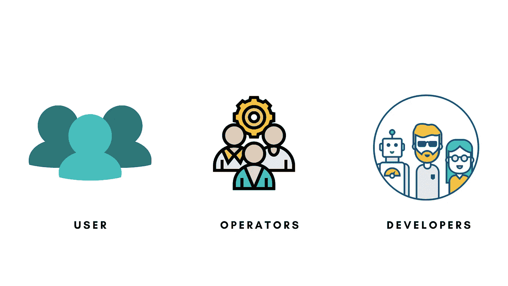
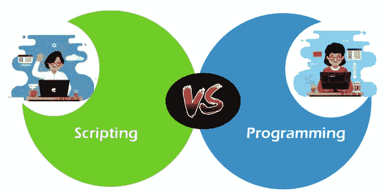
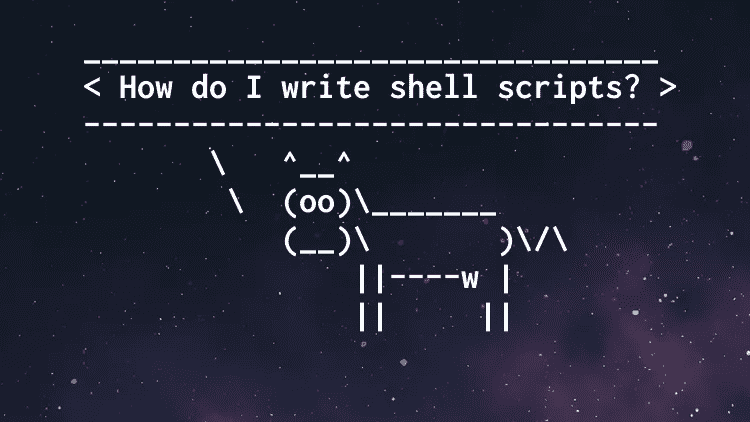

# 编码对网络安全重要吗？

> 原文：<https://medium.com/codex/is-coding-important-for-cyber-security-5e73e4886787?source=collection_archive---------5----------------------->

有很多初学者问学习编程对网络安全有多重要，简单的回答是，这要看情况。因为刚开始，有许多角色并不真的需要你编写代码，而且基于你想达到的高级程度，编程对你来说可能是也可能不是那么重要。

这么说吧，你在网络安全中用到的工具都是用代码写的，编程让你写工具。那么这些工具是什么，理解如何构建它们有什么好处呢？

在概念层面上，工具扩展了你的力量来改变你周围的环境，无论是在自然世界还是数字世界。结合目标，它们让你创造行动和改变。因此，您的工具越先进，您拥有的优势就越大，您可以实现的操作和变化范围就越广。

在网络安全领域，能否取得成效取决于您库存中的软件工具类型以及您使用它们的专业知识。工具+技能=能力的组合真正决定了你的整体网络能力，所以为了提高你的效率，平衡两者很重要。

目前，在网络安全领域，大多数人属于以下三类之一:

用户:他们只知道使用一个或几个不同软件系统的基本知识，而且只是在他们接受过培训的情况下。如果没有更有经验的专业人士的帮助或指导，他们就无法在更复杂的情况下运用他们的培训来独立解决问题。网络安全领域的绝大多数人都属于这一类，知道如何编码对他们来说并不重要，因为他们还需要学习许多他们已经熟悉的最常用的工具，无论是 Wireshark、Metasploit、Autopsy、Burp Suite、Volatility 等等。

*在这个阶段，你最好先专注于基本原理，比如理解计算机网络、操作系统架构和解决技术问题。*

**操作员:**他们非常擅长使用各种软件来完成工作，并能在现实世界中创造性地将它们串联起来。这些人是公司 IT 和安全政策的骨干，通常是安全运营中心的指挥官。但是对于那些没有能力编码的人来说，不利的一面是当你处在一个没有现成工具的情况下，你对此无能为力。

在这个阶段，花时间学习一些编程真的可以增强你的能力，因为它可以让你自动完成许多你曾经手工完成的任务。

**开发人员:**他们积极参与运营，他们能够了解所使用工具的来龙去脉。知道如何编程可以让他们修改现有的软件或制作一些更定制的东西来解决专门的网络安全问题。能够将工具链接在一起或编写定制代码的人拥有更高层次的专业知识。那些有编程背景的人往往比那些没有编程背景的人在学习过程中进步得更快、更深入。

*运营商-开发者类型的人是一些最好的网络安全专业人士，你可以在你的团队中与他们一起工作，从他们那里可以学到比任何认证都多的东西。*

划清脚本和软件开发之间的界限很重要，因为许多人会交替使用“编程”或“编码”来描述它们。

**脚本:**它指的是用一种解释型语言编写简短的代码片段，以自动化任务或将其他工具的功能结合在一起。

软件开发:it 是一个更广泛的术语，包括脚本，但也包括编写算法或库，作为更大、更复杂的工具链的一部分。

人们通常认为 Python 或 Bash 是一种脚本语言，而编译语言如 C++或 Java 更倾向于软件开发，但它是动态的，取决于您的目的和潜在结果。Python 和 bash 对于快速执行任务是有效的，不管 C++还是 Java 更健壮和持久。*这在整个行业中并不正确，因为人们可能会在这个范围内波动，但这是一个不错的经验法则。*

对于那些对软件开发级别的编程不感兴趣的人来说，至少通过学习如何读写脚本，你可以走在前面，因为在任务的操作者方面，你的注意力主要集中在预构建的工具上，这些工具带有某种程度的定制自动化。

拥有编码背景并不十分重要，我个人认为最好从学习脚本开始，这可以很快学会，对于日常的技术任务来说更实用。

我推荐的几个学习脚本的资源是:

1.  [用 Python 自动处理无聊的东西](https://automatetheboringstuff.com/)|[Youtube 上的前 15 个视频](https://www.youtube.com/watch?v=1F_OgqRuSdI&list=PL0-84-yl1fUnRuXGFe_F7qSH1LEnn9LkW)
2.  [学习 Linux Shell 脚本 Bash 基础知识](https://www.amazon.in/Learn-Linux-Shell-Scripting-comprehensive/dp/1788995597)
3.  [在一个月的午餐中学习 Windows PowerShell](https://www.amazon.in/Learn-Windows-PowerShell-Month-Lunches/dp/1617294160/ref=sr_1_5?dchild=1&keywords=windows+powershell&qid=1635063781&qsid=257-7591209-4679250&s=books&sr=1-5&sres=B085LRGZRR%2C0735675112%2C1617294160%2CB07P69NTHF%2CB071R5557S%2C1782173552%2C1787126307%2CB076X6VTY7%2C1590599403%2C8120334590%2C9352138465%2C1925989844%2C0735626464%2C8126534508%2C1633430294%2C0735681007&srpt=ABIS_BOOK)
4.  [52 周的巨蟒-大卫·邦巴尔](https://courses.davidbombal.com/p/quokka)

没有编程技能，完全有可能在网络安全方面取得成功。随着您获得更多的经验，您会很快发现您将要处理的问题类型不容易通过静态工具来解决。你所能做的就是依靠团队中的其他人来帮助你实现一个解决方案，或者自己学习如何去做。

作为一名网络专业人士，能够用代码制作自己的工具让你更加多才多艺，更加全面。这真的扭转了局面，让你能够帮助团队中的其他人变得更有效率，最终在不同的组织中转化为更多的机会。