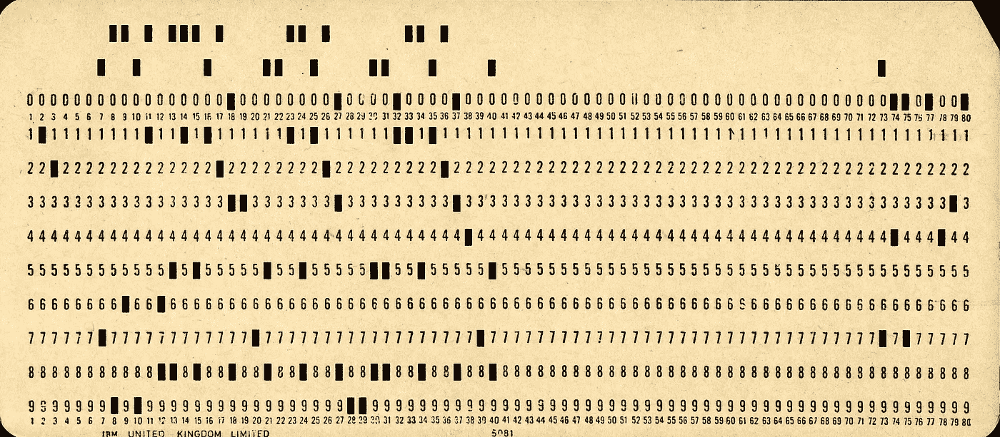

# “已经死了”已经死了

> 原文：<https://medium.com/codex/is-dead-is-dead-c6cc1926144b?source=collection_archive---------7----------------------->

## 为什么“x 死了”的故事应该被抛弃

皮特·伯金肖摄影

已经够了。

朋友们，请举起你们的右手，跟我念……我再也不会点击标题为“已经死了”的文章了。

这类文章似乎是由非常自负的年轻程序员写的，我说的“年轻”是指他们编写代码还不到 20 年。他们从来没有输入过霍尔瑞斯卡，也没有通过从袖珍卡中输入八进制或十六进制模式来启动计算机。他们可能从来没有写过汇编代码。

更糟糕的是，他们通常在编写一个 JavaScript 框架，这几乎是人们所能想象的栈顶。

这就是为什么我们 Medium 和 Reddit 的读者需要停止听从他们的点击诱饵。我们应该停止阅读任何说流行和广泛使用的东西“已经死了”的东西让我们坚持用我们想要的任何语言编写干净的、易于重构的代码，充分了解计算机语言永远不会消亡。Fortran、COBOL、LISP 和 PHP 将永远伴随着我们。

您在任何编程语言中学习的技能通常适用于任何其他语言。如果你已经学会了如何用 Algol 60 或 VBA 编程，那么你用 c 或 python 所需要的可能就是一页的备忘单。

我一直很欣赏“代码就是诗歌”这句格言你可以谷歌一下，找到很多文章。我建议所有的 clickbait mongers 花一些时间阅读这些文章，并思考它们如何为我们的软件开发世界带来更多的光明和清晰。追逐最新的亮点可能是我们的世界中有如此多臃肿平庸的代码的一个原因。

我们称之为“计算机科学”,因为它应该是一门科学。每一步都应该建立在最后一步的基础上，而不是扼杀它。感激那段旅程和带领我们来到这里的先驱者，并渴望在它前进的过程中加入我们的一点点，这应该是我们的愿望。