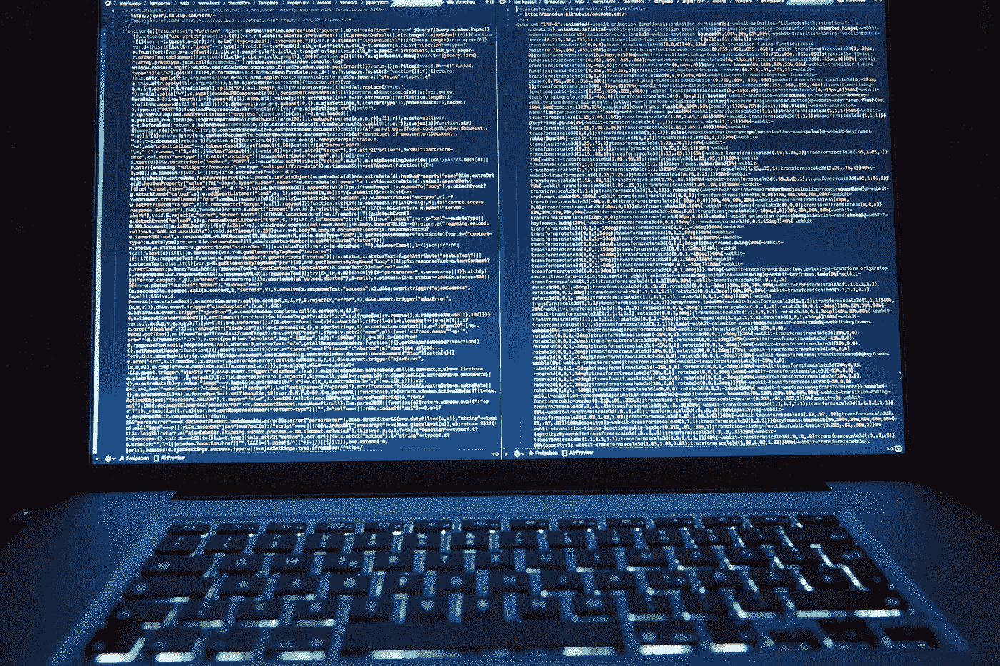

# 加密合乎道德吗？

> 原文：<https://medium.com/codex/is-encryption-ethical-6dd1d821ec46?source=collection_archive---------11----------------------->

在一个数据隐私日益受到威胁的世界里，许多人转向加密来保护他们的信息。但是加密合乎道德吗？在这篇博文中，我们将探讨加密的伦理含义以及如何负责任地使用它。

# 总说明

加密是一种用于保护数据或通信免受未授权访问的技术。它使用数学算法将数据转换成任何没有解密密钥的人都无法读取的形式。加密的数据通常称为密文，而未加密的数据称为明文。

加密用于各种应用，包括电子邮件、文件共享和安全通信。它还用于保护敏感数据，如医疗记录和财务信息。

# 利益

使用加密有很多好处。首先，它有助于确保通信和数据的隐私。其次，它有助于防止数据泄露，因为加密数据更难以窃取或篡改。最后，加密还可以用于创建信任链，因为加密的数据可以被验证和认证。

加密是一个强大的工具，了解整个事情是如何工作的，以及如何利用它来使你受益是很重要的。

# 伦理问题

加密的广泛使用是一个激烈辩论的话题，特别是当涉及到政府机构和执法部门时。一方面，一些人认为加密是保护公民隐私的重要工具。另一方面，人们认为加密可以被犯罪分子和恐怖分子用来向当局隐藏他们的活动。

那么加密的伦理问题是什么呢？它是一个应该用来保护公民隐私的工具，还是一个可以被犯罪分子和恐怖分子用来向当局隐瞒其活动的工具？答案尚不清楚，但可以确定的是，加密是一种强大的工具，既可以用于好的方面，也可以用于坏的方面。随着我们继续使用和开发加密技术，我们需要注意它的潜在优势和潜在风险。

# 我们应该加密一切吗？

鉴于最近曝光的数据泄露和安全漏洞，许多人想知道我们是否应该加密一切。毕竟，如果我们的数据是安全的，它就不会被窃取或用来对付我们，对不对？错了，加密不是一个完美的解决方案。加密大量数据既昂贵又耗时，而且总有可能有人会想出破解加密的方法。此外，加密会使与其他人共享数据变得更加困难，因为如果没有正确的密钥，他们可能无法访问数据。

# 结论

最终，是否加密您的数据取决于您自己。双方都有利弊，你需要在做决定前仔细权衡。

如果你喜欢这篇文章，请关注我。