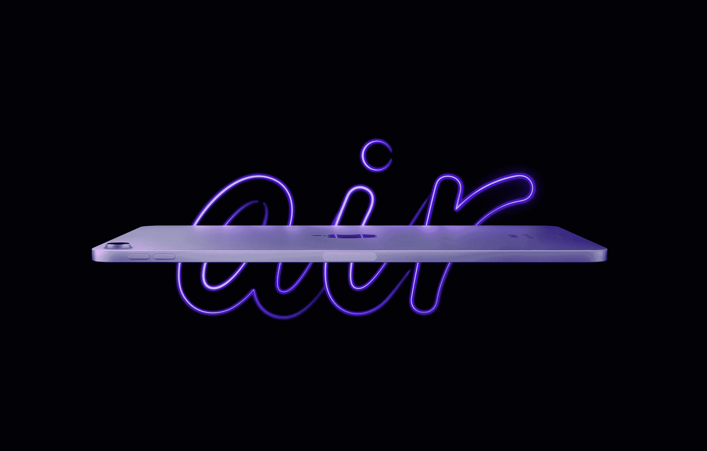
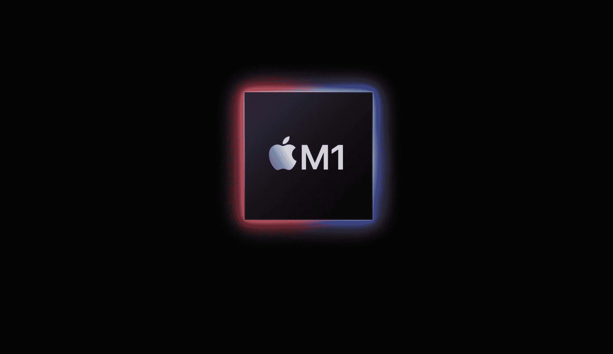
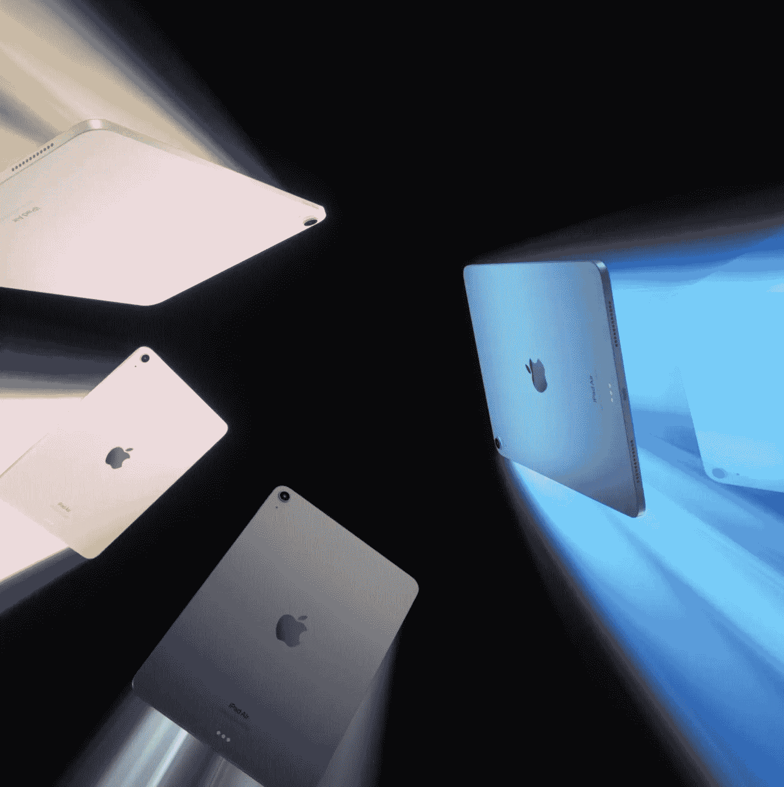
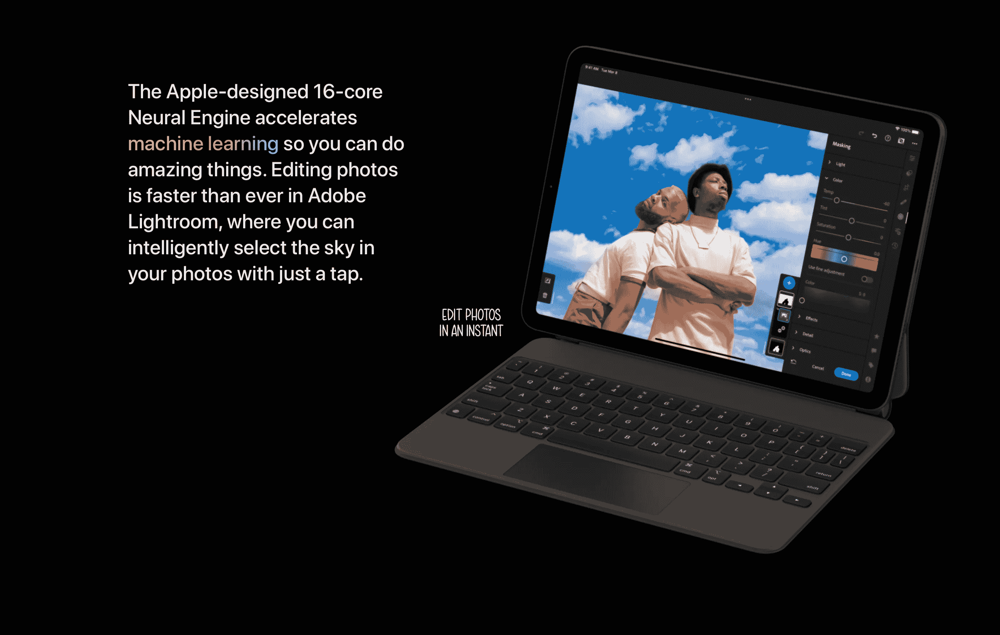

# iPad 丢了吗？

> 原文：<https://medium.com/codex/is-ipad-lost-31e14f61c1d6?source=collection_archive---------10----------------------->

## 有这么多可选择的，真不知道该挑哪一个

在上周 Peek 表演事件的所有狂热中，一位小角色球员感觉几乎没有人爱他。被赋予新的生命，拥有一些新的功能和颜色，这款 iPad 值得拥有它的阳光时刻。但我一直在想，iPad 现在是不是很迷茫？现在有四种型号可供选择，它们确实有相当多的重叠。

 [## 我们看到了最后一台大型 iMac 了吗？

### 这些伟大的机器现在已经成为历史了吗？

medium.com](/codex/have-we-seen-the-last-of-the-big-imacs-5d63bb4bf839) 

## 那有什么新鲜的？

首先，空气已经有了类固醇的过程，并被增压。科学家们给了它 M1 芯片。如果你想知道，是的，这是 MacBook Air，iMac，当然还有 iPad Pro 中的同一芯片。它还有一个 12MP 超宽的前置摄像头，位于舞台中央。它也有 5G——如果那是你的包！此外，它还有一个 10.9 英寸的液晶视网膜显示屏，具有真实色调和 P3 宽色彩。它有五种颜色，上周又增加了一种紫色。这一切都是你的 599。

如果对苹果有一个持续至今的抱怨，那就是他们在存储方面有多吝啬。599 型号仅配备 64 GB 板载，老实说，在 2022 年，这还不够好。我现在就想发起一个请愿，所有的制造商都应该从 128 GB 开始。是的，我知道有很多云存储解决方案，但我们不应该在购买的第一天就小心翼翼，希望我们的设备不会装满。128 GB 不仅能为您的大多数文件提供充足的空间，而且同样重要的是，它还能为越来越大的操作系统提供空间。

我前面提到的相机不应该被轻易忽略。它不仅是现在的 12MP 超宽相机，而且它处理所有光线条件的方式令人惊叹。它不仅能处理明亮的室外环境，还能处理光线充足的室内环境。对于一个传感器如此之小的相机来说，这确实是了不起的。如果在线电话会议是你工作流程的一部分，这款 iPad 将会让你梦想成真。一个巨大的摄像头*和*像样的麦克风使这款平板电脑成为在线聊天的冠军。

尽管如此，就性能和价格而言，iPad Air 是无可争议的。但是，你仍然要决定把钱花在哪里。你可以花 749 英镑买一台运行相同 M1 芯片的 iPad Pro，或者花 479 英镑买一台 iPad Mini。它与 iPad Pro 如此接近的方式很奇怪。只需再多花三分之一的钱，你就能买到基本款 Pro。但是，这对你有好处吗？Air 为您提供了与 11 英寸 Pro 相同的显示器，相同的 USB-C 连接器，并为您提供了相同的 8 核 CPU 和 8 核显卡。我越看越觉得这个平板电脑似乎代表了更多的价值。大多数用户会持有他们的平板电脑一段时间，通常超过五年。因此，为了避免买家后悔，考虑所有这些因素是很重要的。

更令人困惑的是，我们不要忘记还有第三代 iPad。好吧，所以你没有得到 M1 芯片，相机也没有那么好，但在 329 英镑的起始价格，你不得不承认，这也是一个非常有吸引力的选择。

空气并不完美。我提到了 64 GB 的存储空间。还缺少可扩展存储的选项。为什么，哦为什么，苹果不能给我们一个在*任何* iPad 上的 SD 卡插槽？见鬼，我会买苹果存储器，来搭配我刚买的 iPad，但是请给我一个插槽。

 [## 我永远不会折叠，事件和教训回来了

### 苹果观点——我对本周的看法

medium.com](/codex/never-will-ifold-the-event-lessons-are-back-69555dae31ce) 

## 比我们需要的还要多？

有了 M1 芯片，我们现在在这个小巧的手持平板电脑上拥有了比许多 Windows 电脑更强大的功能。就像上周宣布的 M1 超，我们有更多的权力，很可能，我们将永远不会需要。iPadOS 需要迎头赶上，然后苹果需要给我们提供与现有能力相当的应用程序。苹果的原生制作应用如 Logic & Final Cut 还要多久才能来到 iPad？如果 MacBook Air 可以处理它们，这意味着这些 M1 ipad 也可以。

苹果公司在苹果硅的开发上很聪明。他们开始为笔记本电脑设计芯片，然后几乎将芯片逆向设计到平板电脑和手机中。在这一点上，所有的开发成本都将被收回，所以它一直是盈利的。聪明，非常聪明。好像为了证明我的观点，看看上周活动上的 iPhone SE 就知道了。廉价 iPhone 现在运行的 A15 芯片与当前旗舰系列 iPhone 13 中的 A15 芯片相同。真是别出心裁。

## 支持

如前所述，许多平板电脑购买者将在未来几年内继续使用他们的平板电脑。这可能是你选择平板电脑的一个重要决定。从历史上看，苹果对其硬件的支持时间要比安卓对手长得多。这是制造芯片和平板电脑的美妙之处。对于苹果公司，你可以期待六到七年的操作系统升级等支持。

你不仅会得到苹果公司多年的支持，还会有最丰富的配件可供选择。随着智能连接器的出现，就像 Pro 一样，首先，你将有机会使用也许是最好的配件——魔法键盘。有了它，你就可以舒适地坐在膝上进行便携、强大的计算了。

 [## 苹果和谷歌——最好的伙伴？

### 他们是两个最大的科技巨头，但奇怪的是，也是好朋友

medium.com](/codex/apple-google-best-buddies-97e8d35a7983) 

## 被宠坏的选择

所以，正如你所看到的，苹果公司这些天用 iPad 给了你一个大实惠。问题是，有太多的选择，对于其中的大部分选择，很难明确决定哪一个适合你。这就是我们现在所说的 21 世纪的问题吗？

你的心和信用卡要带你去哪里？上周发布的 Air 是否吸引了你，或者你是一个专业用户？当我写这篇博客的时候，mini 就坐在我的一边——这表明，我们真的有太多的选择了。

祝你好运！

## 在你走之前

## 你订阅媒体了吗？

我只是高端博客网站 Medium 的众多作者之一。这是如此好的价值，你可以在这里加入 https://medium.com/membership

[T5 加入我的幕后邮件列表 ](https://www.talkingtechandaudio.com)

**原载于 2022 年 3 月 15 日 https://www.talkingtechandaudio.com/blog****的** [**。**](https://www.talkingtechandaudio.com/blog)