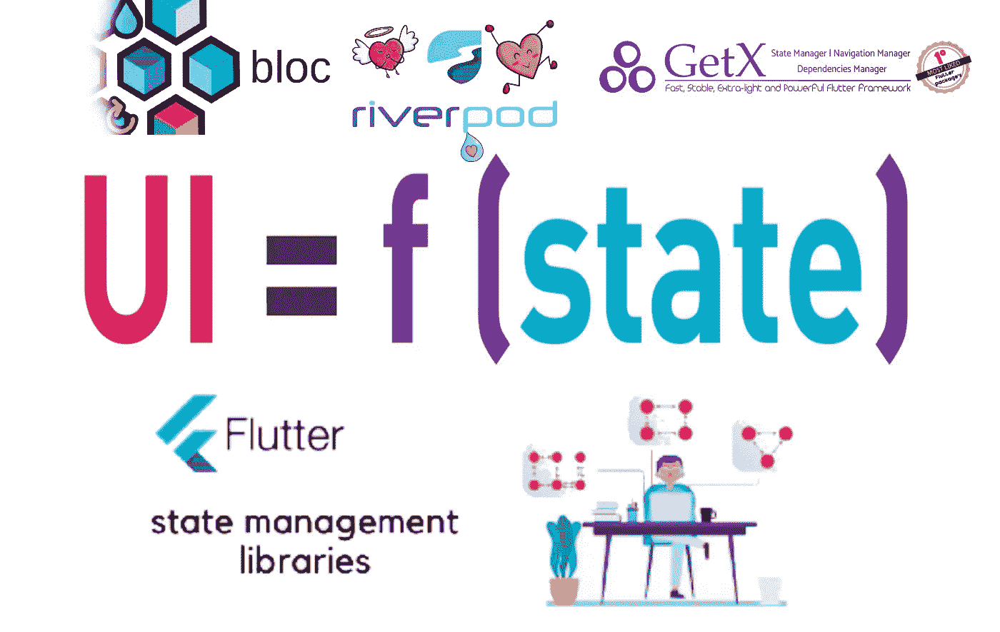

# 在 Flutter 中改变状态管理解决方案很难吗？

> 原文：<https://medium.com/codex/is-it-hard-to-change-state-management-solution-in-flutter-800fa5ad7d7a?source=collection_archive---------1----------------------->

你好，我的朋友们。在这篇文章中，我将谈谈我在 Flutter 中改变状态管理解决方案的经历。

每个想从 Flutter 入手的人都碰到了状态管理这个话题。到时候，人们必须决定至少一个国家管理解决方案。

我记得我是从*有状态* *小部件*开始的，它们有 *setState()方法*。此外，2 年前，有一些关于 *BloC* 的流言，他们说 *BloC* 是状态管理解决方案中最难的一个，他们还建议使用这个库，因为在习惯使用它之后，你可以很容易地使用它。我很害怕，因为他们说集团是困难的，但我克服了它。我学会了如何找到绕过它的方法。这当然是一个例子。

直到我理解并了解了 *BloC* ，我才使用 BloC 库中的 *cubits* 。当这一天到来时，我决定学习 *BloC* ，并且我学会了。过了一段时间，在我提高了自己之后，我该去找工作了。我选择了*集团*，但是我没有**没有**考虑每个人都可以选择其他的方案。如果你加入了一个使用你的状态管理解决方案的团队，那么你可能是幸运的。但是，如果您使用与其他解决方案不同的状态管理解决方案，我也可以替您说。为什么？让我们越来越深入。

# 理解状态管理主题后，您可以使用所有这些工具

这个标题是状态管理主题的总结。随着时间的推移，你会习惯使用越来越多的状态管理和**不管你用什么**。您将学习如何用不同的方法管理状态。如果你使用 *Riverpod* ，那么你需要学习 *providers* 。如果使用 *BloC* ，则需要创建*BloC*和 *Cubits* 。假设你用 *getX* ，那么你需要了解 *obs-RX* 的东西。重要的是，有时你需要根据状态更新屏幕，有时你不需要。因此，您从库中选择一个状态管理解决方案，并将其应用于这个想法。例如，如果您使用 *BloC，*而不是 *getX，*然后而不是 *BlocBuilder* ，您可以使用 *getX* 中的 *Obx* 属性。这也是理解我写的东西的一个例子。

> 逻辑是一样的。

当然，**我不会说他们都是一样的**，他们有**不同的属性**，但是如果你几乎得到了一份工作，并且如果你是其中的决定者，那么你不应该忘记你可以暂时改变你的解决方案**。如果你的首席技术官希望你改变，因为他们用的是不同的，那么你可以改变它，并学习它。**

# **下定决心并愿意学习**

****

**现在，我是 Voltran App 的一名 Flutter 开发人员，这是一个教育平台(面向学生和教师)。我习惯了使用 Riverpod，但是他们使用不同的管理状态的解决方案。所以，这个项目很大，我知道我只能给一个建议，我们不会改变它，因为它需要太多的时间。所以我决定学习 *getX* 库并且我几乎学会了。如果我想换工作，或者如果我想用我喜欢的状态管理解决方案为 YouTube 或 Medium 创建内容，那么我可以很容易地创建它。你可以认为这和你是学生是一样的，那么你在物理中也要用到数学。状态管理部分有一个循环。我强烈建议不要只坚持其中之一。你应该严格学习其中的一个，但是**你也应该是可切换的**。**

**这就是我的全部。欢迎在评论区提问。此外，你可以从 [**这里**](https://github.com/alper-efe-sahin) 看一下我用不同的状态管理解决方案创建的开源应用。最后，我强烈建议你看一下我的 YouTube 频道上来自 [**这里**](https://www.youtube.com/channel/UCcsgi-iDYAtQPmWI7I8e0pg) 的视频。**

**感谢您的阅读，敬请关注！**

****