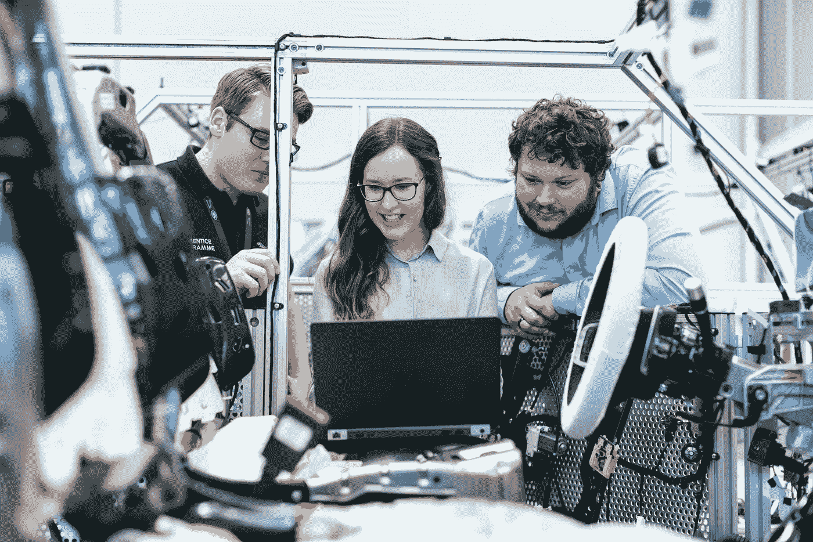

# 一个程序员有必要了解计算机在硬件层面是如何工作的吗？

> 原文：<https://medium.com/codex/is-it-necessary-for-a-programmer-to-understand-how-the-computer-works-at-the-hardware-level-482b7cf10515?source=collection_archive---------27----------------------->

## 让我们在这篇文章中讨论这个问题。

洛伦佐·埃雷拉在 [Unsplash](https://unsplash.com) 上的照片

我先说我遇到过各种水平的程序员；我有精通硬件的程序员，他们是硬件专家。我遇到过懂一点硬件知识的程序员，也遇到过一无所知的程序员。好消息是他们都有工作，这意味着，一般来说，你不需要了解计算机硬件就能找到工作。也有例外，我们稍后会讲到。但我认为了解计算机硬件是个好主意。今天你不需要这种理解，因为在很大程度上，计算机语言工具像 Java、C#和 Python 一样在今天被使用。它们是一种高级编程语言，所以在你编写的代码和计算机硬件之间有一个抽象层，所以你不需要处理芯片级访问或任何类似的事情，所以不需要你理解那个级别的计算机硬件。 ***然而在过去的几年里，你需要对芯片组有一个基本的了解，以及如何最大限度地利用它来开发你的硬件。所以你不需要这么做是件好事，因为这意味着你可以用这些语言中的任何一种编写程序，并支持在不同硬件上运行的各种操作系统。但是具体的工作，如果你想从事嵌入式编程之类的工作，那就是为设备开发软件，编写驻留在芯片上的软件，通常是汇编语言或 C 语言，你可能会从计算机硬件知识中受益。如果你想进入 Linux 内核并支持这个开源项目，一些计算机硬件的知识将是非常有益的。诸如此类，如果你要进入那个领域，你应该有一些知识。***

另一个例子是设备驱动程序。因此，如果你正在为显卡驱动程序或软件驱动程序或类似的东西编写软件，它们通常是用汇编语言或 C 语言编写的，了解你编写的软件最终将在其上运行的计算机硬件，将是非常有价值的。

照片由[本工程图](https://unsplash.com/@thisisengineering)在 [Unsplash](https://unsplash.com) 上拍摄

所以在那些情况下，你可能需要一些计算机硬件经验，也许这是强制性的。事实上，我认为，拥有这种知识对这些职位来说是非常可取的。所以说，如果你不打算进入这些领域，我仍然认为了解计算机硬件对你是有用的。例如，当你在计算机上创建这个变量时会发生什么？它是如何存储在计算机的内存中的？这是一项有价值的技能，因为在某些情况下，它可以帮助你成为一名更高效的程序员。毕竟，你对幕后发生的事情有了更多的了解。甚至其他变量，比如字符串，实数或双精度数，都将有助于理解它们是如何存储在计算机硬件中的，因为，同样， ***它可以让你思考，并有望让你更有效率。***

所以我想这些天来，不太需要关注你的计算机程序使用了多少内存，但当然，这是一个问题。即使是今天的现代计算机，你也可能会耗尽内存，可能会标配 8g 内存，这在今天或更高的时候很常见。仍然有可能耗尽内存，其中一个原因是，我们今天使用的操作系统允许许多不同的计算机程序同时运行，即使有大量的内存，也仍然有可能耗尽内存，因为特定计算机上的内存可能会被许多其他程序使用。因此，在可能的情况下保持高效仍然是值得的，想想看，在我看来，保持高效基本上是一个程序员应该具备的好技能。所以这可能是一种心态，所以这就是为什么我建议你必须学习更多关于硬件的知识以使你成为一名更好的程序员，因为它只是让你思考并试图在编程中更有效，这总是一项好技能。

照片由 [Giu Vicente](https://unsplash.com/@giuvicente) 在 [Unsplash](https://unsplash.com) 上拍摄

这就是总结。程序员需要硬件知识吗？嗯，对大多数工作来说，也许不，你不需要有任何工作。有些工作是必不可少的，拥有计算机硬件经验和对它的理解对你来说是至关重要的，但一般来说，你不需要。但是我认为拥有基本的计算机硬件知识对所有程序员来说都是有益的。

好吧，我希望这有所帮助。如果您有任何问题，请随时留下您的意见，我会尽快回复您。我很快就会见到你！