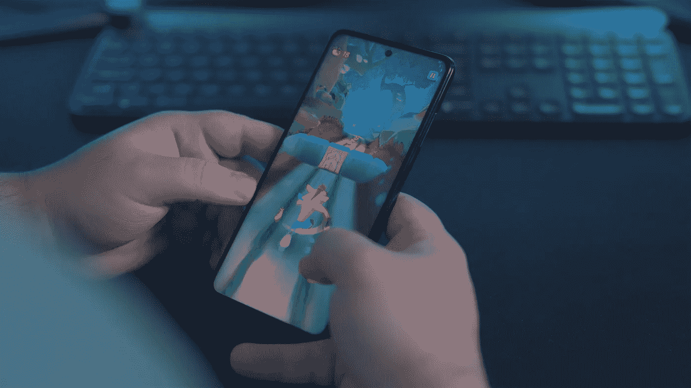
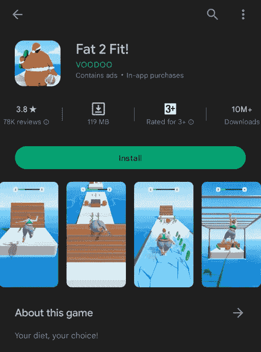

# 做一款手游值得吗？

> 原文：<https://medium.com/codex/is-it-worth-it-to-make-a-mobile-game-4a8b4279810?source=collection_archive---------17----------------------->

## 手机游戏市场的真相以及单人开发者有机会成功吗？

图片由 [Unsplash](https://unsplash.com/photos/2M6qt9fzRBw) 上的 [Onur Binay](https://unsplash.com/@onurbinay) 拍摄

视频游戏市场是当今世界增长最快的市场之一。今天，它的价值约为 2000 亿美元，预计从 2022 年到 2030 年的复合年增长率(CAGR)为 12.9%。移动设备是主导市场的细分市场，2021 年的收入份额最大，超过 40%，预计在未来十年将保持主导地位。这个巨大的视频游戏市场将吸引更多的公司和投资者，甚至是个人开发者。

我一直有这个想法，游戏开发很酷，有一天一定要做一个游戏。几周前，我决定是时候开始我的游戏开发之旅了，以我的编程经验，任务已经完成了一半。于是，我决定做一款手机游戏，同时在苹果应用商店和谷歌 Play 商店发布。我非常兴奋，并开始计划游戏设计以及是否会包含广告和付费版本将包含什么。在那一点上，不知何故我保证我能赚到一些值得我花费时间和精力的利润，但是我错了。

手机游戏市场并没有像包括我在内的许多人预期的那样运行。应用程序商店中的趋势游戏部分已经为游戏工作室设置，他们只为营销和广告支付了大量资金。

与付费登顶、拥有现有声誉和粉丝基础的竞争对手竞争几乎是不可能的。结果，荒谬的游戏最终在应用商店排名靠前，只是因为它们有很高的营销预算，而大多数单人开发者都没有。

应用商店包含成千上万的游戏。在应用商店上推出一款游戏，就像在网上推出一个网站，然后等着人们注意到它。如果你幸运的话，一些人会找到你的游戏并下载它，但是如果没有一个可靠的营销策略，就不要指望有流量。

此外，**如果你开始制作手机游戏赚钱，这不是最好的主意。**通常，你会在 Google Play 和 App store 上发布游戏，因为它们是最大的两家应用商店。对于这两者，你需要建立一个开发者账户，不幸的是，这不是免费的。对于 Google play，一次性费用为 25 美元，加入苹果开发者计划的年费为 99 美元。

此外，苹果和谷歌都对游戏中的任何一次性购买收取 30%的费用。但和苹果一样，一年后，谷歌对你订阅收入的提成降至 15%，所以 12 个月后，你将保留 85%的收入。

移动游戏市场是一个竞争激烈的市场，它不取决于你的游戏有多好，而是取决于如何吸引更多的人。

这样一来，作为一个单人开发者来开发手游，尤其是为了赚钱，就不是最好的策略了。基本上，手机游戏要么非常成功，赚了很多钱，要么下载量勉强达到 1000 次。