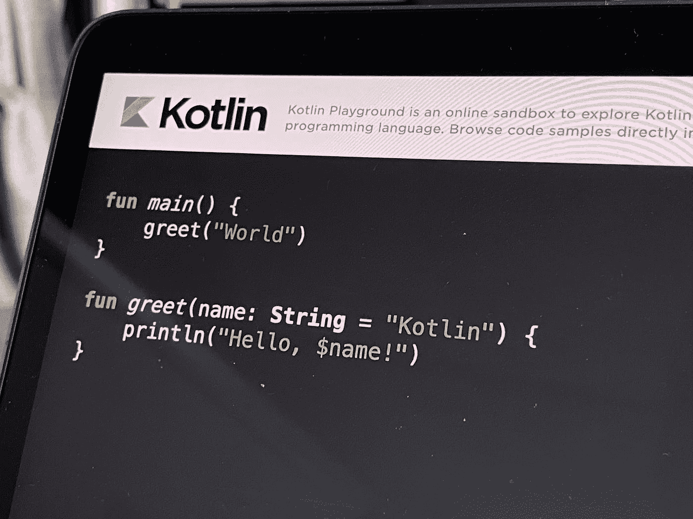
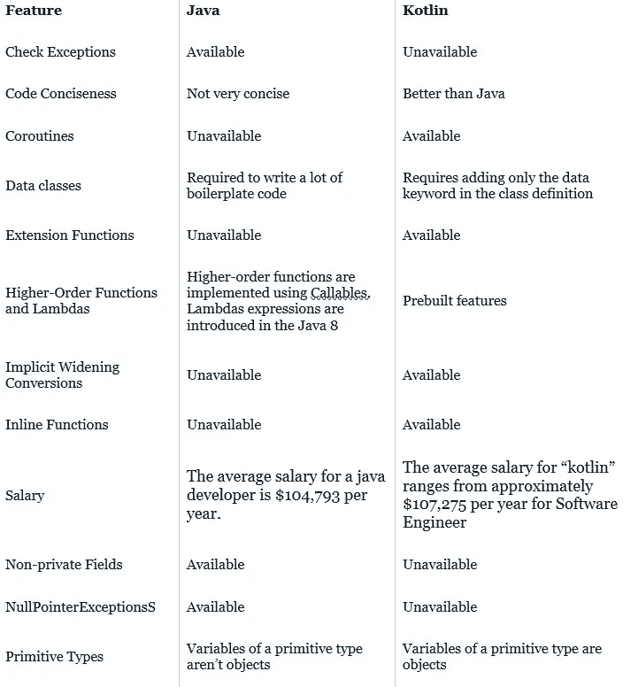

# JAVA 死了吗？(撕😢JAVA)

> 原文：<https://medium.com/codex/is-java-dead-rip-java-2d91aa663ddd?source=collection_archive---------6----------------------->

## JAVA 会被 KOTLIN 取代吗？

现在 android 工作室已经正式宣布 java 可能会被 kotlin 取代。2019 年 5 月 7 日早些时候，谷歌宣布 Kotlin 编程语言现在是其 Android 应用程序开发者的首选语言。自 2017 年 10 月 Android Studio 3.0 发布以来，Kotlin 一直作为标准 Java 编译器**的替代产品被包括在内。**为了理解争论的双方，我们先仔细看看它们的含义。

# **为什么是科特林？**

Kotlin 是一种通用、免费、开源、静态类型的“实用”编程语言，最初是为 JVM (Java 虚拟机)和 Android 设计的，它结合了面向对象和函数式编程特性。现在让我们来了解一下什么是 java。

照片由[路易·蔡](https://unsplash.com/@louis993546?utm_source=medium&utm_medium=referral)在 [Unsplash](https://unsplash.com?utm_source=medium&utm_medium=referral) 上拍摄

# **为什么是 java？**

Java 是 Sun Microsystems 开发的一种高级编程语言。它最初是为机顶盒和手持设备开发程序而设计的，但后来成为创建 web 应用程序的流行选择

Java 语法类似于 C++，但严格来说是一种面向对象的编程语言。例如，大多数 Java 程序包含用于定义对象的类和分配给各个类的方法。

Michiel Leunens 在 [Unsplash](https://unsplash.com?utm_source=medium&utm_medium=referral) 上拍摄的照片

*现在让我们来谈谈它们之间的区别*

# **Java 和 kotlin 的区别**

## 1.扩展功能

与 Java 不同，Kotlin 允许工程师扩展类的有用性，而无需从根本上从类中获取。为了在 Kotlin 中实现扩展功能，工程师应该在利用“.”实现的功能的名称前面加上类的名称(将被扩展)文档。

在 Java 中，为了扩大当前类的用途，应该创建另一个类，并从父类获得功能。因此，扩展功能是不可用的。

## **2。零安全**

Java 中著名的 NullPointerExceptions 让设计者非常头疼。NullPointerExceptions 背后的思想是，它使客户能够将无效值记入任何因子。然而，假设客户试图利用一个最终具有无效价值的项目引用。考虑到所有的事情，Java 的 NullPointerExceptions 成为一个不可或缺的因素，并且打开了一个设计者需要处理的例外。

相反，在科特林那里，把无效的品质归功于因素或项目当然是不可想象的。假设我们试图这样做，代码将在安排时间失败。因此，在 Kotlin 中没有 NullPointerExceptions。尽管如此，万一设计者希望将一个无效的值降级，检查被明确称为可空的变量是可行的。为此，应该加上一个问号:

Val num: Float？=空

## **3。代码**

Kotlin 和 Java 的一个重要区别是 Kotlin 需要的代码少得多。它是一种非常简洁的语言，减少了代码出错的可能性，提高了工程师的工作效率。

一般来说，Kotlin 的简洁性使得构建大型企业更加合理，因为它通常比 Java 需要更少的代码行来构建完全相同的功能。此外，它知道如何在不破坏语言结构连贯性的情况下保持简短和重点突出。

## **4。智能投射**

要在 Java 中转换一个对象，开发者必须**检查变量的类型**与操作一致。

在 Kotlin 中，**造型检查由智能造型特性**处理。Kotlin 的智能编译器通过“is-checks”关键字自动管理冗余转换(具有稳定的值)。

## 5.协程支持

在 Android 中，理所当然地，在相似的周期和字符串中运行相似的应用程序的部分通常被间接称为主字符串，并对 UI 负责。网络 I/O 和 CPU 升级的任务被认为是大量的。当这两个活动都开始时，特定的调用字符串被阻塞，直到整个工作完成。

为了避免基础字符串的复杂性，Java 允许在处理扩展任务时创建不同的基础字符串。缺点是处理不同的字符串是一项令人难以置信的任务，可能会导致代码中出现更多的错误。

此外，Kotlin 同样能够制作不同的琴弦。无论如何，它提供了一种更高级、更直接的安排:协程。

协程是如何工作的？事实上，协程是无栈的，它允许工程师编写代码，暂停执行，然后再继续执行。这赋予了一个看似协调的无阻碍的另类代码。因此，协同程序尽量不要有这么多的字符串，而不是让设计人员在以后处理大量的字符串。除此之外，它们比 Java 的答案更加清晰简洁。

## **6。检查异常**

检查异常在 Kotlin 上不可用。因此，Kotlin 的开发人员不需要捕捉或声明异常。这是好事吗？嗯，看情况。

Java 开发人员已经检查了异常支持。因此，它们必须捕捉并声明异常。一方面，这可能令人沮丧且耗时。但是，另一方面，它确保了健壮的代码和正在处理的错误。因此，检查异常支持有其优点和缺点。最终，这取决于每个开发人员最重视什么。

[制作者 UX 设计工作室](https://unsplash.com/@weareprocreator?utm_source=medium&utm_medium=referral)在 [Unsplash](https://unsplash.com?utm_source=medium&utm_medium=referral) 上拍摄的照片

## 7.数据类别

一方面，在 Java 中，**开发人员需要建立字段**(或变量)来存储数据、构造函数、字段/变量的 getter 和 setter 函数，以及其他函数，如 hashCode()、equals()和 toString()。

说实话，这些类主要是用来存储数据的，没有(或者最多只有很少)功能。

另一方面，Kotlin 提供了一种更直接的方法来创建保存数据的类，只需在类定义中包含“data”关键字。然后，编译器将为几个字段/变量自动生成构造函数以及 getter 和 setter 函数。

## **8。函数式编程:高阶函数和 Lambdas**

正如文章开头提到的，Kotlin 是面向对象和函数式编程的混合体。

函数式编程是一种基于数学函数处理计算的声明式编程风格。**高阶函数**和 lambda 表达式是(一些)函数式编程概念。

第一个表示函数应该被认为是一流的。因此，Kotlin 这种静态类型语言可以充分利用各种函数类型来表示函数。换句话说，有可能以多种方式操作功能。

此外，还可以在 Kotlin 中使用 **lambda 表达式**或匿名函数。这些被认为是“功能文字”。因此，它表示一个没有声明并立即作为表达式传递的函数。

相反，Java 更局限于面向对象编程的概念。然而，它也朝着函数式编程迈出了一些步伐。从 Java 8 开始，2014 年， **Java 推出了 lambda 表达式**，这是一个不一定属于某个类也可以创建的函数。Java 中的 Lambda 表达式可以作为对象传递，可以按需执行。

此外，随着 lambda 表达式的引入，Java 也开始支持高阶函数。Java 将函数与方法关联起来，Java 8 支持 lambda 从方法返回。

照片由[弗洛里安·奥利佛](https://unsplash.com/@florianolv?utm_source=medium&utm_medium=referral)在 [Unsplash](https://unsplash.com?utm_source=medium&utm_medium=referral) 上拍摄

## 9.隐式转换

一方面，Kotlin 不支持隐式扩大转换。因此，较小的类型不能转换为较大的类型。为了克服这一点，Kotlin 开发人员必须执行显式转换来实现所需的转换类型。

另一方面， **Java 支持隐式转换**，这意味着开发人员不需要执行显式转换。

## **10。原始类型**

在 Java 中，原语类型的**变量不是对象**；它们是在 Java 的数据类型中预定义的。Java 有八种不同的原始数据类型:int、byte、short、double、float、boolean、char 和 long。因此，这些变量不能是由结构或类表示的对象。

即使基本类型不是类，Java 开发人员也可以使用能够包装基本类型值的类。要使用 Java 做到这一点，开发人员必须明确指出。

相比之下，在 Kotlin 中，只要你初始化一个原始类型的变量，它就会被自动视为一个对象。

肯尼·埃利亚松在 [Unsplash](https://unsplash.com?utm_source=medium&utm_medium=referral) 上拍摄的照片

## 11。通配符类型

典型的一个*问号(？)*在代码中被视为通配符，暗示未知类型(变量、字段或参数)。

与 Java 不同， **Kotlin 不提供通配符**。相反，它有一个声明-

## 12.公共字段

Java 中有公共字段(也称为非私有字段)。在对象的调用者需要根据同一对象的表示进行修改的情况下，它们会非常方便，因为它使开发人员能够在不需要调整调用者的情况下改变对象的表示。这样，字段可以是公共的；因此，公共 API 保持不变，程序可以保持一定程度的可维护性。

相比之下，Kotlin 没有公共字段。

# java vs kotlin 总结

# 结论

那么，哪个更好，该不该用呢？这个问题的答案取决于你的需求。如果你正在寻找一种有谷歌坚实支持的语言，那么 Kotlin 可能是最好的选择，因为 Android Studio 3 现在支持 Kotlin 开发。灵活性*(特别是在第三方库方面)*，Java 可能是你的正确选择。

> 我希望这篇文章对你来说是有益的和有趣的。这是我最近的一些文章。*(如果你喜欢我的文章，我希望有像你这样的观众，这有助于我鼓励你做出像这样的精彩文章，所以如果你关注我继续获得我的最新文章，我会很感激，*这是我的网站【https://infoyl.com/blog/】T5*)*

 [## 为什么 python 如此强大🤴

### 为什么每个人都喜欢 python 胜过其他语言

medium.com](/@krishishah2021/why-python-is-so-overpowered-2dc747cf28dc)  [## 软件开发和 web 开发的 10 个主要区别

### 软件开发和 web 开发的区别。

medium.com](/@krishishah2021/10-key-differences-between-software-development-and-web-development-a1e42867c623)  [## 面向对象编程和面向过程编程的 10 个关键区别

### POP 和 OOP 的区别

medium.com](/@krishishah2021/10-key-difference-between-object-oriented-programming-and-procedure-oriented-programming-35b608f08dea)