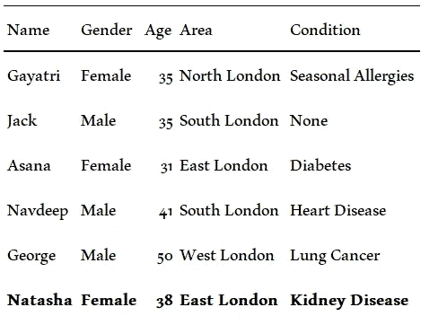
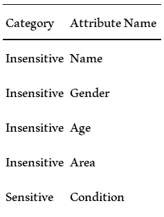
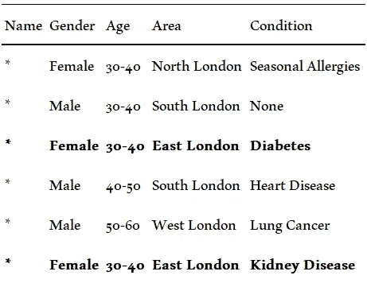
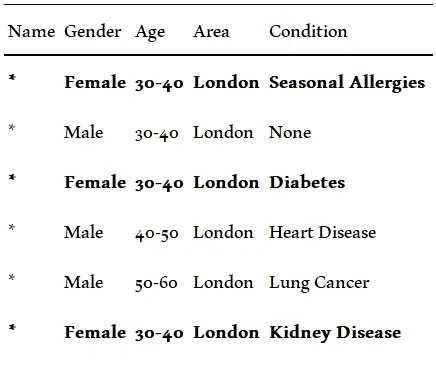

# K-匿名化的患者信息安全吗？

> 原文：<https://medium.com/codex/is-k-anonymised-patient-information-safe-e7de8384d4bd?source=collection_archive---------8----------------------->

新冠肺炎疫情奖意味着卫生组织与研究人员公开分享患者健康信息的压力增加。然而，这种个人健康信息的披露会引起严重的隐私问题。

[粘土银行](https://unsplash.com/@claybanks?utm_source=medium&utm_medium=referral)在 [Unsplash](https://unsplash.com?utm_source=medium&utm_medium=referral) 拍摄的照片

# **最主要的隐私问题是什么？**

当数据代表具有指纹的唯一个人时，任何对该个人有足够了解的人都可以识别该指纹以识别数据记录。如果这种情况发生，某人可能会知道记录中其他一切。

# 什么是匿名化？

以不可逆转的方式更改个人数据的过程，因此无法通过单独的数据或与其他方合作来识别数据主体。

# **什么是**k-匿名？

为了缓解对数据隐私的担忧，通常会使用一种称为 *k* 的匿名方法，这是一种编辑单个记录中的信息的过程，这样就不会有任何特征集与单个数据记录相匹配。

> 如果不敏感属性的任意组合与发布数据中的至少 k 个个体匹配，则称一个数据集是 k 匿名的。

例如，考虑以下来自伦敦一家全科医生诊所的患者数据集——即使去除了姓名，任何认识娜塔莎并知道她的年龄、性别和地区的人都可能知道她患有肾病。

假想的 GP 患者记录数据集仅代表一名 38 岁的女性患者，因此任何认识 Natasha 的人都可以推断她患有肾病。

匿名的基本目标是使不敏感和敏感属性之间的信息难以推断。

将数据属性分为“敏感”和“不敏感”。条件属性为“敏感”,其余为“不敏感”。

有两种主要方法来编辑表中的信息，使其成为 k 匿名的。

1.  **数据抑制**:数据中可能根本不包含值。例如，在下面的匿名表中,“名称”列中的所有值都被替换为星号。
2.  **数据一般化**:数值可能不会像我们所知道的那样精确地发布，而是分时段发布。例如，“年龄”列中的值“35”可以替换为“30–40”。

经过 2 次匿名抑制和数据归纳后的相同数据集。现在有两项记录符合娜塔莎的年龄范围和性别。

在取消了所有患者姓名，并将所有年龄归纳为 10 岁以内之后，我们现在可以说我们的数据集是*2*-匿名的。因此，我们所知道的关于 Natasha 的任何不敏感信息现在至少与两个独立的记录相匹配——没有一个单独的患者记录可以从他们的敏感信息中被重新识别。

如果我们更进一步概括这个区域。我们将能够创建一个 3-匿名数据集。

3-匿名抑制和数据归纳后的相同数据集。现在有三项记录符合娜塔莎的年龄范围和性别。

# **匿名的 k-****患者信息安全吗？**

底线是，不。

虽然 k-匿名可能是一种可靠的方法，但隐私攻击者仍然可以推断出关于数据集的信息。

例如，如果攻击者正在搜索东伦敦的 38 岁女性娜塔莎，攻击者将能够推断出她患有季节性过敏、糖尿病或肾病。

> k-匿名不能防止攻击者推断信息。这是对隐私的严重侵犯。

# 进一步阅读

*   违背隐私承诺:回应匿名化的意外失败

# 参考

*   纳拉亚南，阿尔温德；维塔利.什马蒂科夫。大型稀疏数据集的鲁棒去匿名化。
*   迈克尔·卡恩斯；罗斯艾伦。伦理算法:社会意识算法设计的科学。