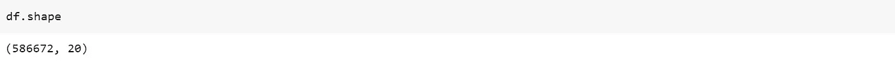
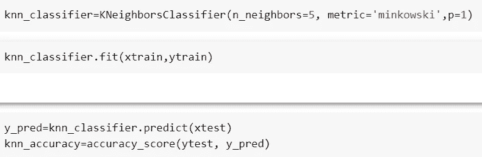
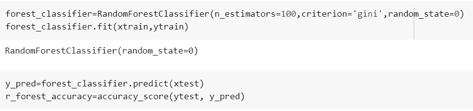

# 机器学习有能力预测一首歌的受欢迎程度吗？

> 原文：<https://medium.com/codex/is-machine-learning-capable-of-predicting-popularity-of-a-song-a7b6dad4ac39?source=collection_archive---------11----------------------->

音乐是我们生活中不可或缺的一部分；它决定了我们一天或任何时刻的心情。这是几乎每个人都能体会和享受的东西，除非你患有 [**音乐快感缺失**](https://mappingignorance.org/2018/07/02/musical-anhedonia-not-everyone-likes-music/) **:(** 作为一名吉他手，我总是好奇是什么让一首歌像病毒一样传播。幸运的是，我们出生在一个大多数事情都可以测量的时代，这使得预测一个事件发生的概率变得很容易。

在这个项目中，我试图从上个世纪发行的歌曲中汲取灵感，并预测一首歌是否会流行。用于此分析的数据集来自 Spotify 应用程序，可在 Kaggle 上获得。

作为典型的机器学习过程，执行以下步骤。
加载库
加载数据集
数据清理
探索性数据分析
将数据分成训练和测试
特征缩放
训练模型
模型选择

# **加载库**

# **加载数据集**

数据集包含 20 个特征，这些特征基于歌曲的流行度、技术/音乐参数(如响度、能量、音调等)来识别歌曲。

# **数据清理**

**空值:**数据集包含 71 个空值，由于与整个数据集相比不重要而被丢弃(< 1%)。

**不必要的特征:**id、id_artists、artists 和 name 等特征被删除，因为它们不能提供任何重要的信息。

**自定义列:**创建“Popularity_Class”列，该列将用作对歌曲是否流行进行分类的目标变量。

# **探索性数据分析**

**历年平均歌曲时长:**

从上面的视频中可以看出，在 1960 年代末和 1980 年代初，歌曲时长有所增加；这可能是由于技术革命，如磁带、光盘和互联网的发明。

另一方面，在过去几年中，平均歌曲持续时间有所下降**，其可能的原因可能是由于内容的选择性、 [**内容冲击**](https://www.ceralytics.com/what-is-content-shock/) 等各种原因导致用户的注意力持续时间下降。**

> 但是歌曲时长减少的主要原因被认为是艺术家的收入方式。如今，艺术家通过 Spotify、亚马逊音乐(Amazon music)等应用获得报酬，基于流媒体，而不是传统的按 EP/专辑付费的系统(即在卡带/CD 时代)。阅读这篇有趣的文章由 [**濒临**](https://www.theverge.com/2019/5/28/18642978/music-streaming-spotify-song-length-distribution-production-switched-on-pop-vergecast-interview)

**关联热图** 关联提供了两个特征之间关系的强度。“特征 1”和“特征 2”之间的正相关意味着随着“特征 1”的增加/减少；特征 2’也分别增加/减少。

从上面观察到的一些强相关性是
能量和响度(+)
能量和声音(-)
可跳舞性和价(+)

能量与声音

# 列车测试分离

出于建模的目的，我考虑了 2000 年以后发行的歌曲，因为它与今天更相关，并且考虑到数据量，不会破坏 IDE。

> 从 sklearn.model_selection 导入 train_test_split
> xtrain，xtest，ytrain，ytest= train_test_split(x，y，test_size=0.2，random_state=0)

# 特征缩放

为了在固定比例上标准化特征，执行特征缩放。
用于训练模型的两种算法(即逻辑回归和 K 最近邻)需要对独立特征进行缩放。

> 从 sklearn .预处理导入 standard scaler
> scaler = standard scaler()
> xtrain = scaler . fit _ transform(xtrain)

# 培训模型

我对以下三个模型的数据进行了训练
逻辑回归
K 近邻
随机森林

## 逻辑回归

逻辑回归是在因变量为二分变量时进行的分析。逻辑回归用于描述数据，并解释一个因变量与一个或多个名义变量、序数变量、区间变量或比率水平自变量之间的关系。

## k-最近邻

k-最近邻算法是一种监督学习分类器，它使用邻近性来进行分类。它脱离了可以在彼此附近找到相似点的假设。

由于模型中存在高维度，我使用了曼哈顿距离(即 p=1)而不是欧几里德距离，并将邻居设置为 5，以从计算角度保持计算简单。

## 随机森林

这是一种基于系综树的学习算法。随机森林分类器是从随机选择的训练集子集得到的一组决策树。它聚集来自不同决策树的投票来决定测试对象的最终类。

同样，为了简化计算，通过“基尼”指数来计算杂质，并且树的数量(n _ 估计量)被设置为 100。

**模型精度:**

# 型号选择

上述模型是在设定的随机状态下训练的，即(random_state=0)。为了检查任何随机数据集的所有模型的准确性是否过度拟合，我们需要计算交叉验证分数。

**交叉验证** 交叉验证提供分类器泛化能力的信息，特别是分类器的预期误差范围。

基本上，它通过在不同的随机数据集上训练模型来计算精确度，并进一步给出平均精确度。

“cv”是交叉验证迭代，基本上是在不同的随机数据集上训练模型的迭代次数。

从上面的准确度结果可以明显看出**随机森林**算法是一个更好的音轨流行度分类器。

> 可以得出结论，机器学习模型能够使用各种特征对音轨的流行度进行分类。