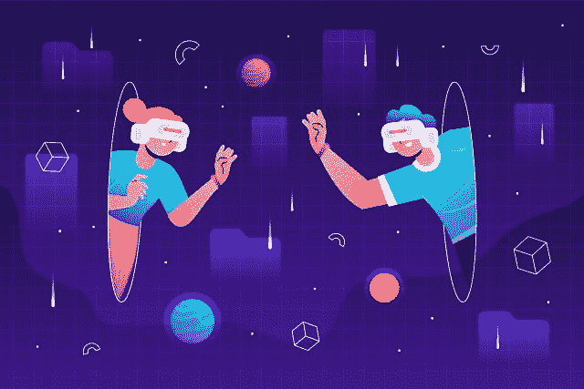

# 没有区块链，元宇宙可能吗？

> 原文：<https://medium.com/codex/is-metaverse-possible-without-blockchain-8f65aa274fae?source=collection_archive---------4----------------------->

元宇宙是一个新的数字平台，使用区块链和数字识别技术，通过共享的元宇宙或在线 3D 世界连接用户。元宇宙利用区块链的力量在数字领域连接个人，让他们以更高效、更安全、更具成本效益的方式进行构建、互动和交易。

元宇宙渴望建立一个开放、包容和公平的数字环境，在这里任何人都可以表达自己，建立关系，创造价值。由于其区块链、数字身份和虚拟现实的技术基础，元宇宙提供了新一代的在线服务和体验。

术语“元”暗指“超越”，而“诗”指的是“宇宙”。此外，一些人用元宇宙这个词来指代虚拟世界，玩家可以在其中旅行并相互交流；例如，在一个世界中，开发者可以创建现实中不存在的建筑、公园、标志和其他项目。它有大规模的头顶盘旋灯光秀和众所周知的街区(三维时空的规则被忽略，还有人们可以去打猎和互相残杀的自由战斗区)。

## 为什么元宇宙越来越受欢迎？

在新冠肺炎疫情爆发期间，人们的生活方式发生了巨大变化，学生们开始参加在线课程并在家工作。工作环境的这种转变需要在家里工作或学习时提供真实世界的体验。脸书于 2021 年 10 月更名为 Meta，以反映其创建虚拟世界或元宇宙的目标。

另请阅读:[为什么元宇宙迅速走红？(blockchainshiksha.com)](https://blockchainshiksha.com/metaverse-technology-product-marketing/)

# 区块链和元宇宙的相互关系

在新冠肺炎疫情爆发期间，人们的生活方式发生了巨大变化，学生们开始参加在线课程并在家工作。工作环境的这种转变需要在家里工作或学习时提供真实世界的体验。脸书于 2021 年 10 月更名为 Meta，以反映其创建虚拟世界或元宇宙的目标。

元宇宙是一个广泛的想法，区块链技术，像其他新技术一样，预计将发挥作用。它是机器学习、人工智能、虚拟现实和区块链等几种技术的集合，这些技术被整合在一起，和谐地工作，彻底改变了我们与互联网的交互方式。

元宇宙是一个三维虚拟现实领域，用户可以在一个完全沉浸式的环境中与数字对象以及彼此进行交互。元宇宙是无限的、连续的、实时的、独立的、可互操作的和分散的。

显而易见，加密货币可以帮助元宇宙实现其目标。在价值或物理形式方面，加密货币与现实世界的法定货币没有关系。因此，它是虚拟世界中一种便捷的支付和交易方式。

此外，根据定义，#元宇宙是分散的。没有人不应该统治元宇宙，货币去中心化将大大有助于实现这一目标。

此外，加密货币(以及一般的区块链技术)可能是不断变化的世界中的一个有价值的锚。

在元宇宙，我们的周围环境、自然栖息地、人们的外貌、产品等等会随着开发者的活动和正在进行的定制而变化。区块链和加密货币的不变性将带来关键的稳定性。

与此同时，我们不能忽视权力下放是元宇宙的一个关键因素。通过采用区块链技术，用户可以在虚拟现实中保护他们的数字资产。这一点在区块链的项目中得到了强调，如“[沙盒](https://www.sandbox.game/en/)”和 Axie Infinity，因为它们与元宇宙有关。

区块链技术的其他特性，如转让价值、数字可收集性、所有权的数字证明、可访问性、治理和互操作性，也是有效执行元宇宙所必需的。这些区块链功能为用户提供了一种经济高效且透明的选择。

区块链的跨链兼容性是元宇宙的基石。通过跨链兼容区块链，用户可以在区块链之间使用他们的加密令牌，包括可替换和不可替换的令牌。

**最后的想法:**尽管区块链对于元宇宙环境来说并不必要，但它为元宇宙增加了价值。区块链增加了元宇宙的价值。看到元宇宙在未来如何发展将是令人着迷的。请继续关注我们，并在下面的方框中评论您的观点，了解更多精彩的故事。团队区块链 Shiksha 会很乐意和你互动。

*原载于 2022 年 4 月 30 日 https://blockchainshiksha.com***。**