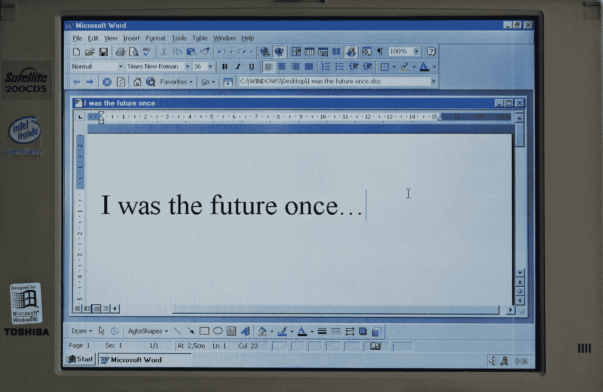

# 微软 Access 死了吗？

> 原文：<https://medium.com/codex/is-microsoft-access-dead-470c036cb4f6?source=collection_archive---------0----------------------->

## 现代数据科学和分析团队有哪些替代方案？

由 [Pedro Santos](https://unsplash.com/@pedro_ag_santos?utm_source=unsplash&utm_medium=referral&utm_content=creditCopyText) 在 [Unsplash](https://unsplash.com/s/photos/microsoft?utm_source=unsplash&utm_medium=referral&utm_content=creditCopyText) 上拍摄的照片

在过去的几十年里，微软 Access 拥有使用权。当 Excel 变得过于复杂和繁琐时，在开发出更复杂和编程工作量更大的 MySQL 或 MSSQL 解决方案之前，MS Access 通常被用作一种解决方案。

## 为什么 MS Access 变得如此…