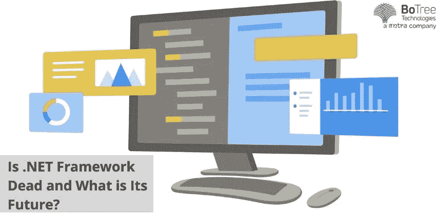

# 是。NET 框架死了，它的未来是什么？

> 原文：<https://medium.com/codex/is-net-framework-dead-and-what-is-its-future-958cc04311a5?source=collection_archive---------0----------------------->

自 2002 年 1 月成立以来，微软 ASP.NET 走过了漫长的道路。长期以来，该平台一直是大多数 [**定制软件开发服务**](https://www.botreetechnologies.com/dot-net-development-company) 提供商的热门选择。但是，在经历了 20 多年的巨大影响之后。NET 框架已经受到质疑。而有些人。NET 专业人士称它为未来的强力播放器，一些人对它缺乏更新感到失望，并宣布它已经死亡。

不管死了没有，根据 w3techs**的一份报告，在所有已知服务器端编程语言的网站中，仍有 7.9%在使用 ASP.NET。然而，它远没有接近 PHP 的使用统计数据，后者占所有框架的 78%。**

**在技术的世界里，变化是唯一不变的。是否有一个巨大的变化等待着我们。NET 框架？的未来是什么。NET 框架？让我们深入研究一下。**

# ****什么是 ASP.NET？****

**ASP。NET 被设计开发为一个开源的服务器端 [web 应用框架](https://www.botreetechnologies.com/web-application-development)用于 web 开发制作动态网页。这是一个免费的 web 框架，可以用来在 Windows 上构建和运行桌面和服务器端应用程序。。NET 兼容 C#、F#、Visual Basic 等高级语言。**

# ****是。NET 框架死了？****

**虽然没有明说，但微软已经明确表示。NET 框架，正如我们今天所知，正在走向退休之家。正如[broadbandsearch.net](https://www.broadbandsearch.net/)的联合创始人等行业专家在 [ifourtechnolab 的](https://www.ifourtechnolab.com/blog/is-net-framework-dead-and-what-is-its-future#:~:text=It%20is%20dead%20because%20it,company%20itself%20announced%20its%20end.)网站上评论的那样——“看起来。NET 的产品周期即将结束。虽然不是在不远的将来，但它肯定已经有了一个结束日期，v.4.7 将在 2022 年结束。”**

**2019 年，微软宣布。NET v.4.8 将是该框架的最后一个版本。但这并不意味着遗留框架系统的实际终结。随着的发布。2019 年晚些时候的网芯 3.0，一个全新的时代。NET 框架开始了。最终，。NET Core 5.0 继承了。网芯 3.0。因此，换句话说，可以说。NET Core 取代了 legacy。NET 框架。但是，它没有包含许多。NET Framework 做到了。**

**在的新框架中，许多原有框架的遗留系统已被替换或停止使用。网芯。比如说，[。NET 应用程序开发服务](https://www.botreetechnologies.com/dot-net-development-company)企业一直在使用。NET web 窗体和 Windows Communication Foundation(WCF)。网芯 5.0。这迫使许多 ASP.NET 核心开发公司分别使用 Blazor 和 gRPC 或 CoreWCF 等替代产品。**

**总的来说，微软已经尝试统一了。NET 和。NET 核心平台。通过这些方式，开发者不再能够利用原始平台的关键特性。从这个意义上说。NET 框架好像死了。**

> ****多读:**[的利弊。NET 应用开发](https://www.botreetechnologies.com/blog/pros-and-cons-of-net-application-development/)**

# ****的未来是什么。NET 框架？****

**很明显。NET 框架正在被淘汰，微软现在正致力于开发它。NET Core 通过每年引入相关的最新版本而变得更加敏捷和强大。[。NET 6.0 版本](https://www.botreetechnologies.com/blog/top-things-know-about-net-6/)不顾新冠肺炎疫情的反对条件，于 2021 年 11 月初发布。的。NET Core 7.0 和 8.0 版本计划分别于 2022 年和 2023 年的 11 月发布。同时，旧系统继续根据需要接收较小的更新。这有助于。net 开发服务保持领先。**

**的。NET 5.0 和 6.0 版本具有跨平台的能力，并且大部分提供了大多数开发人员所寻求的东西。他们更适合物联网(IoT)和移动应用程序开发。**

**版本 6.0 的更新是独一无二的，因为它改变了专利。 [NET framework](https://topdigital.agency/top-20-reasons-to-choose-net-for-enterprise-application-development/) 成为一个开源的、跨平台的开发平台。这是最快和最安全的。网还没有。该版本具有以下几个特点:**

*   **提高安全性**
*   **长期支持版本**
*   **热重装**
*   **全面提高性能**
*   **面向浏览器、云、桌面、移动和物联网的统一平台**
*   **Arm64 支持**
*   **语言改进的 C# 10 和 F#6**

**诸如此类的版本和更新增强了框架的能力，并给所有. net 开发公司注入了信心。[企业](https://www.botreetechnologies.com/blog/why-companies-use-net-for-enterprise-development/)现在更致力于未来的持续使用。**

**根据 [**2020 年开发者调查**](https://insights.stackoverflow.com/survey/2020#technology-most-loved-dreaded-and-wanted-web-frameworks-loved2) **，**如果单纯关注 web 框架，ASP.NET and.NET 核心均以 22.9%和 20.3%的份额跻身开发者选择的前十大框架。**

*   ****开源政策:**降低进入互联网的门槛。NET 帮助微软赢得了声誉，就像 Java 和 Python 一样，它们的信誉和价值很大程度上归功于它们的开源政策。的。NET 6.0 教育可访问性可能会改变。NET 在 2022 年向前发展。**
*   **的未来。NET Apps: 用。NET 将继续不受阻碍地运行，不需要添加更多的功能。的。这类应用的. NET 开发和漏洞修复可能会转移到 Xamarin 这样的开源平台上。**
*   **布拉索少校:布拉索被微软许诺有一个光明的未来。这项技术的前景是巨大的。它会跑。Net 代码在所有浏览器没有浏览器插件的要求，等等。**
*   ****安全:**。自从 2021 年 11 月的版本更新以来，NET 变得非常安全。这将增强。NET 框架的未来，并积极影响 [**net 开发服务**](https://www.trickyenough.com/net-for-enterprise-application-development-top/) 提供商的业务。**
*   **开发人员面临的挑战和机遇:新平台为新开发人员提供了许多机遇。然而，老的开发者将不得不面对学习和过渡到新的挑战。网芯。**
*   ****统一平台:**自。NET 6.0 是一个统一的平台，该框架辅助云、桌面、物联网、浏览器和移动应用的开发需求。这一新功能将帮助 [**网络开发服务**](https://www.botreetechnologies.com/dot-net-development-company) 跨应用和平台重用代码**
*   ****热重装:**the.NET 6.0 的热重装特性是该版本的一大优势。有了这个武器库，开发人员可以提高他们的生产力，减少时间，因为他们可以立即看到变化。**

## ****结论:也是。NET 框架死了？****

**它没有死，在可预见的未来也不会死。**

**的。NET Core 更新可能让很多开发者苦恼。它们可能无法使用原始平台的主要功能，因为统一。NET 和。NET 核心框架。但是微软承诺从。NET Core 3.0 版本和更高版本应该会成为开发人员的普遍选择。**

**大量开发人员仍然欣赏和喜爱。NET 核心框架。据统计，根据堆栈溢出的 [2020 开发者调查](https://insights.stackoverflow.com/survey/2020#technology-most-loved-dreaded-and-wanted-web-frameworks-loved2)。NET Core 以 71.5%的专业人士信任票成为最受欢迎的框架。**

**雇佣[像](https://www.botreetechnologies.com/software-development-company) [BoTree Technologies](https://www.botreetechnologies.com/) 这样的[最佳定制软件开发公司](https://www.botreetechnologies.com/software-development-company)对于公司来说是重振数字需求和获得高质量产品的一个好方法。**

**[今天就联系我们的专家](https://www.botreetechnologies.com/contact)。NET 开发服务。**

***原载于 2022 年 3 月 10 日 https://morioh.com/*T22T24。**