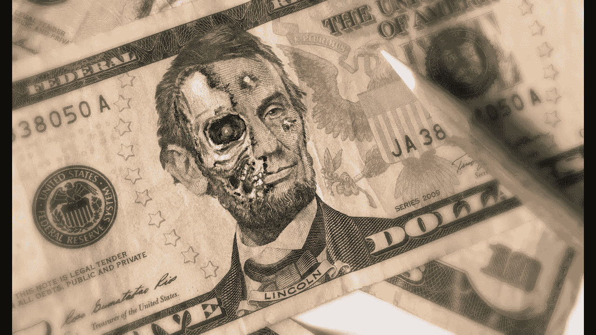
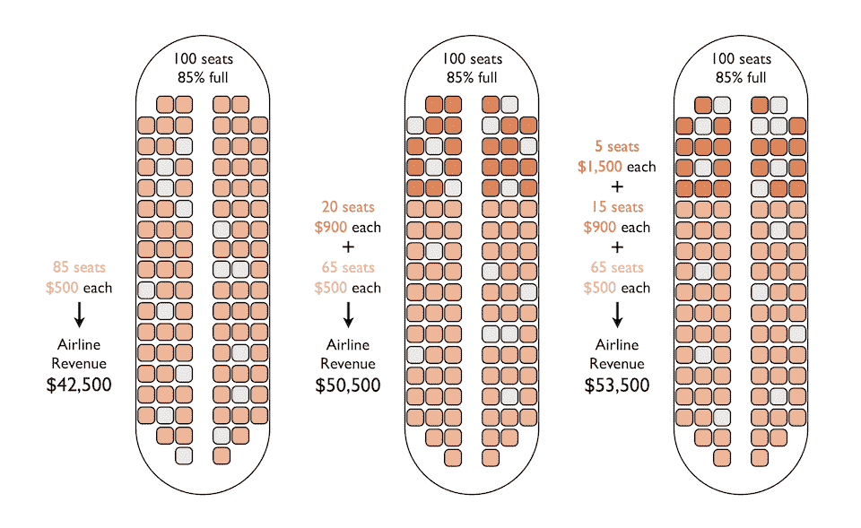
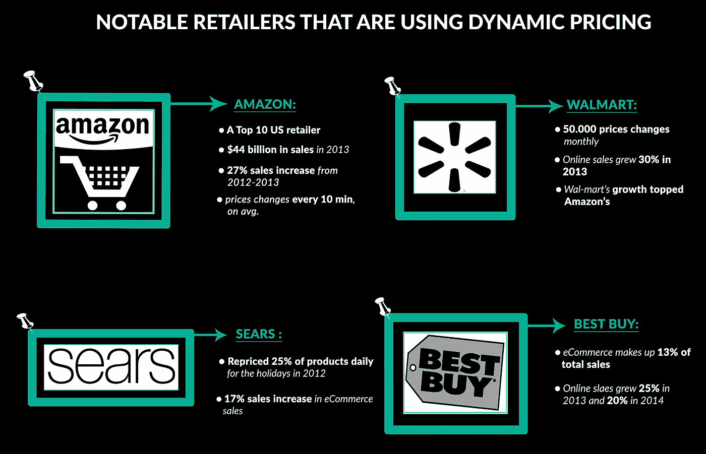

# 价格是人为控制的吗？

> 原文：<https://medium.com/codex/is-price-control-by-human-9670ddd68082?source=collection_archive---------15----------------------->

我敢打赌，每个点击这篇文章的人都发现自己卷入了数学中的价格优化问题，我们曾经在数学课或更具体的微积分课上学习并问**“这个优化问题有什么用？”**，我们很好奇，因为我们从学习过程中寻求应用和实证研究，我们一直在遭受我们试图实现的东西的未知用途。如果你从事计算机科学、经济学、应用数学、工程学位或面向现实世界的数学应用，你会比其他人更有机会面对这个问题。我有你曾经试图通过提供价格优化应用程序的证据来寻找的答案。

# ***什么是价格优化？它来自维基百科的定义是…***

> [**价格优化**](https://en.wikipedia.org/wiki/Price_optimization#Price_optimization_software) 是一家公司利用数学分析来确定客户将如何通过不同渠道对其产品和服务的不同价格做出反应。它还用于确定公司认为最符合其目标(如营业利润最大化)的价格。价格优化中使用的数据可以包括调查数据、运营成本、库存和历史价格&销售。价格优化实践已经在包括零售、银行、航空公司、赌场、酒店、汽车租赁、邮轮和保险行业在内的行业中实施。”…维基百科…

简单地说，根据需求、供给和影响公司盈利能力的外部性，价格是应该收取的最高价格，如果利润可以从价格的增加中增加，价格就可以高，否则价格就可以低。影响盈利能力的因素有很多(如公司数量、替代产品、品牌忠诚度、质量等。)而且人类似乎不可能把价格控制到它的最佳潜在结果，假设数学是正确的，没错！一些更有能力的人必须介入并承担这项工作，所以人类创造了他们，价格优化软件的发明。这是一个简单的过程，你可以在 Microsoft Excel 中尝试，如果你有数据，你可以用机器计算能力手动优化它，但最近，以数据为中心的时代创造了一种更强大的技术，不仅仅是计算能力，而是计算和动态自我操作的能力，同时通过增加训练数据或所谓的机器学习和人工智能来改进自己，创造算法定价的软件。

# 我们为什么要关注？

**首先**，每个人都必须承认[定价是商业世界中最重要的支柱之一。](https://insight.kellogg.northwestern.edu/article/principles_of_pricing)几十年来，我们不得不执行的许多任务已经被更好的重复性和暴力物种机器人所取代。这些任务需要蛮力或纯粹的计算能力，引入机器来取代这项工作只是因为机器可以完成人类在这些任务中无法完成的任务。算法定价是通过最大化给定目标(曝光率、利润、市场份额等)来服务订单的软件。)，这个算法[定价](https://www.kantify.com/article/3)的引入是[改变整个商业](https://competitoor.com/dynamic-pricing-how-works/)在很多行业，大多是电子商务和数据驱动的业务。很久以前，商人根据他们的知识来定价，有些是在一定范围内猜测价格，有些是模仿竞争对手。有许多定价策略，但没有一个选择根据所有相关因素随时优化的价格，这些因素会随着因素的变化而更新，通常，由人工处理的价格会随着周期的变化而稳定地变化，但如果人工智能是控制价格的人，它会随着其接收的信息更新知识而变化，以达到最佳结果。想象一下，商人向你要价很高，但你仍然愿意支付这个高价，如果 AI 按照利润最大化价格收取这个价格，结果将是他们试图掠夺它可以获得的每一块利益，并确保人们仍然购买它。它并没有缓慢地影响到日常商业生活，但现在许多公司和初创企业已经找到了价格优化软件公司，并相互竞争，以更好的质量和更低的价格提供更好的算法定价，达到任何小公司都可以购买的水平。**例如** [Pricefx](https://www.pricefx.com/site/) 用于价格竞争， [IBM 全渠道智能定价](https://www.ibm.com/th-en/marketplace/omni-channel-pricing)专门用于定价和促销，[智能节点](https://www.intelligencenode.com/)用于电子商务业务和技术。

# 定价算法如何工作

垄断其平台的一个实证算法定价是**航空公司飞机票**算法定价。航空业是最具创新性的适应性行业之一，但这种创新并没有帮助消费者获得更好、更快或更便宜的服务，而是帮助航空公司实现了对人类来说不可能完成的任务——定价策略。它服务于目标，从[人口统计和可用数据中获取最大利润。](https://flightfox.com/tradecraft/how-do-airlines-set-prices)

首先，它定义了机票等级的价格范围，如商务舱、经济舱和高级舱。越是特权阶层，其向消费者收取的费用就越多，这是人类仍然能够执行的基本原则，第二步是根据利润最大化进行销售。为了实现最大利润，AI 不需要向一个消费者收取与其他消费者相同的价格，它保持可用座位的数量。当可用座位开始减少或稀缺时，它会收取更高的价格，每买一张票，其他票的价格就会上涨，如果你试图一次买很多票，所有票的平均价格都会高于买一张票的价格。不仅仅是它的收费[价格歧视](https://en.wikipedia.org/wiki/Price_discrimination)，同样的产品向不同的消费者收取不同的价格。好吧，这可能是有争议的，如果消费者在离航班起飞越近的时候购买机票，他们可能会花费更多，这可能会增加管理、订购和准备食物、人力资源和资产分配，或者另一个论点，因为离航班日期越近，需求越高。第三种是可选的可退款附加价格，它利用了消费者的不确定偏好，但仍然是次要的，第四种更聪明，利润的黄金组合是价格和成本，因此它所做的是限制可用的座位，以便它既可以收取垄断的高价格，又可以保留连接航线的燃料，例如， 你以 1000 美元的价格从伦敦旅行到迈阿密，而迈阿密是到波哥大的连接路线，但是 AI 对从伦敦到迈阿密的机票定价超过了一次直达波哥大的旅行，即使时间旅行更少。 它所做是阻止人们预订这些座位，并保留这些座位以降低燃料使用量和限制产量。它使利润最大化，同时保持座位可用，这样迈阿密的人们可以通过他们执行的预测分析来预订座位支持，它应该为未来的座位保留的数量可以抬高价格以使利润最大化，[进一步阅读](https://www.cnbc.com/2018/08/03/how-do-airlines-price-seat-tickets.html)。

不仅机票价格由人工智能控制，电子商务平台、使用电子支付的零售店、供应链行业、保险和医疗保健也是如此。它不仅可以执行远优于人类的价格优化，而且还可以使用合谋策略或公司定价。在经济学中，企业定价是企业决定合作并减少市场竞争的价格，这样所有企业都可以享受高价格，而不用考虑价格竞争或价格战。来自**卡尔瓦诺**、**卡尔佐拉里**、**德尼科洛**和**帕斯托雷洛**的研究人员在受控环境(计算机模拟)中对由强化学习驱动的 AI 智能体进行实验，并发现沉默寡言的 AI 智能体执行战术共谋。即使仍然没有证据支持现实世界中的策略共谋，或者我们仍然缺乏检测它的能力。

# 算法定价能对社会有好处吗？

所有这些都在控制算法定价，反垄断法或美国联邦贸易委员会仍然无法找到适当的方法来反对这项技术，因为如果他们不知道监管的后果，他们不能简单地停止这项技术。看起来我已经说了关于算法定价的不好的东西，算法不是一个应该被摧毁或保留在库存中或操纵邪恶行为的坏机器，它是取决于使用的工具。正如我们所知，它解决了对目标函数的优化，我提到了故事的坏的一面，利润的一面，所以如果我只告诉这一面，通过注入贪婪的目标技术是坏的，整个社会将是贪婪的定价，但如果算法可以使用社会福利函数或在经济学中代表整个市场人口的社会利益的函数来调节，而不是最大化私人利益，而是社会利益。但是谁愿意通过限制社会利益来最大化他们的利润，这对于商人来说是不合理的，但是如果政府监管来固定利润最大化的水平，或者他们创造可以检测任何共谋或垄断滥用定价并惩罚的人工智能，这可能是控制算法定价的解决方案。

*原载于*[*https://www.linkedin.com*](https://www.linkedin.com/pulse/price-control-human-theethat-anuraksoontorn/)*。*