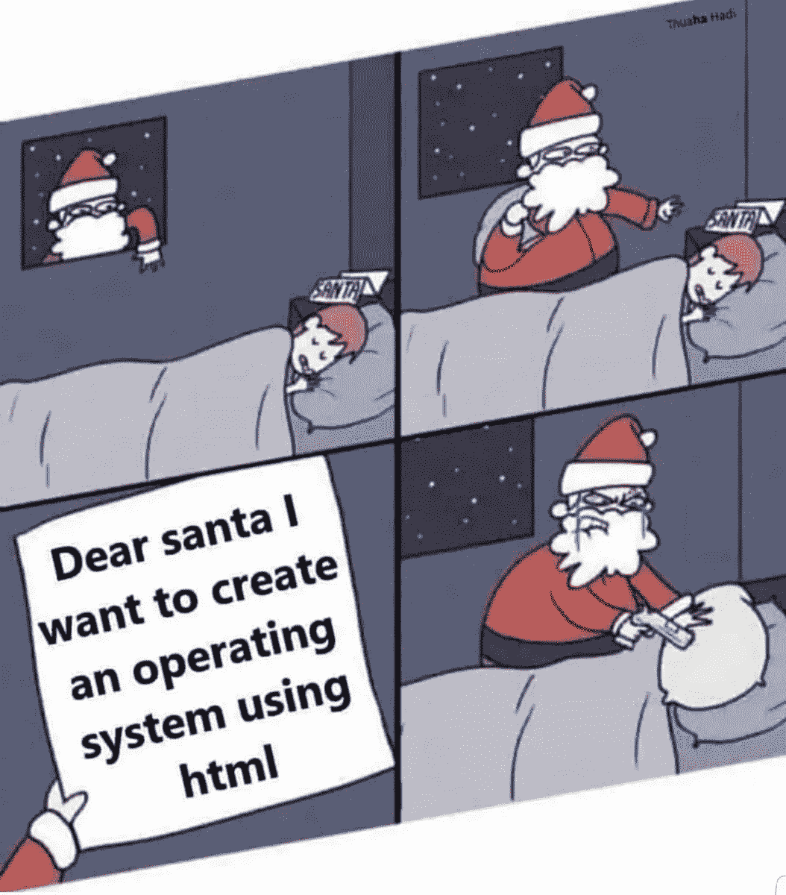

# 编程是一个创造性的过程吗？

> 原文：<https://medium.com/codex/is-programming-a-creative-process-683dbbf3cac?source=collection_archive---------4----------------------->

## 如果不应该呢？

来源:推特

每当我写一个在编程中被普遍接受的事实时，我都会被驳倒。不管事实是什么。不管它有多真实。

“Python 慢”？瞬间受到攻击。“Python 其实并不慢”？从天而降。互联网的工作方式确实很有趣。但有时，这些反对意见实际上会激怒我…