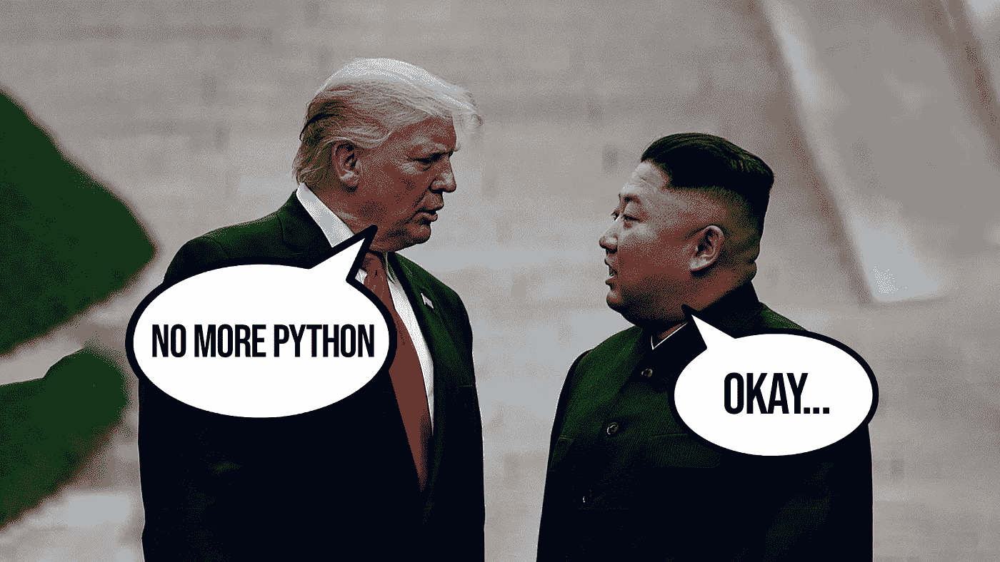

# Python 是一门糟糕的编程语言吗？

> 原文：<https://medium.com/codex/is-python-a-bad-programming-language-b260507ca06c?source=collection_archive---------0----------------------->

## 人们常说的话

Python 是最差的编程语言吗？自从 Python 于 1991 年首次开发以来，人们就一直在争论这个问题。关于 Python 是否是最好的编程语言的争论可能永远不会解决，但这并不意味着你不能从阅读关于争论的文章中获得一些有用的信息，**，**两者都来自认为…