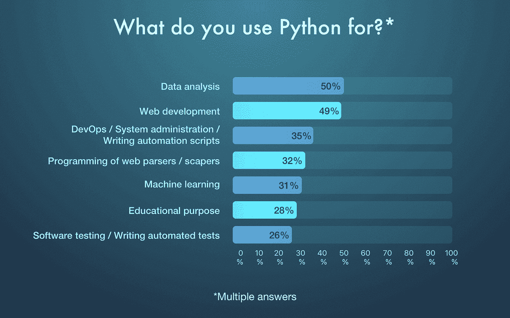
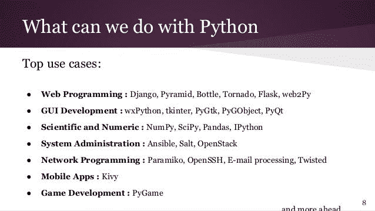
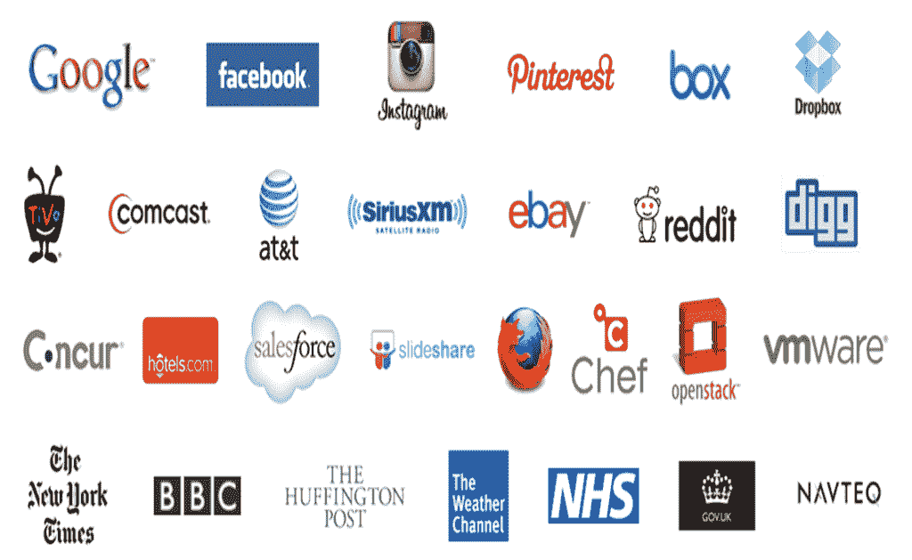

# Python 对软件开发有好处吗？

> 原文：<https://medium.com/codex/is-python-good-for-software-development-63b06ebeac07?source=collection_archive---------9----------------------->

2021 年 6 月， [Python 是第二流行的编程语言](https://www.tiobe.com/tiobe-index/)。同月，它的采用率增长了 3.48%。Python 开发非常适合复杂的应用程序，同时保持简单的代码。你知道谁用 Python 吗？谷歌、Spotify、Instagram、Redditt、网飞等巨头。

Python 将不可避免地成为编程的未来。为什么？因为它在机器学习中有大量的应用。31%的开发人员使用这种语言来解决 ML 问题。另一方面，多达 50%的开发人员使用它进行数据分析。

Python 减少了总的开发时间，因为它内置了字典数据结构。没有必要在运行前编译代码。无论是基于消费者的应用还是企业解决方案——[Python 软件开发服务](https://www.botreetechnologies.com/python-development)都可以提供帮助。

这篇文章将强调为什么 [Python 是软件开发的好选择](https://bestinau.com.au/is-python-good-for-software-development/)。开发人员使用几种编程语言进行软件开发，如 Ruby、JavaScript、PHP。我们将理解是什么使基于 Python 的 web 开发服务不同于这些语言。

> **阅读更多:** [**10 个真实世界的 Python 用例及应用**](https://www.botreetechnologies.com/blog/top-10-python-use-cases-and-applications/)

# **Python 开发:为什么软件解决方案是肯定的**

首先，没有一种编程语言像 Python 一样多样化。它能够轻松构建现代解决方案。开发者仍在探索[端到端 Python 开发服务](https://www.botreetechnologies.com/blog/python-case-study-for-logistics-company-b-l-processing-system/)在不同领域的全部潜力。

来源:[https://www.cleveroad.com/blog/python-vs-swift](https://www.cleveroad.com/blog/python-vs-swift)

所谓域名，我们指的是金融科技、健康科技、保险科技、网络安全等等。这些是新的经济领域，Python 有能力服务于所有这些领域。大多数都需要强大的计算能力。Python 的代码是动态的和健壮的——能够处理大量的流量和繁重的算法功能。

如今，软件开发是多维的。[企业软件](https://www.botreetechnologies.com/blog/complete-guide-to-enterprise-application-integration/)需要具有人工智能& ML 功能的交互应用。基于消费者的应用需要数据分析来提供更好的用户体验。网飞、特雷罗和亚马逊就是这类应用的好例子。Python 有助于轻松构建它们。

> **结帐**[**Python 的利弊:权威的 Python Web 开发指南**](https://www.botreetechnologies.com/blog/pros-and-cons-of-python/)

# **使用 Python 进行软件开发的 5 个理由**

Python 能做的事情太多了，以至于开发者找不到足够的理由去佩服它。Python 应用程序开发不仅限于 web 和移动应用程序。它高度可扩展，非常适合各种各样的应用程序。

以下是使用 Python 进行软件开发的 5 个理由

**1)动态框架**

1.  Python 以其工具和框架而闻名。凡事都有个框架。Django 对于构建 web 应用程序、企业应用程序、科学应用程序和数值计算非常有用。Flask 是另一个没有任何依赖性的 web 开发框架。
2.  Web2Py、CherryPy 和 Falcon 提供了强大的配置来定制 Python 开发服务。其中大部分都是支持快速开发的开源框架。

**2)易于读写**

1.  Python 有一个简化的语法——类似于英语。项目的新开发人员可以很容易地理解他们在项目中所处的位置。编写的简易性使得应用程序的快速开发成为可能。
2.  正如创建者 Guido Van Rossum 所说，构建 Python 的目的是为了让业余开发人员也能理解这种编程语言。快速的代码编写也允许开发人员在不被不必要的细节所困扰的情况下进行快速的修改。

**3)所使用的最佳**

1.  好吧——Python 不仅仅是另一种编程语言。它必须有一些东西，这就是为什么行业领导者使用它。这也是为了多种目的。谷歌的程序员使用
2.  Python 可以构建系统管理工具、二进制数据推送器、代码审查、测试和 QA 等等。同样，网飞将 Python web 开发服务用于其推荐引擎和媒体播放器。

来源:[https://www . esparkinfo . com/why-choose-python-for-enterprise-software-development . html](https://www.esparkinfo.com/why-choose-python-for-enterprise-software-development.html)

**4)大规模的社区支持**

1.  Python 有一个不断增长的社区，提供了巨大的支持。从初学者到专家，社区里的每个人都有。有大量的教程、文档和指南可用于 Python web 开发解决方案。
2.  如今，许多大学从 Python 开始，增加了社区成员的数量。通常，Python 开发人员在不同的项目上合作，并在算法、功能和应用程序问题解决方面互相帮助。

**5)高级应用**

1.  在任何一家[软件应用开发公司](https://www.botreetechnologies.com)，Python 都是数据科学、机器学习和人工智能的最大贡献者。它在高级应用中的用例是它成功的最大原因。Python 是继 R 之后第二流行的数据分析工具。
2.  通过动态库易于组织、管理和可视化数据，这使得它非常适合基于数据的应用程序。用于神经网络的 TensorFlow 和用于计算机视觉的 OpenCV 是 Python 在机器学习应用中最受欢迎的两个用例。

> **阅读更多:** [**Python AI:为什么 Python 更适合机器学习和 AI**](https://www.business2community.com/big-data/python-ai-why-python-is-better-for-machine-learning-and-ai-02389380)

**Python 开发的弊端**

基于 Python 的 web 开发服务并不都是好的。它有一些缺陷，可能会给一些公司和开发者带来挑战。

**1) Python 速度慢**

*   希望推出快速 MVP 的公司不应该把目光投向 Python。编程语言真的很慢。由于许多代码是动态类型化的，因此会占用大量内存。这导致大量的计算时间。
*   开发人员也不喜欢 Python 一次只能执行一个任务的事实。Python 确保每个变量都有一个数据类型，而并行处理会带来挑战。

**2)有限的移动应用**

*   在构建移动应用程序时，Python 提供的功能有限。虽然有 Kivy 库来构建移动应用程序，但没有多少公司使用这种编程语言来开发移动应用程序。
*   开发者必须明白 Python 从来不是为移动设备而构建的。还有其他语言，如 React、Java 和 Flutter，用于构建移动应用程序。

**3)运行时错误**

*   这种技术性大概是开发者最讨厌的。代码不是先编译后执行的。相反，每次执行时代码都会编译。因此，所有的错误都发生在运行时，这导致了大量的时间消耗。
*   也导致业绩不佳。初级开发人员必须真正熟悉这一点，并在用 Python 编译代码时测试他们的耐心。

# **Python App 开发:是还是不是？**

[考虑到编程和技术的进步](https://www.botreetechnologies.com/blog/top-10-python-use-cases-and-applications/)，Python 对于各种各样的应用来说是肯定的。游戏开发、GUI 开发、ML & AI 开发、企业&消费者应用——所有这些都充分利用了 Python。

由于 Python web 开发解决方案提供的好处，它的缺点经常被开发者和公司忽略。他们优先考虑质量而不是速度，优先考虑健壮性而不是错误。这就是为什么使用 Python 来构建未来的应用程序是有意义的。