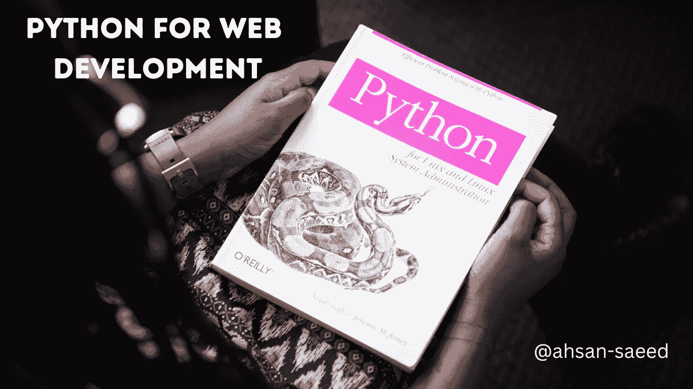

# 2023 年 Python 最适合 web 开发吗？

> 原文：<https://medium.com/codex/is-python-the-best-for-web-development-in-2023-595d29f7b9d?source=collection_archive---------4----------------------->

Python 是目前最流行的 web 开发编程语言。然而，还有其他的选择。本文将把 Python 与 web 开发中使用的其他语言进行比较，包括 PHP 和 JavaScript。我们还将了解这些语言之间的比较，以及哪种语言最适合您的需求！

# 最好的网络语言…