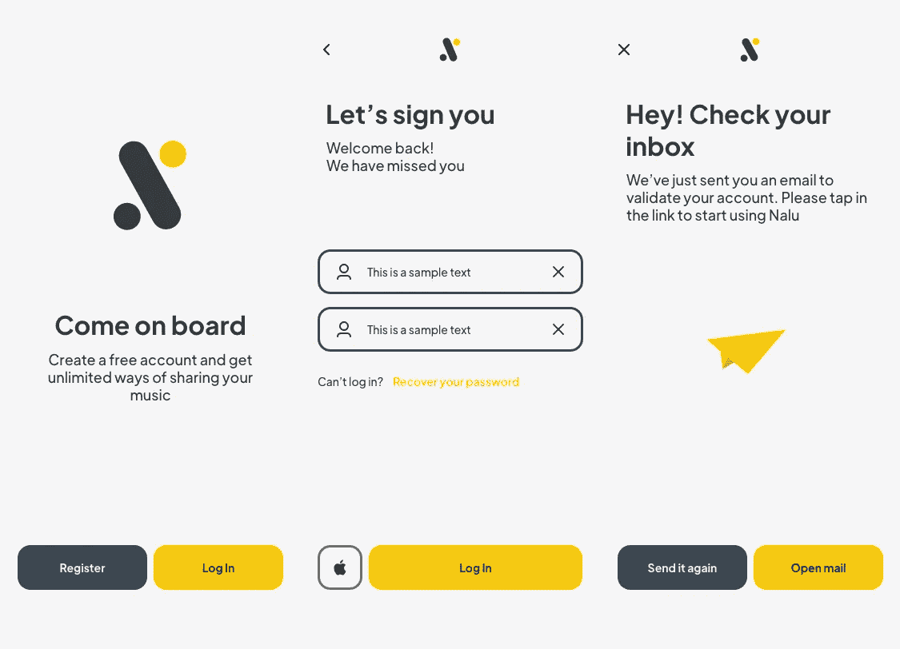

# swiftUI 适合生产吗？

> 原文：<https://medium.com/codex/is-swiftui-suitable-for-production-4a92eb55751b?source=collection_archive---------3----------------------->

我好几次面对这个问题*我们可以使用 swiftUI 来构建我们的视图吗？。*作为一名 iOS 开发人员，我想使用 SwiftUI、Combine 甚至新的并发 API 等最新工具。但是当我们开发一个面向成百上千甚至上百万用户的应用程序时，我们必须优先考虑客户，而不是我们的需求。

这就是为什么这个问题的答案总是:*是的，我们可以引进它，但是你为什么认为我们必须采用它？*在本文中，我将尝试解释使用 swiftUI 构建基本流程的好处，并解释其优缺点。

# 我们的要求

在开始之前，我们必须现实一点，我们希望只使用 swiftUI 将我们的应用程序部署到 iOS 13+,我们不能使用任何其他 UI 框架，如 UIKit 或 AppKit。由于 swiftUI 的主要优势之一是其跨平台支持，我们希望在 macOS 上部署我们的应用程序(不使用 catalyst)

一旦我们定义了我们的需求，让我们检查我们想要构建的流:



如您所见，第一个屏幕将推送登录表单，登录将呈现一个模式化的屏幕。

# 优势

SwiftUI 是如此强大，它所具有的提高生产力的最好的特性之一是预览，它允许你非常快速地创建你的界面。它增加了在你的界面中使用像[原子设计](https://atomicdesign.bradfrost.com/chapter-2/) n 这样的设计模式的好处。

你将能够忘记破坏约束的错误，因为你将把时间花在填充等编码时更安全使用的东西上。

学习曲线很难，因为 swiftUI 依赖于泛型、关联类型等概念，这对于新手来说尤其困难，但实时可视化您的更改的可能性允许您实时测试和理解您正在做的事情(如果您需要，可以使用 UIKit 实现相同的功能)。

完全是反应式的。如果你将 swiftUI 与 Combine(我个人推荐)一起使用，你将会看到两个框架之间的完全兼容性，允许你使用两者的所有优势。

内存管理非常简单，因为您的视图将用结构而不是类来建模，从而减少了获得保留周期的可能性。当您与团队中的初级开发人员打交道时，这一点非常重要。

但是最主要的是跨平台支持。你现在不需要对你的接口编码两次(如果你想完全重用你的接口),因为你现在可以编码一次，然后把代码共享给 macOS 和 iOS。

# 不足之处

如果你真的想使用 swiftUI，你会发现它有几个缺点。

**在建**

我们都知道 UIKit 或 AppKit 有多老，swiftUI 有多新。在我看来，我们还不能放弃 swiftUI，因为我们必须假设我们不能用一个 2-3 年前的框架获得 UIKit 给我们的所有可能性。每一次迭代都会增加越来越多的可能性。但是，我们的客户不能提供更差的体验，因为迫使我们使用 swiftUI，我将向您展示一些示例。

您将面临的第一个问题是缺乏 API。是的，如果你支持最新的 iOS，这可能不会成为你代码中的问题，但是正如我们所说的，我们必须支持 3 个不同的 iOS 版本。

在 swiftUI 中，响应者管理等非常基本的交互并不简单，在 iOS 13 或 14 中，如果不依赖于旧的框架，几乎不可能实现。从 iOS 15 开始，focus API 为我们打开了一堆管理响应器的可能性，但如果你只是想在 iOS 13 上使用响应器，你将不得不依赖于*uiviewreclarable*来实现这一行为

```
struct LegacyTextField: UIViewRepresentable {
    @Binding public var isFirstResponder: Bool
    @Binding public var text: String

    public var configuration = { (view: UITextField) in }

    public init(text: Binding<String>, isFirstResponder: Binding<Bool>, configuration: @escaping (UITextField) -> () = { _ in }) {
        self.configuration = configuration
        self._text = text
        self._isFirstResponder = isFirstResponder
    }

    public func makeUIView(context: Context) -> UITextField {
        let view = UITextField()
        view.setContentCompressionResistancePriority(.defaultLow, for: .horizontal)
        view.addTarget(context.coordinator, action: #selector(Coordinator.textViewDidChange), for: .editingChanged)
        view.delegate = context.coordinator
        return view
    }

    public func updateUIView(_ uiView: UITextField, context: Context) {
        uiView.text = text
        configuration(uiView)
        switch isFirstResponder {
        case true: uiView.becomeFirstResponder()
        case false: uiView.resignFirstResponder()
        }
    }

    public func makeCoordinator() -> Coordinator {
        Coordinator($text, isFirstResponder: $isFirstResponder)
    }

    public class Coordinator: NSObject, UITextFieldDelegate {
        var text: Binding<String>
        var isFirstResponder: Binding<Bool>

        init(_ text: Binding<String>, isFirstResponder: Binding<Bool>) {
            self.text = text
            self.isFirstResponder = isFirstResponder
        }

        @objc public func textViewDidChange(_ textField: UITextField) {
            self.text.wrappedValue = textField.text ?? ""
        }

        public func textFieldDidBeginEditing(_ textField: UITextField) {
            self.isFirstResponder.wrappedValue = true
        }

        public func textFieldDidEndEditing(_ textField: UITextField) {
            self.isFirstResponder.wrappedValue = false
        }
    }
} 
```

但是当我们要求用相同的源代码支持 macOS 时，我们将不得不开始使用编译标志来支持两个平台，所有的优势都消失了。

导航也是如此。由于 iOS 13 中缺乏 API，像模态这样非常基本的导航可能会变得很困难。迫使您使用自定义的 viewModifiers 来实现相同的用户体验。

**视图是状态的函数**

SwiftUI 提出了一个新的接口范例。视图是状态的函数，是一种将状态数据转换成渲染图的算法。这解释了为什么从 SwiftUI 视图中提取路由是一个相当大的挑战:**路由是这个绘制算法不可或缺的一部分。**

这就是我认为 swiftUI 无法与 UIKit 或 AppKit 等框架竞争的地方。构建动态导航树是相当困难的，你至少要在某一点上声明你的导航层次，强迫你到一个特定的导航树。

# 结论

这都在你的要求中，如果你必须处理你的应用程序，这个应用程序被数百万用户使用，我可能会说不，就像你在 swift 的第一个版本中拒绝采用 swift 作为你的语言代码而不是 objective-c 一样。但是，事情可能会在未来发生变化，swiftUI 是一个我们都必须开始使用并学习如何处理的框架，因为它是未来的发展方向。

我目前正在使用 swiftUI 从头开始重建我的应用程序 [**路娜**](https://nalu.gitlab.io/#/) 。所以我会在这篇文章中不断更新我发现的新问题或优势。

如果你想知道发布编译代码而不是源代码的好处，可以看看我的帖子:

[](/@alb.garciam/reduce-build-times-on-your-ios-app-86a964e0f3bf) [## 减少 iOS 应用程序的构建时间

### 如果你是一名开发人员，你可能会面临这样的情况，你的应用程序需要太多的时间来编译。

medium.com](/@alb.garciam/reduce-build-times-on-your-ios-app-86a964e0f3bf) 

如果你喜欢这些帖子，请别忘了给我鼓掌，如果你想让我写另一个话题，别忘了添加到评论中。