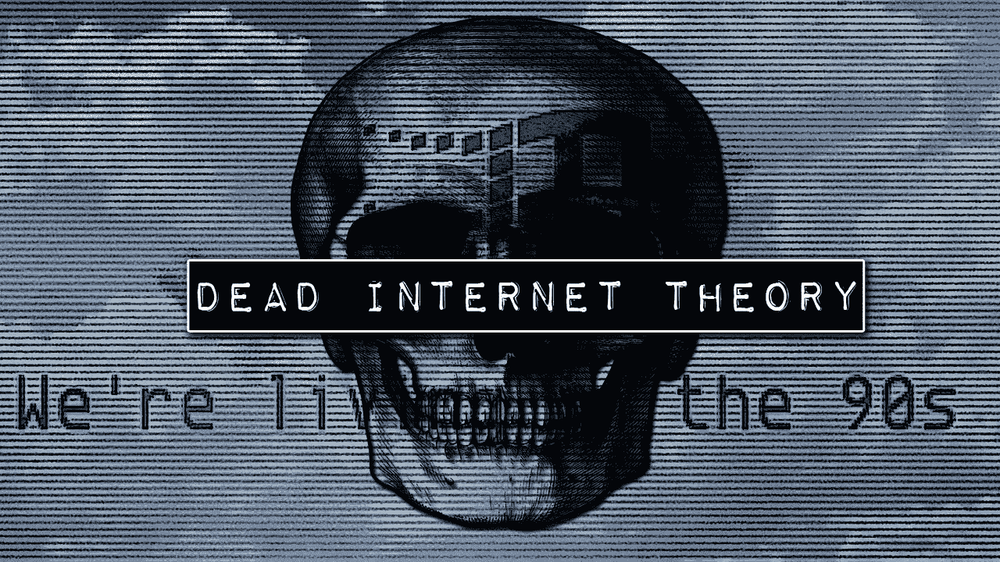
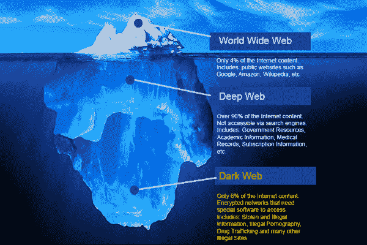
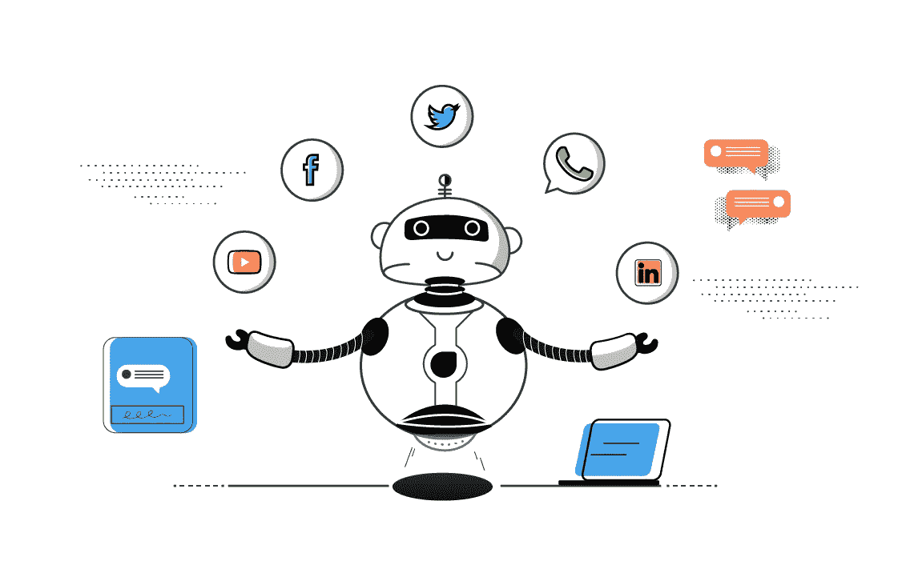
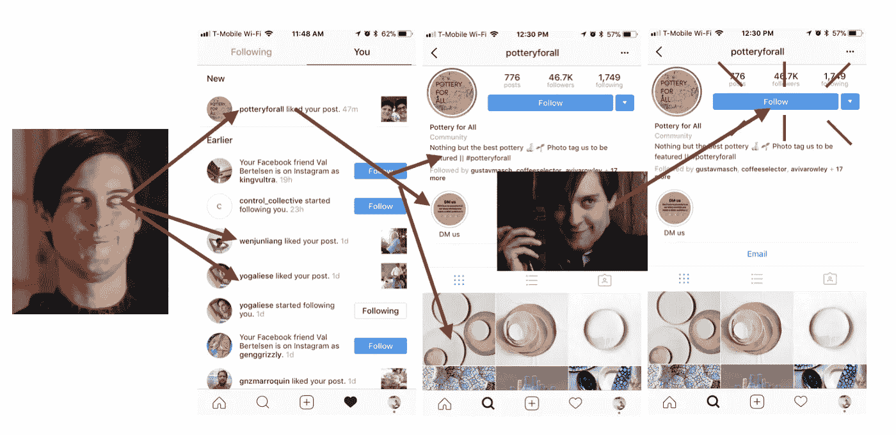

# 互联网已经死了吗？

> 原文：<https://medium.com/codex/is-the-internet-already-dead-29fd16e57849?source=collection_archive---------6----------------------->

> 我担心的不是“像人类一样的机器人”，而是现在看起来像“机器人”的人类让我害怕。匿名的

这篇博客的灵感来自于我最喜欢的 YouTubers 用户之一“Chill Fuel ”,他经常发布关于互联网上发生的怪异和神秘事件的内容。他发布了一个关于“死亡互联网理论”的视频，这激起了我的兴趣，让我想了解更多，并与世界其他地方分享。

当今的世界。互联网是这个星球上最令人困惑和匿名的地方之一。事实是，90%在日常生活中使用互联网的人只是看到了冰山一角。“深层网络”是指对普通人隐藏的大量未知信息和材料。然而，深度网络是另一天的话题；今天，我们将讨论深层网络的一个小部分，它对公众来说是不透明的，他们不知道他们每天都在处理它。

“这个网站曾经很有趣”

“啊！Instagram 和脸书又宕机了”

“她有那么多追随者，老兄！那些是真正的追随者还是仅仅是**机器人？**

僵尸工具，大家都很熟悉僵尸工具的概念，包括为什么存在，有什么用途。但是，我们是否充分意识到他们的在线能力，或者我们只是对正在向我们逼近的大规模网络威胁视而不见？

机器人，通常被称为蜘蛛、爬虫和网络机器人，是互联网机器人。虽然它们可以用来执行重复的任务，如搜索引擎的索引，但它们不能用来执行复杂的任务。就发明和使用而言，机器人已经走过了漫长的道路，随着它们在互联网上的广泛部署，它们变得越来越强大，这使得人们更难判断我正在与之交谈的人是否真的是人。尽管绝大多数互联网用户都不是机器人。但是问题来了，**“如果呢？”**

在这种情况下，“死亡互联网理论”就出现了。该理论指出，互联网上生成的内容似乎是由人工智能机器人制作的。这听起来很疯狂，对吧？

人工智能一天比一天先进。Deepfakes 越来越逼真，聊天机器人越来越智能，语音助手越来越准确。这使得很难在互联网上识别机器人或人。最大的例子是特斯拉的自动驾驶功能，它允许汽车在没有汽车系统上的物理人类交互的帮助下行驶。然而，有一种理论认为，政府和企业已经成功地开发了能够模拟人在互联网上的存在的复杂技术，并且这些技术用于两个目的。

## 智能在线营销

商业组织利用一些策略，比如追随潮流，制造一个迷因或噱头，来提高他们在真正用户中的社交媒体存在。允许机器人在社交媒体平台上创建账户，创建与他们公司的服务和产品相关的内容，并大规模产生赞和评论，从而使他们的帖子获得更多参与，因为它是向真实用户建议的，从而为消费者创造了一种间接的广告形式。

## 影响公众舆论

这个的目的和上一个是一样的。用管理机构取代公司。企业利用机器人增加利润，而政府利用机器人增加权力。我们已经看到了一个政党传播的虚假信息是多么容易，所以想想这对一群聪明的机器人来说是多么简单的工作。

毕竟我做的东西都是推测，没有足够的证据表明这些阴谋论是不是真的。然而，只有几个世界上最伟大的大脑试图贡献他们的知识和研究来解决这个难题。

Ghost Data 是一个研究小组，涵盖数字宣传、在线仿冒和恐怖活动等重要主题。为了进行研究，该公司购买了 2 万个机器人，并分析了它们的特征，以帮助识别约 100 万个 Instagram 账户中的类似特征，他们的研究证明，Instagram，脸书拥有的全球 10 亿用户的图片共享应用程序，可能有多达 9500 万个机器人冒充真实账户，使该平台成为打击错误信息、假新闻和政治宣传的下一个前沿阵地，据信息报道[。他们估计，Instagram 用户中机器人账户的比例从 2015 年的 7.9%上升到了今年的 9.5%。](https://www.theinformation.com/articles/instagrams-growing-bot-problem)

然而，正如之前所说，随着人工智能技术的发展，机器人可能已经在所有社交媒体平台上超过了人类，仅仅因为大量机器人分散在互联网上，就有改变公众舆论的风险。这一观点得到了 Asch 一致性实验的充分支持。

*我来分享一下更详细解释实验的链接:*[*Solomon Asch——从众实验*](https://www.simplypsychology.org/asch-conformity.html)

截至目前，互联网对于实际交易者和人们来说仍然是可依赖的，但随着技术的快速进步，未来是不确定的。无论从哪个角度来看，我们仍然会发现企业和政府在相互竞争，所以这种变化有可能会对企业和政府组织产生间接影响。想想看，如果 Instagram 开始大规模生产网络机器人，以在线推广其内容并实现营销目标，会发生什么。同样，微软可以开发一个更强大的 bot 检测系统，可以部署在互联网上。

绝大多数艺术家、内容提供商和营销公司使用机器人只是为了在更大范围内推广他们的工作。例如，Twitter 已经宣布使用机器人来推送新闻和天气更新。如果社交媒体上有成千上万个与实际人几乎没有区别的 bot 帐户，会怎么样？然而，正如上面 Twitter 的例子所示，人们利用机器人的恶意程度有所降低。然而，利用机器人进行产品营销和广告并不遥远，谁知道呢，它可能已经在我们背后使用了。

在这个问题上，可能会出现很多大的假设和争论。这仅仅是个人观点，但是“死亡互联网理论”有什么值得关注的吗，或者它可能对人类构成未来的威胁吗？