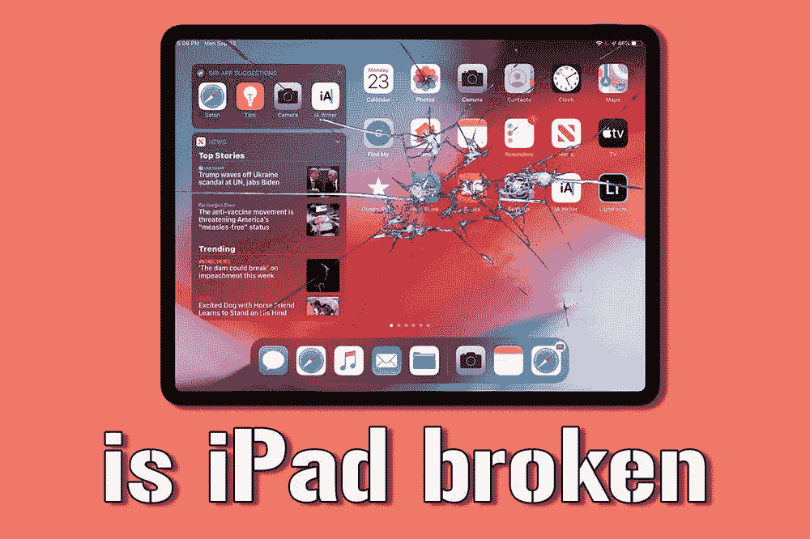
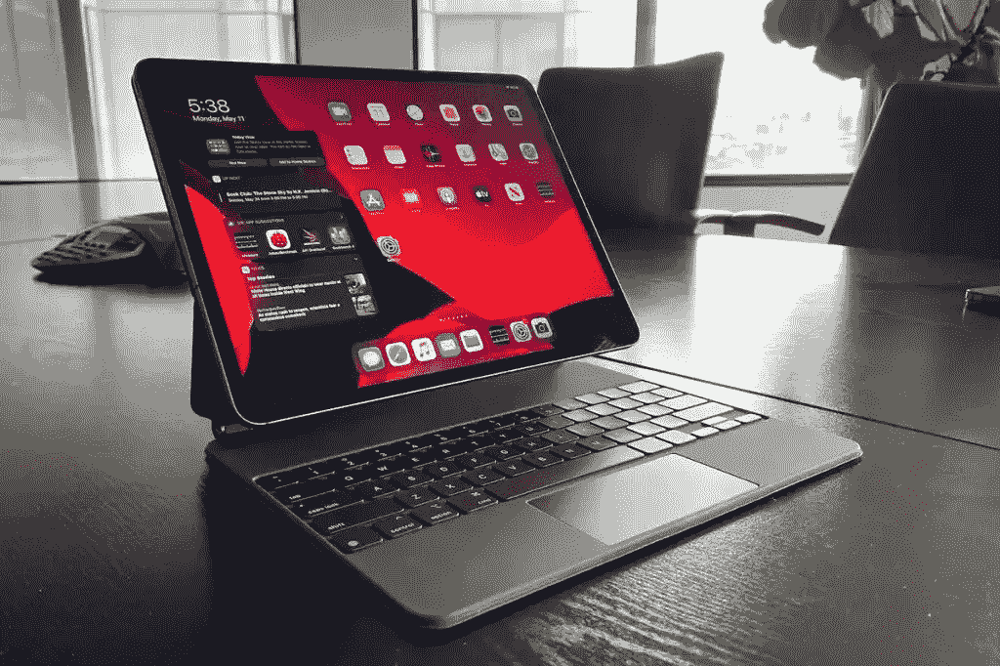
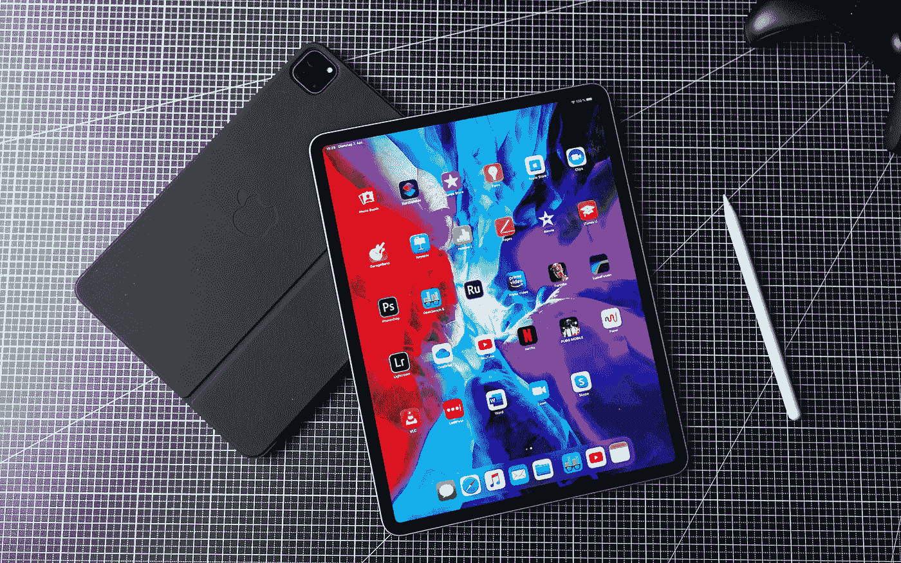
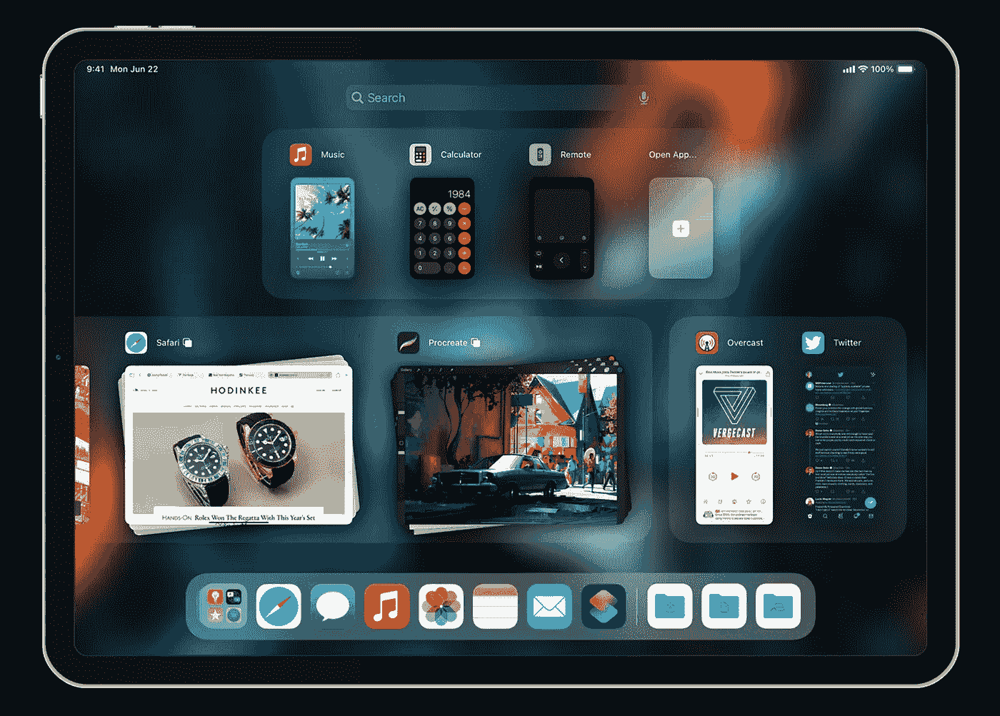
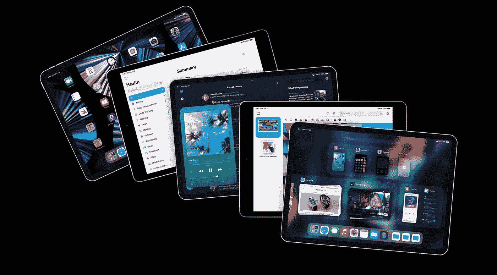
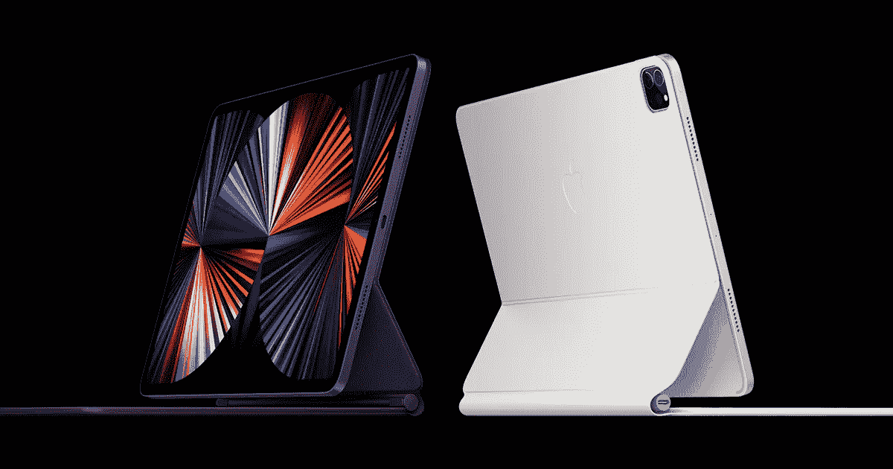
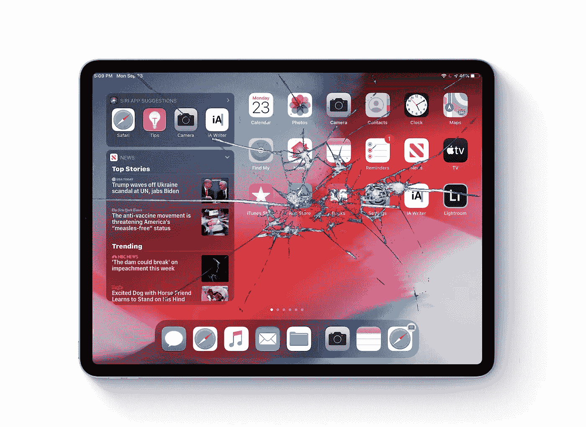

# iPad 真的坏了吗？

> 原文：<https://medium.com/codex/is-the-ipad-really-broken-18968b593073?source=collection_archive---------10----------------------->

## 还是我们只是用错误的方式看待它？

设计史上的关键时刻以最奇怪的方式出现。以 iPad 为例。如果不是为了一个晚宴，这也许永远不会实现！史蒂夫·乔布斯和朋友坐在一起，被告知比尔·盖茨正在开发平板电脑。这就是一切开始的地方。

负十六播客

## 第一次会议

iPad 在家里在办公室

就在第二天，乔布斯召集团队，告诉他们他的愿景。他认为 Mac 对大部分市场来说太复杂了。简单是他的理想。重量轻，易于使用，外形不太复杂。*他希望能够在飞行中收发电子邮件，而不是被束缚在办公桌前。他看到了忙碌、高效的专业人士能够在任何地方工作的愿景，而不需要拥有计算机科学博士学位。有趣的是，这次会议的结果是*实际上*产生了 iPhone。但是紧随其后，我们得到了 iPad…2010 年，全世界看到了第一台 Mac 平板电脑，其余的都成为历史。*

 [## 这会是迄今为止最好的 MacBook Air 吗？

### 为什么 M2 MacBook Air 可以改变一切

medium.com](/codex/will-this-be-the-best-macbook-air-yet-eaf621d8dfaf) 

## 为了大众

Apple Pencil 是 iPad 的又一大亮点

在 iPad 发布之初，它遭到了嘲笑，被称为大 iPhone。然而，这实际上是一种扭曲的观点。iPhone*其实*一个小 iPad！别忘了，最初的会议本应产生一个平板电脑，但我们却得到了手机。

那时候，Mac 不是主流。这是严肃的电脑爱好者、设计师、创意者和音乐家的领域。但是普通大众并不感兴趣。它被认为是复杂、昂贵和神秘的。这就是乔布斯出色地定义并知道需要改变的。随着 iPhone 的出现，这扇门被打开了。人们现在正在使用苹果产品，并对它们有了更多的了解——神话被驱散了。这是乔布斯需要的发射台。从第一天起，简单就是他的座右铭。没有文件导航，没有窗口切换，没有列表来完成一个简单的任务。home 键被视为一张必不可少的出狱卡——一个逃离一切的按钮。对于那些对台式机感到恐慌的人来说，平板电脑革命将简化一切，让移动计算对所有人来说都变得容易。

## 核心 Mac 用户

图片由 Parker Ortolani 提供

苹果必须走的路线是不疏远他们的核心、忠诚、书呆子用户。他们希望这个未来包括他们，但不是只为他们所用！有一些他们喜欢的元素，比如 instant on，但乔布斯知道，要想让这个项目成功，需要公众的支持。事实上，乔布斯认为 iPad 的这种分化是另一个挑战。为什么 Mac 的操作系统不能更像 iPad 呢？回顾 Mac 的历史，我们可以看到这些影响在闪耀。毫不奇怪，在 Mac 系列中，像超轻 MacBook 和 MacBook Air 这样的机器突然得到了所有的关注。如果乔布斯如愿以偿，这些笔记本电脑的使用方式甚至会更像 iPad。

 [## iPhone 14——最新独家新闻

### 颜色，相机，电缆，什么都没有！

medium.com](/codex/iphone-14-the-latest-scoop-f1ffb021d571) 

## 简单赢了

图片由 Parker Ortolani 提供

乔布斯喜欢他所看到的一切；他的梦想成真了。最核心的一点，也是乔布斯和他的团队永远不会放弃的一点，就是简单。这也不仅仅局限于他的直属团队。随着 iPhone 和 iPad 的出现，App Store 已经成为了一项独立的新兴业务。但是，任何开发出哪怕只有一点复杂性的应用程序的开发者都会倒霉。他想要的是一触即发、按下即播放、打开即使用。他也向他的开发者澄清了这一点。多年来，Files 应用程序&甚至是 Air Drop，都被认为是太过了。

## 共同点

iPad Pro —比以往更强大

所以对于我们今天发现的争论…iPad 应该更 Mac 喜欢用吗？iPad 什么时候运行 macOS？这些争论不仅让我们愤怒，也让苹果内部愤怒。苹果最畅销的配件之一是神奇键盘，这并不奇怪。有了这一点，iPad *感觉*几乎是一种桌面体验。简单依旧，但现在有了更熟悉的感觉。在某种程度上，这解释了为什么 iWork 几乎立即上市，因为它完全符合简报，但当时，甚至现在，没有专业应用程序可以在 iPadOS 上运行。iPad Pro 已经问世近七年了，在过去的两年中，它实际上运行了与 MacBook Air 相同的苹果硅处理器&使用了与 MacBook Air 相似的资源。受益的不仅仅是 iPad Pro。iPad Air 也加入了这个行列，它现在也运行着完全相同的苹果芯片。

 [## HomePod 成为一个收藏家的项目&一些好的闪电电缆新闻！

### 苹果视图综述

medium.com](/codex/homepod-becomes-a-collectors-item-some-good-lightning-cable-news-76b0399bbb14) 

## 今后

iPad 到底坏没坏？

随着蒂姆·库克和克雷格·费德里吉的控制，在让 macOS 和 iPadOS 之间的界限变得模糊方面，已经有了一点点松动。使用万能控制，一个鼠标和触控板就可以控制 Mac 和 iPad。我们可以拖放，我们也有文件应用程序。我看不出我们会很快得到三星 DeX 型系统，尽管有几个很好的理由。

首先，我相信苹果不想失去 iPad 的本质和特性。虽然可能会有一点松弛，但它将始终忠实于其最初的设计概要。对于那些希望有一天能够以类似 DeX 的方式将 iPhone 插入显示器的人来说，不要屏住呼吸。虽然我能理解三星拥有这一选择的意义，但 iPhone 和 Mac 却没有。苹果，永远要你不过一台 Mac。他们认为，当你看到 iOS 设备工作得多好时，Mac 将是你的下一站。所以，让 iPhone 变成 Mac 对他们来说会适得其反。

至于专业应用，当然是苹果自己的，如 Final Cut 和 Logic 等原生应用，未来会怎样？我认为这些专业应用程序的专用版本将很快向我们推出。iPadOS 需要一些爱来更好地利用现有的工作空间，当这一点到位时，我想象 pro 应用程序将与我们一起利用 iPad 现在运行的所有处理器能力。

你有什么想法？你是 iPad Pro 用户吗？您希望看到哪些改进？如果 pro 应用程序在 iPad 上，你会使用吗？你认为几年后 iPad 会在哪里？

## 在你走之前

我只是高端博客网站 Medium 的众多作者之一。这是如此好的价值，你可以在这里加入 https://medium.com/membership

***加入我的幕后邮寄*** [***名单***](https://www.talkingtechandaudio.com)

最初发表于 2022 年 4 月 27 日 https://www.talkingtechandaudio.com/blog。