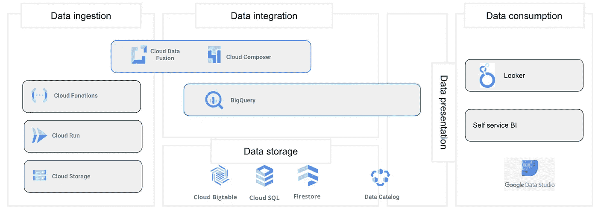

# 这是你的下一个数据物流平台架构吗？

> 原文：<https://medium.com/codex/is-this-your-next-data-logistics-platform-architecture-dffe402d1daa?source=collection_archive---------5----------------------->

雅克·迪利斯在 [Unsplash](https://unsplash.com/s/photos/warehouse?utm_source=unsplash&utm_medium=referral&utm_content=creditCopyText) 上的照片

数字化在发展，越来越多的数字工具被实施并产生关于你的业务的数据。为了从所有数据点中获得洞察力，需要一种灵活的数据物流平台方法。

# 基本的 4 层体系结构

从数据中创造知识至少有三个步骤，第一，将数据吸收到平台中，第二，集成各种数据源，第三，向您的消费者系统呈现统一的可消费且可理解的数据模型。

数据在各种系统中产生，每个系统都有用途，一体化系统往往难以理解和维护，因此会使用各种系统和平台。所有这些系统中产生的数据都需要纳入一个统一的数据平台。这是由第一层完成的，即数据接收层。这一层主要由特定业务所需的临时区域和服务连接器组成。

这些数据需要被处理并合并到一个统一的数据模型中，这是在数据集成层完成的。在这里，各种数据源被过滤、转换和组合。此外，这一层通常用于数据接收和处理管道的编排。

为了有一个稳定的数据模型来创建报告并将数据从一个系统移动到另一个系统，使用了数据表示层。这一层通常通过数据仓库、(REST)API 或“仅仅”数据库来实现。

第四层也是最后一层是消费层，可以是报告/ BI 工具或消费系统。这一层只使用底层表示层的数据，因此与数据管道是分离的。这增加了报告或消费的稳定性，同时引入了数据集成的灵活性以及表示层的可验证性。

数据物流平台架构的基本模式

理论够了，如何在超大规模上实现这个架构！每个具体的实现都会有一点不同，让我们来看看实现这样一个架构的一些工具。

# 在 Google Cloud 上实现这个数据物流平台的工具

首先，哪些工具与实现如上所述的数据集成平台相关。Google 有 BigQuery 服务，它可以成为您实现所有 4 层的首选，只要您的数据源中只有可用作 Google BigQuery 连接器的数据，并且只要您想实现单向数据传输。

另外，对于数据摄取，有像 Googles 云存储、云功能和云运行这样的工具从源系统获取数据并摄取到数据物流平台。

对于数据集成，GCP 上有各种各样的服务。Cloud Fusion 和 Cloud Composer 是编排和实施数据传输和转换的两种服务。对于大数据，Googles 的 BigQuery 服务可能也是一个有效的选择。而处理流数据需要像 Dataflow 或 Pub/Sub 这样的工具。

经过转换和集成的数据及其所有可能的集成层可以存储在一个数据库中，如 Cloud SQL、Big Table、Cloud Spanner 或 Firestore。同样，BigQuery 可能是存储和呈现集成数据的首选工具。

为了消费数据，实现基于集成数据模型的 API 并在您的任何业务应用程序中使用该 API 的可能性是无限的。Apigee 是谷歌的 API 管理工具。

在报道 GCP 的情况下，可以在 Looker、Google Data Studio 和 BigQuery 之间做出选择。也可以连接其他 BI 系统，如 PowerBI。

Google 云平台上的示例实现

# 在 Microsoft Azure 上实现该数据物流平台的工具

不是谷歌用户？好了，我们来看看如何在微软 Azure 上实现一个数据物流平台！首先，数据摄取部分，类似于 GCP，Azure 功能可以从复杂的 API 或数据湖中摄取数据。说到数据湖，再加上 Azure 存储，这是从 Azure 之外的来源转储数据的首选解决方案。在简单的 API 和已经可用的连接器的情况下，Azure 数据工厂可以是数据摄取层的一部分。

PowerApps 也可以用于将数据导入数据物流平台，尽管 PowerApps 可能更像是手动数据输入的解决方案。

Azure Data Factory 主要作为实现数据集成管道和数据转换管道编排的工具。这些可以在数据流中实现，也可以在 Databricks 或 Azure 批处理中实现，很多情况下直接在 Azure Data Factory 中实现。

因此，Azure Data Factory 是实现集成层的主要工具，尽管集成平台需要处理流数据，然后需要考虑 Azure Stream Analytics 和 Azure Event Hub，同样也可以使用 Databricks 和 HDInsight。

第二层的结果是，数据集成又是一个统一的数据模型，可以使用 Azure SQL 数据库(或其变体)、Azure Cosmos DB，甚至在 Azure 数据湖中存储该数据模型。

第三层，数据表示，可以使用 Azure Synapse Analytics，Azure 上的数据仓库解决方案，特定于数据表示的 Azure SQL 数据库，甚至通过(自定义)(REST)API 来完成。

PowerBI 是微软的商业智能工具，使用来自 Azure Synapse 分析平台、Azure SQL 数据库或 Azure Cosmos DB 的数据。PowerBI 还可以使用许多其他连接，尽管这很诱人，但不推荐使用 PowerBI 进行数据集成。

当通过 API 呈现数据时，应该考虑 Azure API 管理来实现 API 管理和安全性。

Azure 上的示例实现

# 事后思考

4 层体系结构及其在超大规模上的实施总是伴随着对开发运维或 CI/ CD 流程的需求。因此，基础设施需要通过 IaC 解决方案来实现。根据所选解决方案的不同，这需要实施或多或少复杂的 CI/ CD 工作流，还需要编写测试来验证基础架构、配置和数据的状态。

此外，所有服务的配置都需要指定为代码，声明式编程的范例在处理基础设施、数据库和集成服务时非常有用。这种范式不同于标准的命令式开发方法，因此需要转变对开发的思考。

您是否已经实施了数据集成平台？它能帮助您的企业从数据中创造更多知识吗？请在评论中告诉我！

每个企业都有其特殊需求，上述服务目前还不全面，如果您的企业需要数据物流和定制实施，请随时联系。

和往常一样，如果你喜欢这篇文章，如果这篇文章对你有帮助，你可以考虑:

