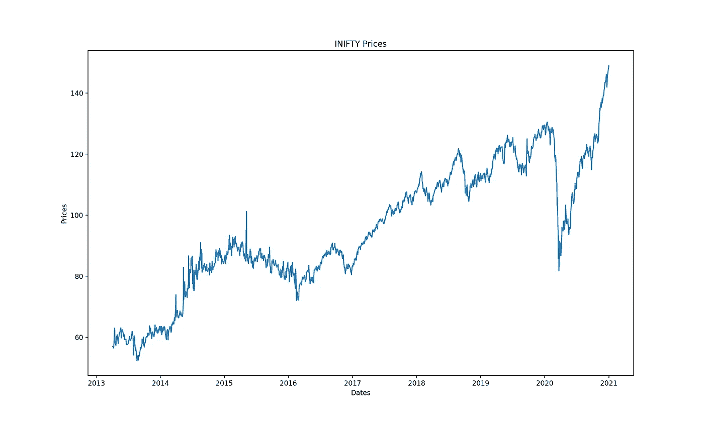
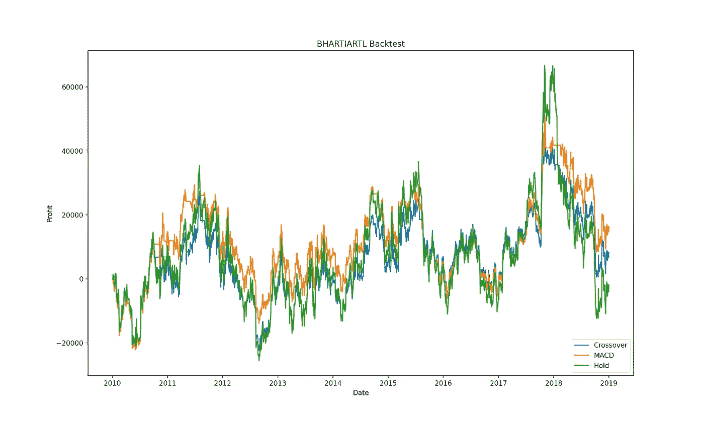

# 使用指数移动平均线(EMAs)交易有利可图吗？

> 原文：<https://medium.com/codex/is-trading-using-exponential-moving-averages-emas-profitable-2482c4e8ba6e?source=collection_archive---------1----------------------->

## 使用 Python 回溯测试过去 10 年的 EMA 算法


图片由[科技日报](https://unsplash.com/@techdailyca)在 [Unsplash](https://unsplash.com/photos/ztYmIQecyH4) 上拍摄

技术指标是普通算法交易者的面包和黄油。任何简单的谷歌搜索，或者技术分析课程(如果你是 boujee)，都会告诉你某些指标:移动平均线，相对强弱指标，布林线等等。因此，我将分析移动平均线指标在描述股票趋势方面的效用——并进一步获利。

在这个项目的整个过程中，我将解释移动平均线的使用，移动平均线背后的一些数学知识，用于回溯测试的算法，回溯测试的结果，以及之后获得的见解:

## 目录

–[移动平均线解释](#5bd8)
–[后验](#adcc)
–[结论](#dbd5)
–[代码](#13a1)

这个项目的 GitHub repo 可以在这里[找到。我还将主要代码放在了文章的末尾。](https://github.com/jai-agrawal/ema-backtests/)

免责声明:本项目及其结果的任何部分都不应被视为股票市场建议。我只是一个业余程序员，希望分享我个人项目的发现。

# 移动平均线解释

如果你还不知道移动平均线(MA)意味着什么(在这种情况下，大胆地跳到本文)，下面是它的简单含义:

> “在统计学中，**移动平均值**是一种计算方法，用于通过创建完整数据集的不同子集的一系列平均值来分析数据点” [1](https://www.investopedia.com/terms/m/movingaverage.asp)

为什么这在金融环境中是有用的，是因为 MA 能够消除股票价格的微小波动，并使交易者能够查看特定股票的趋势。总的来说，交易中有两种均线:简单均线和指数均线。

## 简单移动平均线

*n* 日 SMA 取最后 *n* 个交易日的算术平均值。例如，如果我想找出一种商品的 50 天均线，我必须找出该商品的最后 50 个收盘价，并找出该价格的平均值。够简单吗？(哈哈)

## 指数移动平均线

SMA 的一个限制是它给旧数据和新数据同等的权重。这就是均线发挥作用的地方。你可以在这里查看它背后的数学原理，但我不认为这有什么关系。相关的是，它给了最近的数据更多的权重，因此能够更动态地描绘趋势。

我现在将回测均线——因为我发现它更有用——以了解它过去的盈利情况。

# 回溯测试

## 使用的算法

有一些算法可以用来合并 EMA:

1.  交叉:当收盘价低于/高于均线时，分别买入/卖出。这意味着当一只股票的价格低于均线时，你应该买入，因为这意味着它的交易价格低于趋势价格。
2.  移动平均收敛发散(MACD):

```
MACD = 12-day EMA - 26-day EMA
```

很简单，这是股票动力的另一个指标。

3.多个 EMA 组合的交叉交易:类似于交叉交易，人们可以根据多个 EMA 何时相交来买入/卖出。例如，我过去尝试过的一个策略是，当 5 日均线低于 20 日均线，20 日均线低于 60 日均线时买入(卖出功能正好相反)。

我将使用 100，000 卢比的任意预算，以及算法 2 和 3 进行回溯测试。

注意:我还将反复灌输这样一种逻辑，即用户可能不想以低于其平均购买价格的价格出售。因此，我把它放在回溯测试算法中。

## 使用的数据

这个项目中使用的所有数据都是使用 NSEpy [LINK]库提取的。你可以看看 Github repo，看看它是怎么做的。它使您能够从预定义的时间段中提取某一股票的股票数据。

就时间段而言，我观察了 2011 年至 2021 年间的投资势头:



极低的价格

我可能不得不排除 2020 年以后的数据，因为由于疫情，市场运转异常。因此，2009-2019 年是一个很好的十年。

至于股票，我将从大、中、小盘股中各选三家公司。这个决定将被武断地做出。我将使用 BHARTIARTL 价格来说明下面的项目。

## 分析

MACD 和跨界车的 10 年盈亏曲线如下:



*2009 年因股票分割而删除

外卖:

1.  由于反应更灵敏，MACD 更加活跃，能够利用价格波动产生更高的利润，同时几乎不会遭受更多的损失
2.  交叉速度较慢，也更稳定
3.  持有(在回溯测试的第一天投入全部预算，完全不卖出)是利润最低的策略，尤其是考虑到第五点。虽然，股票价格的上涨也会导致持有利润比其他利润增加更多
4.  对这只股票来说，两种算法都有利可图
5.  利润的最高点是₹50000，考虑到时间跨度很大，这是不可行的。我还考虑到，大部分产生的利润可能会变现，并重新投入股票，这将使结果倍增。因此，在接下来的回溯测试中，我将只获取 2016 年至 2019 年的数据

结果如下:

所有符号的回溯测试

*   IDEA (Crossover)和 LUXIND 没有盈利，尽管我认为这在很大程度上是由于接近数据结束时(2018 年底)的价格下降
*   其他银行显然是盈利的，ICICI，TATA 和 JINDALSTEL 的年回报率约为 20%
*   交叉利润和 MACD 利润之间真的没有关联，尽管深入研究数据可能会发现一个关联

## 限制

虽然回溯测试可能是一个人在他的算法交易之旅中应该反复灌输的第一步，但它不应该是最后一步。回溯测试有许多限制。例如:

*   **过去的表现并不能保证未来的结果**。这一点非常重要。回溯测试就是这样——回溯测试。这仅仅意味着它的结果将符合未来的结果，因为市场的运行*与回溯测试数据中的完全一样。这一点永远无法保证。未来的违规行为可能是由各种原因造成的，这里的列表太长，无法一一列举*
*   虽然回溯测试算法能够在完全流动的情况下进行买卖，但将资金转入你的账户并实际购买股票确实需要时间，并可能导致股价的涨跌。据我所知，印度经纪人还没有提供免费的 API 使用，允许你直接从你的代码下订单
*   如前所述，我还没有用赚来的钱做任何事情。在现实世界中，赚到的钱会被投资回去，导致指数级的结果

# 结论

使用 EMAs 交易有利可图吗？很难说。回溯测试只能在一定程度上证明结果。基于过去的趋势，如果股票投资遵循给定的 EMA 算法，排除外部市场变化的情况(破产、丑闻、疫情),那么在很长一段时间内，这些投资很可能是盈利的。这是否比在整个时期都持有这项投资要好？完全取决于市场。这个策略有逻辑和实际意义吗？是的，只要股票价格不会永远下跌，你应该*在技术上*能够利用股票价格的涨跌赚取一些利润。

## 未来的工作

我想回测更多的交易算法，看看它们的预期利润。或许，加密货币也是如此。我还想找到更好的方法来显示生成的结果，而不是简单的表格。

# 密码

查看我的 [GitHub Repo](https://github.com/jai-agrawal/ema-backtests) 获取更多关于如何在 [utils.py](https://github.com/jai-agrawal/ema-backtests/blob/master/utils.py) 中创建数据帧的信息。