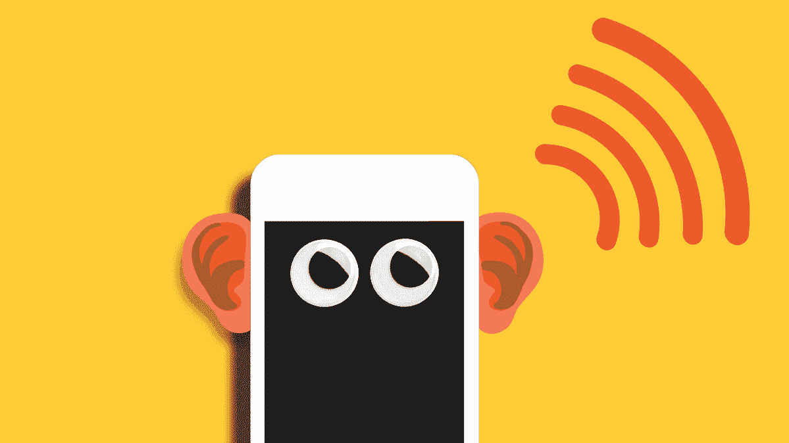

# 你的智能手机在听你说话吗？是的。

> 原文：<https://medium.com/codex/is-your-smartphone-listening-to-you-yes-d77b4a67a9c7?source=collection_archive---------11----------------------->

这个场景就像一个脊椎冷却器:你拿出你的电话，你看到一个 AirPods 的促销。

> 在我们开始之前，我请求你加入我的时事通讯。我保证你将来会有深刻的见解。让我们用惊人的内容来满足我们饥饿的头脑，你甚至可以亲自给我发消息来学习和写一些东西或你对它的看法。

 [## Niraaj 的时事通讯

### 喂养饥饿的心灵。点击阅读 Niraaj 的时事通讯，作者 Niraaj Ojha，是一个子堆栈出版物。启动 5 天…

niraajojha.substack.com](https://niraajojha.substack.com/) 

袖手旁观一会儿，你想。我不是简单的和同伴讨论了一下 AirPods 吗？就像，真诚的讨论，大声说出来？我的电话…在关注我吗？

为什么，事实上，它很可能是。当你使用默认设置时，你所说的一切都可能通过你的小工具的本地可用放大器被记录下来。我们的电话定期收集我们的语音信息，存储在一个遥远的服务器上，并用于展示的最终目标。这个事实被沉默了好一阵子，然而这种指定促销正在一点一点地成为常识。

作为“prime”型号，点击或点击此处，查看亚马逊如何管理其收集的语音信息，以及如何阻止 Alexa 收听。

你的电话不是关注你的主要工具。美国联邦调查局警告说，程序员可能会假设控制你的精明的电视上的机会，你没有得到它。轻按或抓拍，找出如何在您的电视机过了不归路之前接管对它的保护。

在你问之前，的确，这是完全合法的，工程师保证不会错误地处理这种训练。然而，这并不意味着你需要喜欢它；许多人看到他们谈论过的东西的广告时会感到惊讶，而不是在他们的节目中寻找。幸运的是，有一些方法可以防止你的小玩意偷窥你。

喃喃自语(展示)努力
当你想到这一点时，手机配备了一个检查硬件的武器库:不同的接口和摄像头旨在保留声音和视频。虽然这些设备可能有助于制作媒体，但它们同样是赞助商的金矿。

2018 年年中,《坏习惯》的一名记者测试了手机对我们讨论的关注程度。为了测试他的电话，这位专栏作家连续五天每天说两次预先选择的表达。在此期间，他观察他的脸书频道，检查是否有任何进展发生。

足够肯定的是，进步似乎暂时出现了。他的一个测试短语包括“回到大学”，第二天早上，记者看到了夏季课程的促销活动。然后，在那一点上，他把他的测试表情换成了“朴素的衬衫”，并立即在他的脸书频道上看到了最低消费服装的广告。

这份报告掀起了一股关注网络娱乐舞台影响的热潮。

虽然每一个奇怪的评论中很少有人给出明确无误的回答，但由于一些应用程序和虚拟娱乐平台的客户端安排中的线索，人们对这种情况达成了普遍的解决感觉。轻按或抓拍，这是一种简单的方法，可以发现你的#1 阶段的客户安排中隐藏了什么。

这些客户协议明确声明录制的声音可用于指定的推广目的。奇怪的是，这种做法并不违法。这项活动允许技术组织进一步推动保护限制，促使我们购买我们不需要的东西。

我能做些什么来避免被监视呢？万一你对指定的促销活动不满意，有一些方法可以缓和你手机的政府代理权力。考虑到所有的事情，你可能会失去一些有用的元素，如唤醒词和语音伙伴，所以你需要断定这些亮点是否值得放弃你的保护。

最大的弱点来自大多数语音合作伙伴的“持续在线”元素。为了获得像“你好，Siri”这样的唤醒词，麦克风需要一直开着——这意味着你的电话在不断调谐。

开始恢复保护的最佳方式是关闭手机上的“持续开启”接收器高亮显示。这是实现它的方法。

停用“你好 Siri”
苹果因翻译 Siri 客户端的声音账户而遭到严厉批评。这些信息被私下放在你的小工具上，一旦 Siri 被激活，这些信息就会被传输，因此削弱这个元素将从本质上使你的 Siri 输入更加有限，并为你的请求更好地定义。

要关闭“你好 Siri”，请浏览 iOS 小工具的设置，然后是 Siri 和搜索。然后，将“你好，Siri”的调谐功能关闭。

瘫痪“好吧谷歌”
每次你使用“好吧谷歌”，或利用另一种语音控制功能，你的问题都会被记录下来，并保存到你的谷歌账户。点击或点击此处，找出如何删除这些账户和其他你认为谷歌不应该存储的数据。

假设你在 Android 上使用谷歌助手，打开谷歌右手设置。说，“好的谷歌”或按住电话的 home 键，然后点击右上角找到的档案柜符号，并点击三键菜单。选择更多并选择设置。

从这里开始，您需要向下查看小工具分类并选择您的电话，然后，在靠近顶部的 Google Collaborator 区域，点击蓝色滑块按钮将其变为黑色，这将关闭 Google Partner。

使话筒无法接入应用程序
削弱电话中持续开启的放大器亮点对于脸书等应用程序来说是不够的。这个社交网站为这一标准提供了特例，除非你推出改进，否则它会继续倾听。

这只是众多保护设置中的一个，万一你有一个脸书帐户，你真的应该利用它。点击或点击获取保护您的个人资料的其他方式。

这是您关闭脸书录音的方法，但类似的改进也适用于任何使用接收器的应用程序:

苹果手机

进入子菜单中的设置>>脸书>>设置。向左滑动麦克风开关，使其从绿色变为白色。这就关掉了。或者，你可以进入设置>>隐私>>麦克风，然后寻找脸书做同样的事情。请注意，您也可以为其他应用程序打开和关闭麦克风。

机器人

打开“设置”，然后选取“应用程序”和“应用程序管理器”。查找脸书，点击应用程序权限，然后关闭麦克风。

请记住，关闭脸书的接收器访问将影响和削弱现场视频等特定的亮点。假设你将利用这些亮点，你应该翻转麦克风回来。按照上面类似的步骤，但是确保开关设置为开，你就一切就绪了。