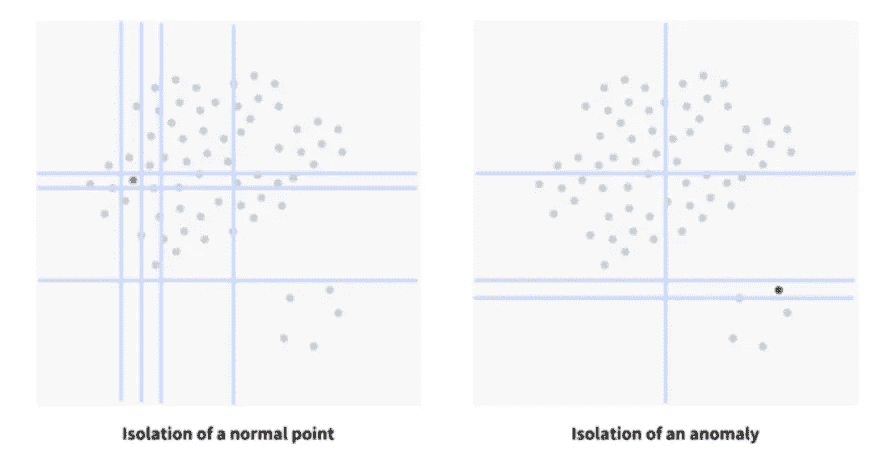
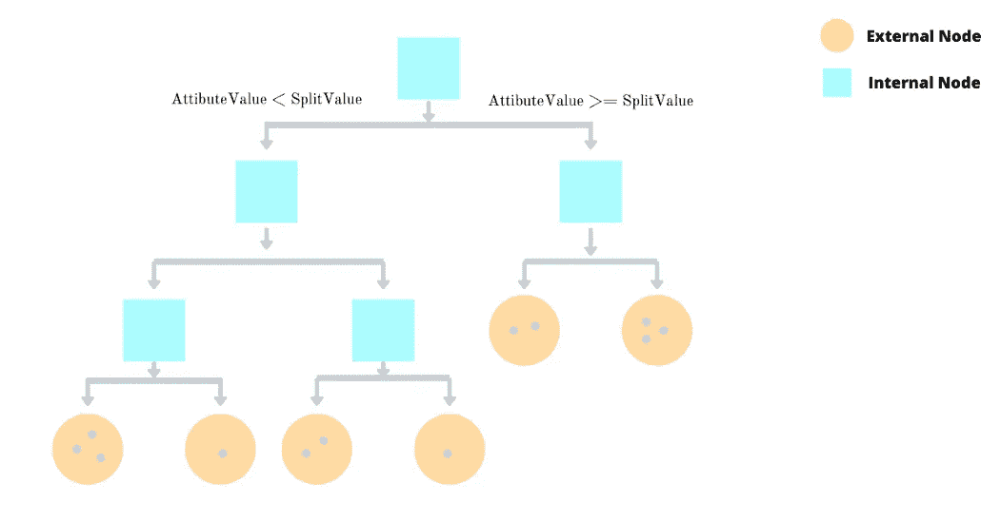
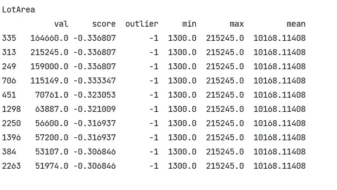
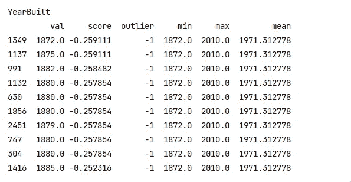
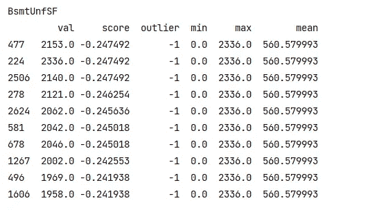
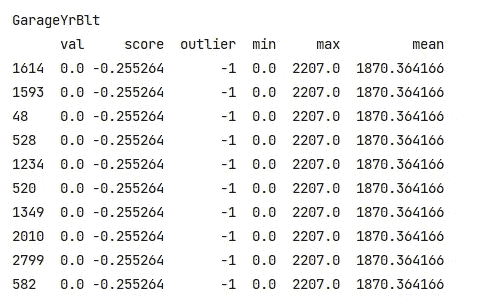

# 简化隔离林异常值检测

> 原文：<https://medium.com/codex/isolation-forest-outlier-detection-simplified-5d938548bb5c?source=collection_archive---------2----------------------->

反常

异常是具有不同于正常实例的数据特征的数据模式。

# 商业应用

异常检测具有重要的相关性，并且通常在各种应用领域中提供关键的可操作信息。例如，信用卡交易中的异常可能意味着信用卡的欺诈使用。天文图像中的异常点可能预示着一颗新星的发现。异常的计算机网络流量模式可能代表未经授权的访问。这些应用要求异常检测算法具有高检测性能和快速执行。

# 它与现有的基于模型的方法有何不同？

在传统方法中，我们使用各种统计方法，如分类、聚类、距离、密度&在这些方法中，我们构建正常实例的轮廓，然后将不符合的实例归类为异常。这些方法的缺点是存在假阳性。有时，人们甚至可能无法捕捉到异常。

这种方法正好相反。它明确地隔离异常，而不是剖析正常实例。就数量和属性值而言，异常通常是“少数和不同的”实例，这使得它们比正常点更容易被隔离。因此，我们将利用这两个因素&将使用基于树的结构。

当树不是从整个数据集而是从子采样数据集创建时，隔离森林(IF)算法工作得最好。因此，你看，这与几乎所有其他技术非常不同，在其他技术中，它们依赖于数据并要求更多的数据以获得更高的准确性。子采样在这种算法中产生了奇迹，因为正常实例可能会因为稍微接近异常值而干扰隔离过程。在本例中，我们设置 max_samples=100，因此隔离林抽取 100 个样本来训练每个特征的基本估计量。

# 它是如何工作的？

该算法很好地利用了异常值的特征，使其独立于数据分布，并使该方法新颖。

该算法的核心是通过在随机属性上创建决策树来“隔离”离群值。随机分区为异常值产生了明显更短的路径，因为:

*   (离群值的)实例越少，分区就越小
*   可区分的属性值更有可能在早期分区中被分离

因此，当随机树的森林为某些特定点共同产生较短的路径长度时，它们很可能是离群值。



上图显示了分离一个正常点和一个异常值所需的分割数。用蓝线表示的分裂是在构建决策树的过程中随机发生在随机属性上的。分裂的数量决定了隔离发生的级别，并将用于生成异常值分数。

这个过程重复多次，我们记录每个点/实例的隔离级别。一旦迭代结束，我们为每个点/实例生成一个异常值分数，表明它是异常值的可能性。分数是孤立点的平均水平的函数。根据分数收集的前几个样本被标记为异常值。

换句话说，隔离树试图做的是---->随机选择一个特征(X)，对其进行划分，然后递归地选择所选特征的最小值和最大值之间的随机分裂值，使得不能再进行分裂，并且隔离 X 的每个值。

对于产生的异常分值:

*   如果该值接近 1，则该数据点可能是异常的
*   如果该值小于 0.5，则该数据点可能是一个常规点



给定高斯分布(135 个点)，(a)正常点 xi 需要 12 个随机分区被隔离；(b)异常 xo 只需要隔离四个分区。当树的数量增加时，xi 和 xo 的平均路径长度收敛

# **隔离林的优势和独特之处**

> 1)小样本量效果更好→能够构建部分模型并在现有方法不可行的程度上利用子采样。因为隔离正常点的该树的大部分不需要用于异常检测；它不需要被构建。较小的样本大小会产生更好的等值树，因为沼泽和掩蔽效应减少了。
> 
> 2)更少的计算工作量和更低的内存需求→不使用距离或密度测量来检测异常。这消除了所有基于距离的方法和基于密度的方法中距离计算的主要计算成本。
> 
> 3)纵向扩展以处理具有大量不相关属性的极大数据量和高维度问题的能力。

解释:

*   **clf.fit** 使用特定特性的 max_samples 计数来拟合基本估计值。
*   **如果观察被认为是异常值，clf.predict** 返回-1，否则返回 1
*   **clf.decision_function** 返回基于拟合模型的测量异常值分数

统计数据框架仅保存原始样本值、它们的分数、是否认为它们是异常值以及一些简单的特征统计数据，如最小值、最大值和中值。

# 数据列

以下是所有的列名

['Id '，' MSSubClass '，' MSZoning '，' LotFrontage '，' LotArea '，' Street '，' Alley '，' LotShape '，' LandContour '，' Utilities '，' LotConfig '，' Condition1 '，' Condition2 '，' BldgType '，' HouseStyle '，' OverallQual '，' OverallCond '，' YearBuilt '，' YearRemodAdd '，' RoofStyle '，' RoofMatl '，' Exterior1st '，' Exterior2nd '，' MasVnrType '，' MasVnrArea '，' ExterQual '，'

# **代码**

```
import pandas as pd
import os
import matplotlib.pyplot as plt
import seaborn as sns
import numpy as np
import warnings

warnings.filterwarnings('ignore')
pd.reset_option('^display.', silent=True)

*# Load the two datasets* X_train = pd.read_csv("C:/Users/SM/train.csv")
X_test = pd.read_csv("C:/Users/SM/test.csv")

*# Seperate independent and dependent variable* num_train = len(X_train)
num_test = len(X_test)
y_train = X_train.SalePrice
X_train.drop(['SalePrice'], axis=1, inplace=True)

*# Merge train and test data to simplify processing* df = pd.concat([X_train, X_test], ignore_index=True)

*# Rename odd-named columns* df = df.rename(columns={"1stFlrSF": "FirstFlrSF",
                        "2ndFlrSF": "SecondFlrSF",
                       "3SsnPorch": "ThirdSsnPorch"})

*# Shopw 5 samples* print(df.head())
*# Find columns with more than 1000 NaN's and drop them (see above)* columns = [col for col in df.columns if df[col].isnull().sum() > 1000]
df = df.drop(columns, axis=1)

*# Fill LotFrontage with median* df['LotFrontage'].fillna((df['LotFrontage'].mean()), inplace=True)

*# No garage values means no year, area or cars* for col in ['GarageYrBlt', 'GarageArea', 'GarageCars']:
    df[col] = df[col].fillna(0)

*# No garage info means you don't have one* for col in ['GarageType', 'GarageFinish', 'GarageQual', 'GarageCond']:
    df[col] = df[col].fillna('None')

*# Fill no basement* for col in ['BsmtQual', 'BsmtCond', 'BsmtExposure', 'BsmtFinType1', 'BsmtFinType2']:
    df[col] = df[col].fillna('None')

*# Fill remaining categorical and numerical cols with None and 0* cat_columns = df.select_dtypes('object').columns
num_columns = [i for i in list(df.columns) if i not in cat_columns]
df.update(df[cat_columns].fillna('None'))
df.update(df[num_columns].fillna(0))

*# Check for missing values* print(df.isnull().values.any())

from sklearn.ensemble import IsolationForest

rng = np.random.RandomState(0)

*# Helper function to train and predict IF model for a feature* def train_and_predict_if(df, feature):
    clf = IsolationForest(max_samples=100, random_state=rng)
    clf.fit(df[[feature]])
    pred = clf.predict(df[[feature]])
    scores = clf.decision_function(df[[feature]])
    stats = pd.DataFrame()
    stats['val'] = df[feature]
    stats['score'] = scores
    stats['outlier'] = pred
    stats['min'] = df[feature].min()
    stats['max'] = df[feature].max()
    stats['mean'] = df[feature].mean()
    stats['feature'] = [feature] * len(df)
    return stats

*# Helper function to print outliers* def print_outliers(df, feature, n):
    print(feature)
    print(df[feature].head(n).to_string(), "\n")

*# Run through all features and save the outlier scores for each feature* num_columns = [i for i in list(df.columns) if i not in list(df.select_dtypes('object').columns) and i not in ['Id']]
result = pd.DataFrame()
for feature in num_columns:
    stats = train_and_predict_if(df, feature)
    result = pd.concat([result, stats])

*# Gather top outliers for each feature* outliers = {team: grp.drop('feature', axis=1)
            for team, grp in result.sort_values(by='score').groupby('feature')}

*# Print the top 10 outlier samples for a few selected features* n_outliers = 10
print_outliers(outliers, "LotArea", n_outliers)
print_outliers(outliers, "YearBuilt", n_outliers)
print_outliers(outliers, "BsmtUnfSF", n_outliers)
print_outliers(outliers, "GarageYrBlt", n_outliers)
```



让我们快速回顾一下这些功能的结果:

*   LotArea 有 4 个显著异常值(-1)，异常值分数约为-0.33，值高于 100000。这与该特征的平均值 10168 相差甚远。我们看到 LotArea 达到了 215245，因此减少这四个观察值(总共有个)对这个特性的方差的影响可以有利于我们以后的建模过程。
*   见下文，YearBuilt 不像 LotArea 那样多样化，因为发现最大异常值分数约为-0.25。这表明这些值与平均值相差不远。对于这个特性，如果发现最低值(~1880)是异常值。



*   BsmtUnfSF 模拟 YearBuilt，但是具有显著更高的方差。



*   根据 IF，GarageYrBlt 在 0 val 处显然有异常值，但这些是有意义的，因为这些观察值是没有任何 garage 的。大多数房子都有车库，它们与平均水平相差很大。



# 结论

概括地说，今天我们了解了如何使用隔离林来跟踪数据集中的异常值。我们以房价数据集为例。我真正感兴趣的一个原因是，隔离森林依赖于子采样数据，不需要从整个数据集构建树&与子采样数据配合良好，而且执行速度非常快，因为它不依赖于距离或密度计算等计算开销很大的操作。训练阶段具有低常数的线性时间复杂度，这意味着我们可以将其用于更大的数据处理场景。