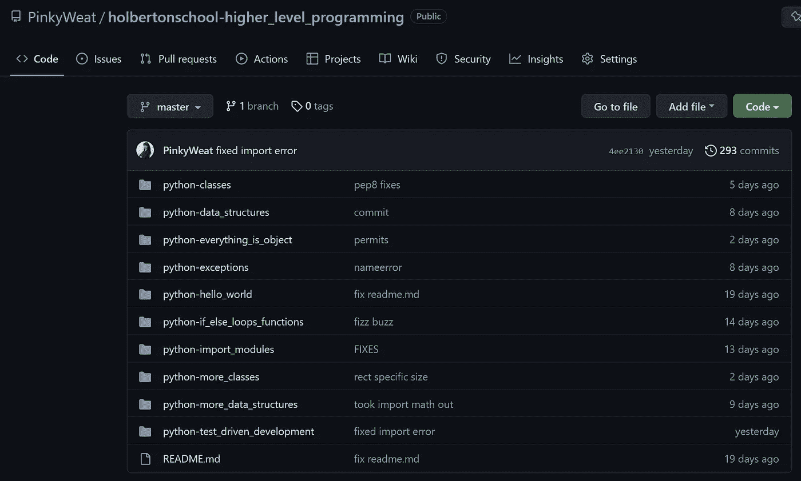
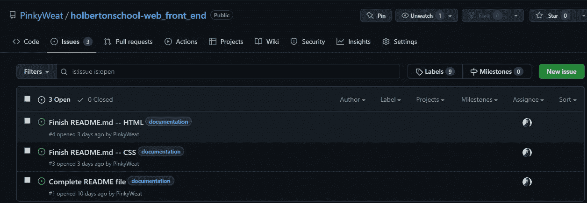
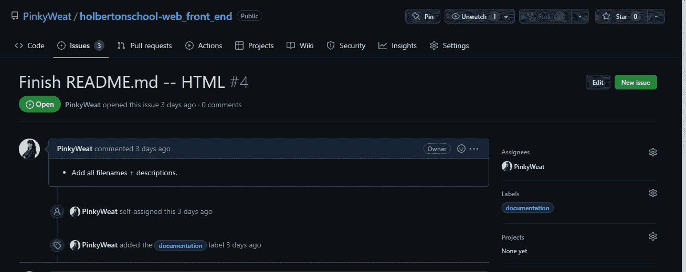
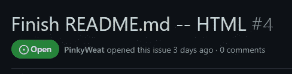
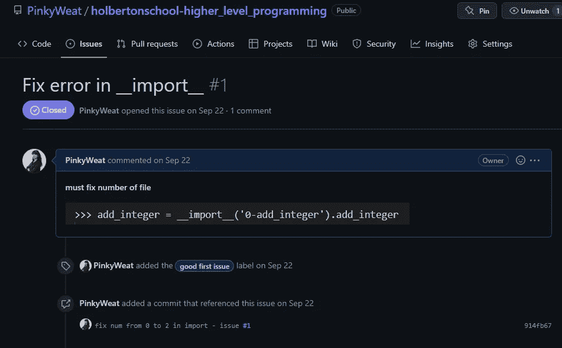
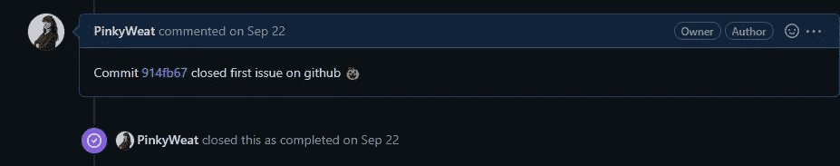

# GitHub 上的问题——教程+一个新手的观点

> 原文：<https://medium.com/codex/issues-on-github-tutorial-a-noobies-point-of-view-1886ea326bdf?source=collection_archive---------20----------------------->

首先，我想声明我几周前才在 GitHub 上完成了第一期。

然而，**这就是为什么**我觉得有一个像我这样的新手写的关于这个主题的帖子是很好的，这是一个简单的教程，告诉你为什么应该把它们添加到你的日常编码程序中。

# 我开始使用它们的原因

当我在几个月前创建我的 Shell 解释器时，我的课程导师建议我开始使用 Issues 特性，因为这个项目有太多的文件(至少在当时是这样),这将有助于更好地组织工作。

# 操作方法

得到这个特性一点也不困难，但是，可能有一两件事并不像你想象的那样本能，你可以在这里找到。

下图显示了我们点击 GitHub 存储库时看到的内容:

更准确地说，这是**问题**的特点:

现在我想给你们看下一张图片:

这是我的最新存储库在单击“问题”按钮后的样子。我使用**“文档”**标签填写了 **3 期**。你有更多的默认标签选项，比如 bug，enhancement，help wanted，或者你也可以为自己定制更好的标签。

如果你看右边的栏，你可以看到我给自己分配了这些任务。但是，如果您与同一个存储库中的人一起工作，您肯定可以分配另一个合作者来完成该任务。

## 不再到处张贴，但每件事都是详细的，真正有条理的

就我个人而言，我发现文档是最重要的，然而，我并不总是有最好的心情来写我的 *Read Me* 文件，所以通过这种方式，我可以根据我急需做的事情和可以等一两天的事情来重新安排我的优先事项。

这是其中一期的标题，见“**# 4”**是灰色的？这个号码是在你归档你的每一个问题时自动给出的，当你完成这些问题时，这个号码就被释放出来，可以重新分配。

## 最重要的是，这个数字是您提交更改后需要使用的数字！

在执行我们经典的 *git add* sequence 时，记得在您的重要提交注释之后，写入您用来*完成*任务的提交、您想要关闭的问题的 **# *< <编号> >*** 。推送后，您可以仔细检查您的问题是否已移至“已关闭的问题”部分。

下面是一个例子:

看看我在提交中写了“在导入中把 num 从 0 修正到 2——问题#1”之后是怎样的？GitHub 就是这样识别出你想做什么的。在右下角，您可以看到是 commit *914fb67* 解决了这个问题。

# 结论

虽然解决问题看起来没那么有趣，因为你是在给自己工作，但记住工作已经在那里了，为什么不记录下来，在完成任务的同时提高你的技能呢？

没有什么比看到自己完成的所有任务更令人满意的了。您可以在任何给定的时间返回，当两次遇到类似的问题时，这也会有很大的帮助。

## 来吧，和我一起实现这个新的目标，记录下通往掌握尽可能多的编程语言的道路上的一切！