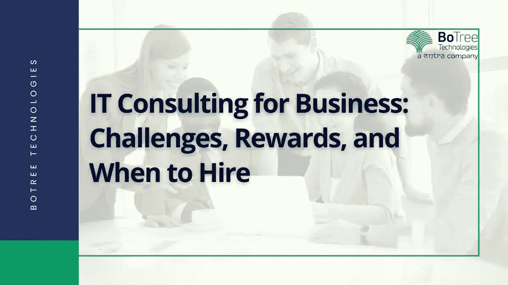

# 商业 IT 咨询:挑战、回报和何时雇佣

> 原文：<https://medium.com/codex/it-consulting-for-business-challenges-rewards-when-to-hire-ad806ad59406?source=collection_archive---------4----------------------->

IT 咨询服务充当 IT 部门实现业务目标的支持系统。维持一个专门的全职 IT 团队来进行流程优化和系统维护是非常昂贵的。IT 顾问是经济高效的 IT 和业务流程优化的可行选择。

报告显示，66%的技术项目以全部或部分失败告终。失败的最大原因之一是没有明确定义目标，没有问正确的问题。IT 咨询公司请来了专家，他们的主要工作是提出问题，推动实现最佳结果的整个过程。

今天，一家 [IT 咨询公司](https://www.tntra.io/)由领域专家组成。有金融科技、数据、云计算、数字化转型、流程优化等方面的顾问。这些 IT 专家确保无论什么流程需要转换，他们都可以为此提供工具和专业知识。

> **阅读更多:** [**全球 7 大科技咨询公司**](https://www.botreetechnologies.com/blog/top-technology-consulting-companies/)

让我们来看看聘请技术咨询公司的一些好处。

# 雇佣 IT 咨询公司的回报

信息技术咨询服务需求量很大。2020 年，[全球软件咨询市场](https://www.grandviewresearch.com/industry-analysis/software-consulting-market)的规模为 2186 亿美元，预计从 2021 年到 2028 年将以 12%的 CAGR 增长。

随着公司寻求外部专业知识和指导来改善 IT 成果，信息[技术咨询公司](https://www.tntra.io/technology-consulting)在企业运营中的作用将会增加。

让我们看看雇佣专业 IT 顾问的一些好处——

1.  **获取 IT 专业知识:**

*   通常，雇佣一个内部 IT 专家团队是很昂贵的。技术实现需要知道自己在做什么的专家。IT 顾问既实惠又有效。他们拥有公司在其他地方可能找不到的专业知识。
*   专业的 [IT 咨询服务](https://www.botreetechnologies.com/it-consulting-services)提供商提供一个拥有不同技术领域经验的专家团队。他们可以提供整体的 IT 咨询方法，并协助无缝实现 IT 目标。

**2。关注核心业务功能:**

*   虽然这是一项核心业务职能，但对于非 IT 专业人员、经理和高管来说，这可能是一项挑战。但是将 [IT 战略和规划](https://www.botreetechnologies.com/blog/it-strategy-challenges/)外包给顾问，这些人可以专注于核心业务职能。通常情况下，技术实施和研究需要花费大量时间。
*   战略咨询服务领域的专业人员承担起 IT 职能，使经理们能够专注于他们的核心专业领域——管理、规划和流程优化。

**3。确定需要改进的领域:**

*   一些企业受到这个问题的困扰，他们无法确定需要改进的关键领域。IT 顾问提出正确的问题，并确定可以从流程或解决方案优化中受益的领域。
*   IT 专家团队带来了几位专业人士，他们为改进现有系统贡献了新的想法和解决方案。他们也是流程再造方面的专家，知道需要做什么以及如何做。

**4。节省时间和成本:**

*   雇佣 IT 战略咨询公司的另一个好处是节省时间和成本。企业不需要花很多钱雇佣一个有 401k、医疗、保险等福利的全职员工。通常，中小型企业没有足够的预算来雇佣全职专家团队来管理其 IT 运营。
*   因此，此类企业可以为特定目标雇用 IT 顾问，并使流程变得可承受和无缝。

**5。按需扩展:**

*   公司可以随时雇佣 IT 咨询服务提供商。当项目需求高时，他们可以请专家来，当项目需求低时，让他们走/按需扩展允许他们定期维护 it 系统，而不会产生雇佣团队的固定成本。
*   [IT 咨询公司](https://www.botreetechnologies.com/blog/it-consulting-firms-to-help-digital-transformation/)按需提供 IT 战略、数字化转型、流程优化等方面的专家。企业可以合并并雇佣一个团队来提供所有这些服务。

# IT 咨询服务面临的挑战

我们知道高质量的 IT 服务提供了广泛的优势。然而，IT 咨询服务也带来了一些挑战。

以下是雇佣 IT 顾问的几个挑战——

*   **工作文化差异:**
*   IT 顾问在不同的文化中工作。他们的方法是快速识别问题，采取大规模行动，并监控结果。然而，一家公司可能不会以这种方式工作。
*   如果文化是自由和悠闲的方式，IT 咨询可能是一个具有挑战性的努力。培训可能既耗时又昂贵。因此，识别工作风格差异并尽快解决它们是非常重要的。
*   **时间紧迫:**
*   IT 咨询活动侧重于改善 IT 成果和业务流程优化。然而，顾问通常在紧张的期限内工作。他们必须在有限的时间内取得成果。
*   公司不能在 IT 顾问上花很多钱，因为他们需要预算。因此，IT 顾问承受着满足最后期限的持续压力，否则他们将被项目解雇。
*   **市场的不可预测性:**
*   对于 IT 顾问来说，市场动荡总是具有挑战性。投资迅猛增长，消费者行为不断变化，网上活动让市场变得不可预测。因此，咨询公司有时很难适应市场的变化，最终导致企业亏损。
*   当顾问不适应动态的市场变化时，企业就要遭殃。应对这种动荡还会带来其他多种挑战。

# 何时雇佣 IT 顾问—使用案例

如今，许多公司都在寻求 IT 顾问来帮助他们实现 IT 目标。技术日新月异。因此，专业知识对于正确实施新的进步和技术至关重要。

当企业需要从外部了解其现有的 IT 流程时，他们会聘请 IT 顾问。内部团队经常对他们的想法和工作方式有偏见。然而，IT 顾问保持不偏不倚，并提供客观的情况。他们可能会找到被其他团队成员忽略的解决方案。

企业雇用 IT 顾问的另一种情况是，他们需要经验丰富的专业人员，但只是暂时的。一家提供专业 IT 顾问的可信赖的软件开发公司可以将他们部署到一个项目中，然后在工作完成后给他们打电话。全职员工团队的情况就不一样了。IT 顾问通常是按项目聘用的，这为企业提供了一种灵活的工作模式。

除此之外，雇佣 IT 顾问还有其他几个原因。随着越来越多的技术进步，聘请专家 IT 咨询服务的需求变得迫在眉睫。

> **阅读更多:** [**招聘 IT 顾问要考虑什么**](https://www.botreetechnologies.com/blog/what-to-consider-while-hiring-an-it-consultant/)

## 结论

如今，IT 咨询在公司 IT 计划的成功中扮演着重要的角色。他们带来了构建和扩展 IT 系统所需的专业知识、经验和网络。技术创新总是需要具备必要技能的专家从不同的角度看待问题，并提供正确的结果。

BoTree Technologies 是一家领先的[企业软件开发公司](https://www.botreetechnologies.com/enterprise-software-development-company)和 IT 咨询服务提供商，提供及时有效的 IT 战略和规划所需的合适的 IT 专家。

[**联系我们**](https://www.botreetechnologies.com/contact) **今天免费咨询。**

*原载于 2022 年 11 月 16 日*[*https://www.botreetechnologies.com*](https://www.botreetechnologies.com/blog/it-consulting-for-business-challenges-rewards-when-to-hire/)T22。