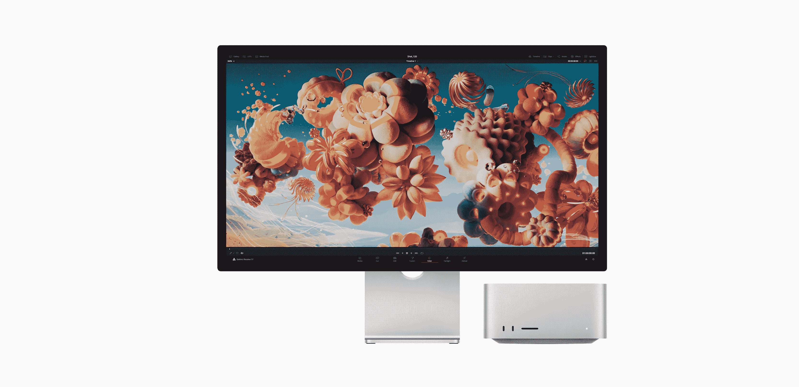
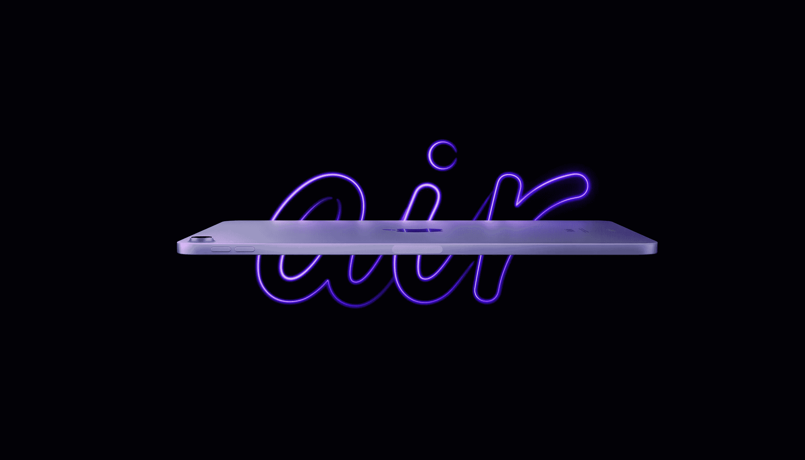
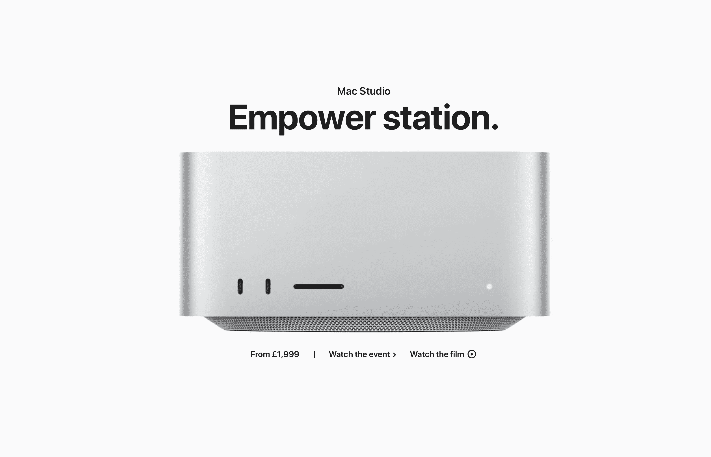
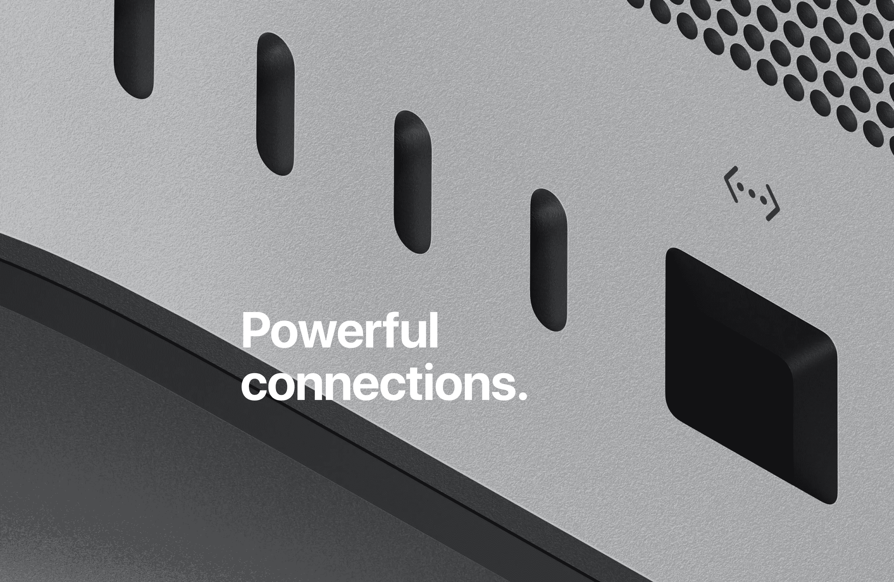

# 这是一件大事，但是…

> 原文：<https://medium.com/codex/it-was-a-great-event-but-d5de6dc6e842?source=collection_archive---------7----------------------->

## 有你想要的东西吗？

近 24 小时前，苹果公司今年的第一次 Peek 表演活动开始直播。所有几个月和几个星期的猜测都平息了。这是它；事实。当然，他们也没有让人失望。但是现在尘埃落定，当我反思时，我意识到对我来说很少是真的，很可能对你也不是。让我们快速回顾一下我们实际得到了什么，好吗，然后再来看看这个节目的主要吸引力 Mac 演播室。

*顺便说一下，在看产品之前，有没有人注意到组合不好？音乐与音频相差甚远。每次转换时，我都得把对白的音量调大，音乐的音量调小。来吧，苹果，我期待更好的。*

 [## 快到表演时间了

### 在 Peek Performance 开始之前写这篇文章——以及我们认为我们正在得到什么

medium.com](/codex/its-nearly-show-time-ef323d5cbbf) 

## 我们得到了什么

*   Apple TV+直播周五晚上的棒球赛
*   配备 5G 和 A15 仿生芯片的 iPhone 5 SE
*   iPhone 13 有两种新的绿色。Pro 系列有阿尔卑斯绿，13 系列有普通的旧绿。
*   iPad Air 现在配备了 M1 芯片、新的 1200 万像素摄像头和中央舞台
*   iMovie 的新版本将于 4 月推出，包含一系列新功能

当我们坐在那里见证这些公告时，我们都知道更多的事情将要发生。有点无聊，我们等着，然后嘣！大人物出场了。在活动的前一天，卢克·米亚尼泄露了我们将要得到的几乎所有细节。至少*对外*。我们谁也不知道，新的 Studio Mac 将会运行和驱动什么。原来，它要么是现有的 M1 最大*或*全新的 M1 超。把 Ultra 想象成两个绑在一起的 M1 Max 芯片。本质上，这就是超芯片。它提供了惊人的力量！号称比前辈快 3.8 倍的 CPU，4.5 倍的 GPU，3 倍的机器学习，这东西就是个畜生。显然，它可以处理多达 18 个 8K ProRes 422 播放流。*有用知道，我肯定*！

 [## 他们确实泄露了秘密

### 苹果的活动邀请，以及他们实际上意味着什么

medium.com](/codex/they-do-give-the-game-away-38cd06fad3b7) 

然后，除了 Studio Mac，我们还可以观看 Studio Monitor。内部配备 A13 芯片，这是 Mac 上第一次，由于该显示器拥有 1200 万像素的摄像头，我们成为了中心舞台。它有三个麦克风来完成您的在线电话会议需求，还配备了六扬声器音响系统。它有 27 英寸的工作空间和 5K 的分辨率。把它想象成 M1 iMac 24 英寸的面板，上面有扬声器和摄像头，然后放大尺寸。这就是你得到的。

价格不可避免地会变得吓人。我相信这款显示器非常超值，因为它的起价是 1599 英镑。你可以安装一些额外的东西，比如高度可调的支架或纳米纹理玻璃，但基本上，1599 美元你就能得到你需要的东西。另一方面，Mac Studio 则完全是另一回事。

从 3999 开始，如果你选择增加一些，它会很快跑到 7999。要向会计师解释这些数字，你必须是一个非常忙碌(并且有利润)的创意者！这是我的观点——这些苹果电脑是给谁的？它们有存在的必要吗？

## 苹果只是在炫耀吗？

从第一台 Apple Silicon Macs 电脑开始，我们就知道我们站在了个人电脑的新时代。容纳和冷却如此强大的芯片所需的占地面积之小令人担忧。在短短的一年里，我们从 M1，到 M1 马克斯，M1 专业，现在，M1 超。

我认为自己是一个有创造力的人。我经营着一个 YouTube 频道，这需要我来编辑 4K 的视频。不仅如此，我还制作播客，也是一名平面设计师。所有这一切意味着，我对我的苹果电脑提出了相当高的要求。

现在，不要误会我，我是一个新玩意儿的吸盘，特别是，我有一个新的 Mac 的弱点。但是，昨晚，当我在编辑我的视频时，我开始想知道，我们现在是不是到了一个点，苹果可以提供几乎没有人会需要的电力？现在这一切都是多余的吗？

我有信心，在今年的某个时候，我会买一台新的 Mac 电脑。根据我的要求，我最好的机器现在有点吱嘎作响。但是，我会买 M1 超级工作室 Mac 吗？我表示怀疑。正如刚才所描述的，我可能对我的机器有更多的要求，但我绝不需要一台 64 核 GPU 和 128 GB 统一内存的 Mac。我是一名专业人士，也是一名创意人士，所以这款新的 Studio Mac 应该直接针对我。但是，这太过分了。*办法太多。*

 [## 它已经准备好了——苹果的全新外部显示器

### 甚至有可能在本周宣布！

medium.com](/codex/and-it-could-even-be-announced-this-week-fb801693a773) 

## 我们忘了 Mac Pros 吗？

然后，我开始思考，未来会怎样？多年来，我们已经习惯了消费级 MAC，然后是‘前消费者’级机器。我在主题演讲中注意到，大多数对 M1 Ultra 的比较都是针对 Mac 系列中现有的英特尔机器。有没有可能 pro 级别的机器现在已经成为过去？如果这款新的录音室 Mac *比它的老大哥 Mac Pro 快*八倍，也比它贵 ***三倍*** ，那么真的，Pro 这个名字还有用武之地吗？

你还能比拥有一台小到可以放在桌子上的机器更专业吗？它可以运行多达 18 个 8K 视频片段流。如果你知道有哪个专业人士对台式机有更高的要求，我洗耳恭听。

尽管约翰·特努斯在他的文章结尾对着镜头调侃我们，说“Mac Pro 是为了另一天”，但那一天已经来了又去了吗？作为消费者，你有 M1 的 Mac Mini、MacBook Air 和 M1 的 iMac，我想今年晚些时候所有这些都将采用 M2 芯片。然后，我们已经有了一个伟大的便携式产品阵容，MacBook Pros 内置 M1 Pro 或 Max 芯片。现在，超级强大的 M1 超级工作室 Mac。难道我们还没有达到临界点，我们现在已经拥有了我们可能需要的所有能力，覆盖了所有类型的用户？

除此之外，就像敬畏地看着一辆能在几毫秒内达到 60 英里每小时的汽车。我们知道这是一项了不起的工程，但实际上有什么意义呢？

如果我们已经得出结论，Pro Macs 已经死亡，不再有 iMac Pro 或 Mac Pro，那么，向苹果硅芯片的两年过渡完全准时。

## 至于我？

我不会很快做出决定，但我认为，当我在两个空间中的一个空间工作或创作时，我很可能会选择一台 M1 Pro 16 英寸 MacBook Pro，并配备一台录音室显示器。这样，我就可以把我需要的所有计算能力都放在一个背包里，这样我就可以一直带在身边。当在我的主要工作场所时，我可以将其连接到一个更大的 5K 演播室显示器，并与更大的房地产一起工作。正如我所说的，我需要时间来做出决定，但老实说，我还不够专业，不够资格购买新的 Studio Mac。

你呢？在昨天的事件之后，你的苹果钱会花在哪里？

## 在你走之前

## *你订阅《灵媒》了吗？*

我只是高端博客网站 Medium 的众多作者之一。这是如此好的价值，你可以在这里加入 https://medium.com/membership

[**加入我的幕后邮件列表**](https://www.talkingtechandaudio.com)

**原载于 2022 年 3 月 9 日 https://www.talkingtechandaudio.com/blog******。****