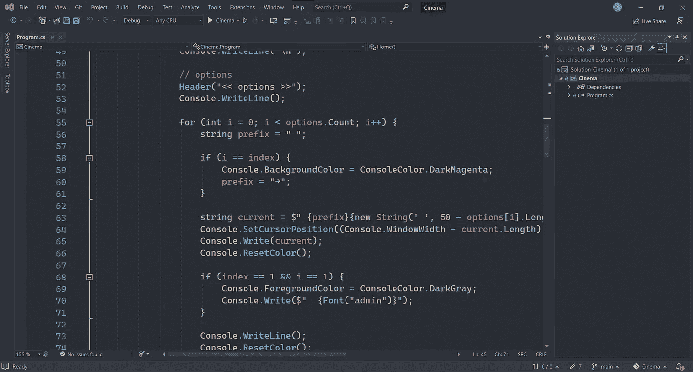

# 现在是 2022 年，这里是最好的代码编辑器

> 原文：<https://medium.com/codex/its-2022-here-are-the-best-code-editors-ides-3be13c07a79a?source=collection_archive---------18----------------------->

## 编程；编排

## 2022 年你作为开发者可以使用的最佳代码编辑器列表

照片由 [Unsplash](https://unsplash.com?utm_source=medium&utm_medium=referral) 上的 [Clément Hélardot](https://unsplash.com/@clemhlrdt?utm_source=medium&utm_medium=referral) 拍摄

编程现在很受欢迎，因为它有潜力让世界变得更好，让人们的生活更轻松。创建一个最佳 ide 的列表实际上是相对的，因为每个程序可能专注于一个语系而不是另一个。尽管如此，我还是试着列出了 2022 年项目中最好的代码编辑器/ide。

## [#1 VS 代码](https://code.visualstudio.com/download)

Visual studio 代码是目前几乎所有编程语言中最流行的。你可以非常快速地编写、构建和运行代码，而没有任何软件延迟，这是一个非常好的工具。

如果一种编程语言相对较新，并且在语言列表中不被支持，有一个巨大的社区会支持你，并且会致力于可能的扩展，直到该语言被支持。

这里你有 4 个控制台:终端、问题、输出和调试控制台，所以你面前有你的项目总结。您甚至可以在同一个窗口中运行多种不同语言或类型(例如 node、shell、bash)的终端，并对它们进行管理。

穆罕默德·拉赫马尼在 [Unsplash](https://unsplash.com?utm_source=medium&utm_medium=referral) 上拍摄的照片

## [#2 喷射脑](https://www.jetbrains.com/)

JetBrains 有很多你可能会用到的编程软件，它在每个编程家族中都进行了优化。但我们可以以他们的一款前端产品——WebStorm 为例。

WebStorm 支持插件，可以加快你的工作和生产力。它还有一个很棒的智能感知代码补全功能，这真的有助于避免重复。WebStorm 也可以几乎立即构建和运行您的代码，它当然属于这个列表。

与 JetBrains 的其他产品一样，它确实掌握了几乎所有的编程语言家族，尽可能具有包容性。

托尼·佩佩在 [Unsplash](https://unsplash.com?utm_source=medium&utm_medium=referral) 上的照片

## [#3 Visual Studio](https://visualstudio.microsoft.com/downloads/)

Visual Studio 是 VS 代码的旧版本，这一点很明显。有时甚至在编写代码时也会非常慢，构建时间和运行代码也会花费很长时间，但这可能真的是语言的“构建时间而不是软件”。

它是在 1997 年为支持 C 语言家族而创建的，并且是为它而改编的。你可以在这个软件中编写前端代码，但这不是它的本意，但如果你没有任何选择，使用它仍然很好。

Visual Studio 2022 照片

## [#4 原子](https://atom.io/)

Atom 在工作方式、设计和工具位置方面与 VS 代码非常相似。仅基于此，从 VS 代码切换到 Atom 是非常容易的。Atom 支持扩展，并且有非常有用的扩展，它有一个庞大的社区，每天都为它做出贡献。例如，像 markdown 这样的扩展对于实时结果来说非常直观和用户友好。

遗憾的是，Atom 不支持在软件本身中运行代码，但是您可以安装扩展(例如脚本)来完成这项工作。Atom 不如 VS Code 和 Visual Studio 受欢迎，但它仍然是最受欢迎的 ide。

照片由[卢卡·布拉沃](https://unsplash.com/@lucabravo?utm_source=medium&utm_medium=referral)在 [Unsplash](https://unsplash.com?utm_source=medium&utm_medium=referral) 拍摄

## [#5 括号](https://brackets.io/)

Brackets 是一个非常简洁的代码编辑器，它只包含你可能需要的浅层工具。设计与 Sublime 文本非常相似，但与 Sublime 不同，它可以运行代码。

括号支持扩展，这正是它与其他文本编辑器不同的地方。括号本身不能运行代码，但通过某些扩展，它是可能的。

[Pankaj Patel](https://unsplash.com/@pankajpatel?utm_source=medium&utm_medium=referral) 在 [Unsplash](https://unsplash.com?utm_source=medium&utm_medium=referral) 上拍摄的照片

## 文本编辑器

你也可以只使用文本编辑器，它不会像我之前展示的 ide 那样分散你的注意力。如果你有一个任务，你需要自己专注于文本编辑器可以是完美的工具。文本编辑器不支持扩展或运行您的代码。一个很好的例子是[记事本++](https://notepad-plus-plus.org/downloads/) 、[崇高文本](https://www.sublimetext.com/3)或 [Vim](https://www.vim.org/download.php) 。

由[凯利·西克玛](https://unsplash.com/@kellysikkema?utm_source=medium&utm_medium=referral)在 [Unsplash](https://unsplash.com?utm_source=medium&utm_medium=referral) 上拍摄的照片

## **结论**

最好的 IDE 是你觉得使用起来很舒服并且喜欢其功能和设计的 IDE。但是如果你想听我的意见，我会推荐 VS Code/WebStorm 用于前端/现代语言开发，Visual Studio 用于 C 语言家族的编程。