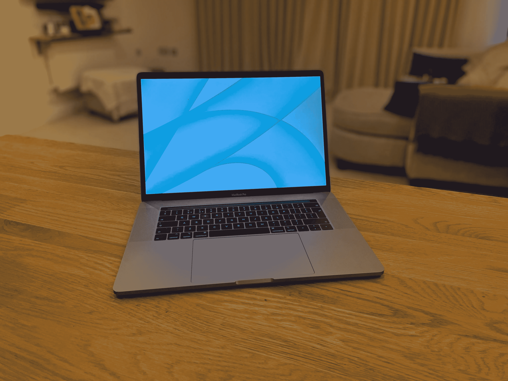
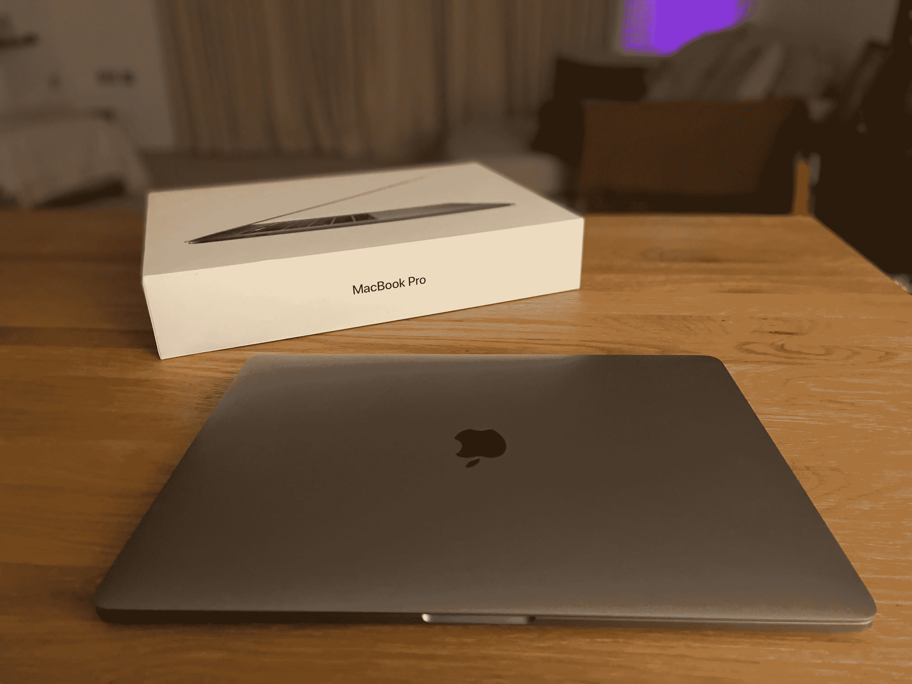
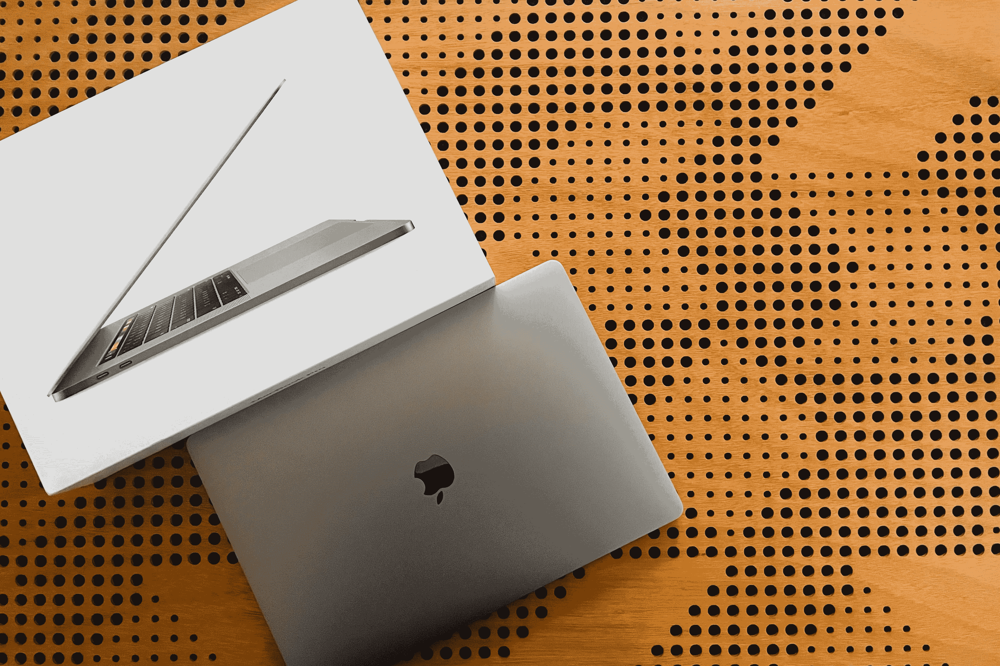
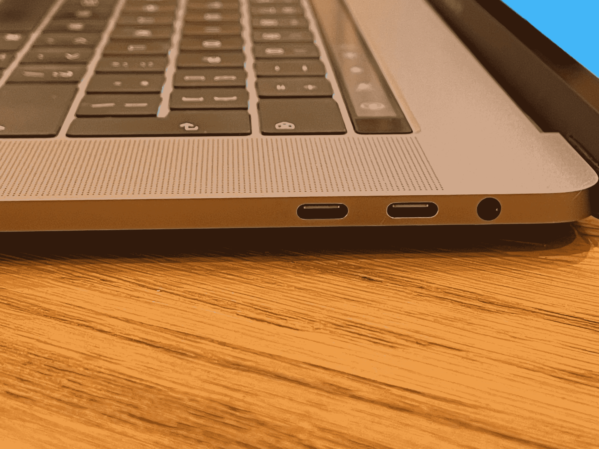

# 这是一个敏感的话题

> 原文：<https://medium.com/codex/its-a-touchy-subject-3d0e920971c2?source=collection_archive---------3----------------------->

## 去年，MacBooks 告别了 Touch Bar。你怀念吗？

一出门，我就要承认自己是一台 2019 款 MacBook Pro 15 寸的主人。我将忽略正在进行的关于键盘的评论，而是关注房间里的另一头大象。触摸栏。

## 它是如何产生的

正如苹果在我们最终购买的机器中放置的所有东西一样，Touch Bar 投入了无数小时的工作。最重要的是，早在 2016 年，它的开发就是为了让那些认为 MacBook 已死的反对者闭嘴。开发团队认为专业人士并不太关心键盘顶部那排功能键的物理性。因此，相反，他们想出了在顶部放一个条带的主意，这个条带可以与你正在使用的任何程序进行反应和交互。它也远比最初看起来要聪明得多。本质上，它是一个嵌入式 iOS 设备，有自己的芯片。进而与英特尔处理器对话。现在，对我来说，这听起来确实像是很多工程！在硬件之后，接下来是编程方面。所有的应用程序都更新了 Touch Bar 支持。如果不说别的，没人会说苹果没有对 Mac 表现出太多的爱。

 [## 调制解调器、Safari、Siri 和键盘

### 苹果新闻综述

medium.com](/codex/modems-safari-siri-keyboards-d29943cf475d) 

## 苹果听取了

然而，在它发布后，一个可以公平地针对它的批评是，它几乎没有得到任何更新或关注。没有更多的应用程序更新来包括它的功能，只有一个硬件更新。菲尔·席勒承认，尽管许多人喜欢它，但迄今为止，最大的抱怨是没有物理上的退出按钮。所以，在 2019 款 16 寸车型上，全退出键又回来了。在首次亮相时，Touch Bar 与 Final Cut Pro 和 Logic Pro 等旗舰应用程序进行了交互，但在那之后再也没有看到任何进一步的实现。我们甚至从未见过在亮暗模式之间切换的能力。至于更清晰的视觉效果、触觉反馈或者甚至是高度的增加——忘掉它吧！许多用户抱怨说，这实际上使他们的整个键盘体验变得更糟，不断意外触发不需要的应用程序，如 Siri(Siri 是另一个时间)！不，它看起来好像所有的工作投入到它的发射，是没有意义的。虽然所有的苹果电脑都支持触摸条，但它只内置在高端的苹果笔记本电脑上。虽然这些机器为苹果公司带来了大量的销售，但开发者们认为这并没有覆盖足够广泛的 MAC 电脑来获得他们的投资和关注。

## 第一印象

我第一次看到和使用 Touch Bar 其实是在 2016 年一个朋友借给我的时候。我敢说，对许多人来说，第一夜的经历就像是游戏时间。它看起来真的很有趣，很酷，很直观。我以前从未见过这样的东西。话说回来，那只是一个晚上。很快，我就拥有了一台带有触控条的 MacBook，就像我之前提到的那样。我承认它肯定没有从根本上改变我打字或使用 Mac 的方式，但同样，我也不能坐在这里说我讨厌它。至少对我来说，它无害地坐在那里，关心自己的事情，让我继续做事情。我从来没有遇到过这么多报道的任何冻结问题。它完全可靠，我现在已经有点习惯它的存在了。这是我一天的一部分。

 [## 但我注定要成为一名音响发烧友！

### 然而在这里，我喜欢我的 AirPods

medium.com](/codex/but-i-am-meant-to-be-an-audiophile-a1b127da535f) 

## 拜拜

在去年发布 MacBooks 之前，我们都知道 Touch Bar 将成为过去，全功能键的回归迫在眉睫。该公司很聪明地避开了任何关于它被拿走的直接声明，而是更愿意把它藏在一篇新闻稿中，这篇新闻稿强调了其他新功能；

*“用户看重的是独立魔法键盘上的全高功能行。我们把它带到了 MacBook Pro 上。他们想要专业用户喜欢的机械按键的熟悉触感。”*

## 习惯动物

创新想法和改变的麻烦在于我们不愿意接受它们。通常创意人员也是最差的。我们喜欢事物一直以来的样子。事实证明，功能键在列表中排在前列。除非你把它拿掉，否则你永远不会意识到你曾经转动和使用了多少把给定的钥匙。这家加州巨头在去年的 MacBook 发布会上做对了许多事情，其中之一就是它显示出他们倾听了。他们听到了专业用户说的话并做出了反应。他们没有被锁在象牙塔里，而是把缺失的功能还给高级用户。HDMI 端口又回来了，SD 卡插槽和 MagSafe 也回来了。

对于那些认为苹果已经脱离接触，喜欢或讨厌现在已经退役的 Touch Bar 的人来说，它无疑证明了苹果通过移除它仍然与他们的用户保持着密切的联系。

 [## 我是苹果粉丝还是仅仅是逻辑上的？

### 看来我注定再也不会使用装有 Windows 系统的电脑了。为什么不呢，我想知道？

medium.com](/codex/am-i-an-apple-fanboy-or-just-logical-5bb91e895127) 

## 至于我和我的

嗯，就像我说的，它从来没有真正困扰过我。如你所知，如果你阅读了我的许多博客，我希望今年改变我的 Mac 系列，这可能包括检查当前的 MacBook Pros。我不知道是不是只有我有点奇怪，但是那些看起来困扰很多人的事情从来没有真正让我兴奋起来。挡板、凹口、蝶形键盘……不，从来没有引起我片刻的焦虑或失眠。所以，我想知道我的 2019 年 MBP 今年是否会休息，我是否会渴望 Touch Bar？我想时间会证明一切。

## 在你走之前

## 你订阅媒体了吗？

我只是高端博客网站 Medium 的众多作者之一。这是如此好的价值，你可以在这里加入 https://medium.com/membership

[T5 加入我的幕后邮件列表 ](https://www.talkingtechandaudio.com)

**原载于 2022 年 3 月 1 日 https://www.talkingtechandaudio.com/blog****的** [**。**](https://www.talkingtechandaudio.com/blog)

查看并订阅我的负十六播客。每两周在 Spotify、苹果播客和谷歌播客上发布新剧集。[https://podcast . apple . com/GB/podcast/the-MINUS-16-podcast/id 1608899642？i=1000550310853](https://podcasts.apple.com/gb/podcast/the-minus-sixteen-podcast/id1608899642?i=1000550310853)