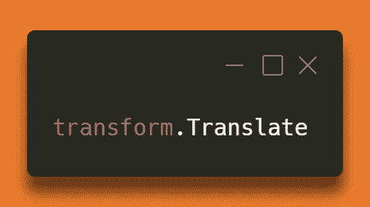

# 它还活着！统一中简单的 2D 球员运动

> 原文：<https://medium.com/codex/its-alive-simple-2d-player-movement-in-unity-77e90c76cf28?source=collection_archive---------12----------------------->

## 目标:

使用`**transform.Translate**` 根据用户输入移动我们的玩家立方体。

顾名思义，`**Translate**`用于根据指定的向量移动游戏对象。在…