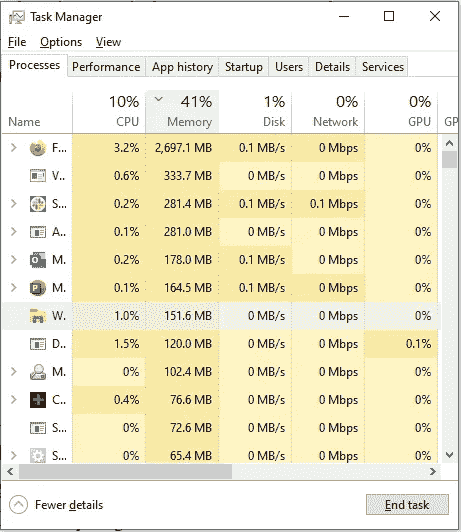
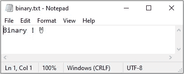
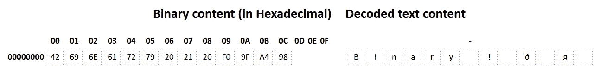
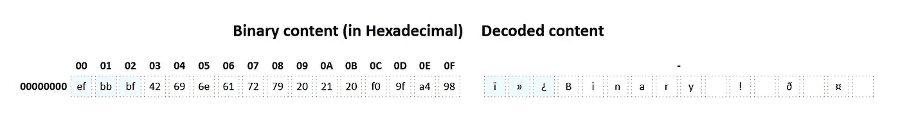
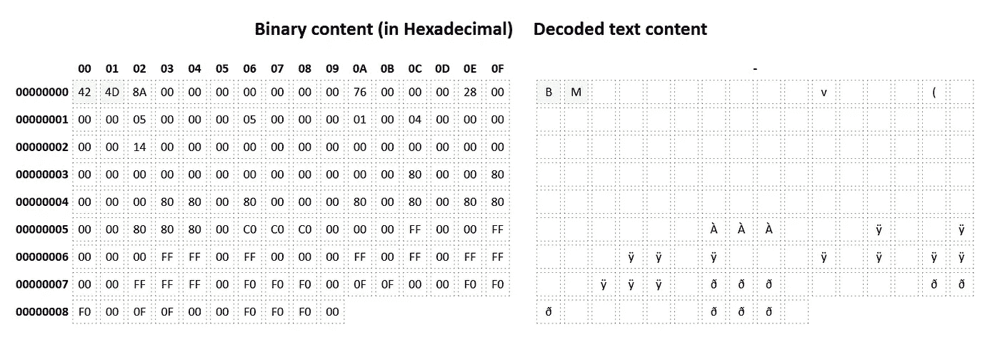

# 都只是 0 和 1:关于比特和字节

> 原文：<https://medium.com/codex/its-all-just-0-and-1-about-bit-and-bytes-683b2d2b821a?source=collection_archive---------9----------------------->

我们经常听到或者说，电脑只是一堆 1 和 0。这一系列的小文章试着解释一下是什么意思！

我们如何想象计算机使用 0 和 1

本文是系列文章的第一部分；你可以在这里找到其他人:

*   [第 1 部分——理解二进制码](https://itnext.io/its-all-just-0-and-1-understanding-binary-8530629e1d1f)
*   [**第二部分—关于位和字节**](/@jbuisson/its-all-just-0-and-1-about-bit-and-bytes-683b2d2b821a)
*   第 3 部分—二元运算(即将发布)
*   第 4 部分—电子学中的二进制(即将发布)

> 在第一篇文章发表[之后，我在这里](https://itnext.io/its-all-just-0-and-1-understanding-binary-8530629e1d1f)创建了一个[小网站，可以快速地进行二进制转换，你也可以在这里](https://binary.jeremy-buisson.fr/converter)查看来自 [Gitlab 的源代码。](https://gitlab.com/jbuisson/binary)

# 第 2 部分—关于位和字节

如今，计算机和数字信息在我们的日常生活中无处不在，以至于我们甚至没有注意到二进制的用法。尽管如此，我们都使用了术语**位**和**字节**。是买一台笔记本电脑，选择你的新智能手机还是比较你的手机计划。大多数时候，即使不知道它是什么，我们也明白它的意思。

**位**被认为是计算中最基本的单位，这个词来源于“ **B** inary dig **it** 的缩写。二进制数中的每一位都是一位。它可以是 0 或 1。

即使是在计算机和数字通信中被广泛使用的单位，它也不是国际单位制的一部分。然而，它通常以相同的公制方式使用，1.000 位将被写成 **1kb** *(一千位)*，1.000.000 位将被写成 **1Mb** *(一兆位)*等等。

**字节**被认为是等于 8 位的数字信息单元。在计算机发展的早期，随着不同的公司和技术按照他们的需要去做，它的位数发生了变化。随着更多现代通信的出现，定义一个标准的需求变得不可避免，8 位字节成为最常用的。

作为**位**单位，**字节**不是国际单位制的一部分，但仍普遍使用其规则。当位使用低位**T5【B】**时，字节使用大写***【B】***作为其符号，1.000 字节将被写成 **1kB** ，1.000.000 字节将变成 **1MB** ，以此类推。

> 千比字节实际上是专家使用的数学上正确的二进制单位，而不是普通大众使用的千字节。一千字节正好是 1.024 字节，而一千字节只有 1.000 字节。

你可能已经注意到了，但这可能是你实际上比你想象的更经常使用的东西！当你想买一台新电脑时，大多数人会考虑它的存储容量或内存。*你可能还会看 CPU，别担心，这个也是和 0 和 1 挂钩的，不过我们会在这一系列文章的后面讨论。*

当我们谈到一个 **256GB** ( *千兆字节*)硬盘的时候，只是说它可以存储 256.000.000.000 字节。由于单个字节由 8 位组成，所以可以持久存储 8×256×10⁹不同的值 ***0*** 和 ***1*** 。

电脑的内存也是一样。当你有 16GB 内存时，你的电脑基本上可以在随机存储器中存储 8 x 16 x 10⁶不同的 0 和 1 值。

你现在甚至可以检查这个！如果你在 windows 上，打开你的任务管理器(*右击屏幕底部的任务栏*)。展开它以查看更多详细信息。在 Memory 选项卡下，您可以看到每个进程使用了多少内存，它在存储器上读取的数据量，甚至网络上使用的数据量。

windows 10 上的任务管理器显示每个进程使用多少字节。

同样的，如果你玩过一些旧的视频游戏主机，比如 NES 的 T38，超级任天堂的 T41，或者 T42 的世嘉的 T43，你一定记得我们称它们为 8 位系统，16 位，32 位，或者 64 位的 T44 N64 T45。嗯，你猜对了，这是这种控制台能够使用更大内存块的系统链接，位越多，控制台的功能就越好！

正如我们所见，二进制实际上在我们的日常生活中广泛使用，用位和字节表示，并且存在于所有现代系统中，但是它到底是如何使用的呢？

## 实践中的二元

我们在计算机上能做的最常见的事情之一是存储文本文件。但是在能够读写文本文件之前，我们需要快速讨论一下文件系统和编码。

文件系统是以特定方式在存储介质上组织和归档文件的写入、搜索、读取、存储、修改和删除结构的系统。最常见的文件系统是微软在 1993 年为 Windows 推出的 **NTFS** (新技术文件系统)。当您创建一个文件时， **NTFS** 系统会将与该文件相关的所有信息(除了其内容)存储在 **MFT** 中，作为主文件系统。在这里，它将存储名称、类型、长度、权限、创建日期或在物理存储上的什么位置找到其内容等元数据。在 Windows 上，您可以通过右键单击并遵循单个文件上的“属性”选项来轻松找到此信息。

编码可以表现为二进制代码和它们的等价字母字符之间的映射。有多种编码，如 **ASCII** 、 **UTF-8** 或**ISO-8859–1**，因为有多个字符集。最基本的一种，即 **ASCII** 代表*美国信息交换标准码*，最初是为英文字母表构建的，包含 128 个字符，其中 95 个可打印。其中包括数字 0 到 9、小写字母 A 到 Z、大写字母 A 到 Z 以及标点符号。不可打印字符也称为控制字符，它们给出如何显示文档内容的信息，其中包括空白、换行符、分页符 ASCII 是一种非常有限的编码，因为我不能用它来写我自己的名字，不包括像" **é** "字母: **Jérémy** 这样的重音符号。更现代的编码，如用于 *16 位 Unicode 转换格式*的 **UTF-16** ，使用 [Unicode](https://en.wikipedia.org/wiki/Unicode) 标准允许多达 1.112.064 个字符，该标准支持 154 种现代和历史文字，以及符号和表情符号，如🦄或者🤘。

**文本为二进制**

现在我们对文件系统和编码有了更多的了解，我们最终可以在文件中写入一些文本，并以二进制形式读取其内容。让我们创建一个简单的文本文件(。txt)包含:“二进制！🤘" *(* [*)此处下载此示例文件*](https://gitlab.com/jbuisson/binary/-/raw/integration/assets/binary.txt) *)* 。

大多数操作系统默认认为该文件是 **UTF-8** ，这是最常见的编码，因此会使用 [UTF-8 字符表](https://www.utf8-chartable.de/)来显示内容:

Windows 10 上的记事本显示一个简单的文本文件。请注意，根据你使用的操作系统甚至软件，表情符号可能会有所不同。

但是如果我们使用一个二进制阅读器来阅读这个文件，或者在 [VS 代码](https://code.visualstudio.com/)中添加一个扩展，比如[十六进制编辑器](https://marketplace.visualstudio.com/items?itemName=ms-vscode.hexeditor)，或者直接使用[我在这里创建的这个小网站](https://binary.jeremy-buisson.fr/reader)，(Gitlab 上有[源代码)，你会发现下面的二进制内容:](https://gitlab.com/jbuisson/binary)

“二进制的二进制等价物！🤘"

使用 [ASCII 表](https://en.wikipedia.org/wiki/ASCII#Control_code_chart)，我们可以确认每个符号的十六进制值。如前所述，ASCII 表只涵盖了 **128 个**字符，从十六进制值 **0** 到 **7F** 。该表之外的任何内容都意味着它是非 ASCII 字符。在我们的例子中，表情符号需要 4 个字节来表示它自己。第一个是 **F0** ，意思是“*我是一个 4 字节的符号*”，其他所有的，加起来唯一地代表了🤘表情符号。

但是你不希望在计算机上只保存简单的文本文件。为了让系统理解如何读取文件，我们可以提供我们称之为文件**头**或文件**签名**的东西。为此，我们在文件的开头添加了一些额外的二进制数。这个字节序列通知系统或软件如何处理它的内容。比如明确说我们的文件是一个 UTF-8 文本文件，我们加 3 个字节: **EF BB BF** *(* [*此处下载这个示例文件*](https://gitlab.com/jbuisson/binary/-/raw/integration/assets/binary-sign.txt) *)* 。

第一个字节用于确定文件类型，这里的 3 个十六进制 EF BB BF 值表示 UTF-8。

有一个庞大的文件签名列表，并且随着越来越多的文件类型的存在，它还在不断地发展。到目前为止，我找到的最完整的列表来自加里·凯斯勒，可以在这里找到。我试图在我的简单的二进制阅读器中添加尽可能多的内容，但是有了成千上万的内容，只有两只手，这还远远不够。反正随便玩！

给你最后一个例子，我已经创建了一个非常简单的图像文件，格式为[位图](https://en.wikipedia.org/wiki/BMP_file_format)格式 *(* [*在这里下载这个示例文件*](https://gitlab.com/jbuisson/binary/-/raw/integration/assets/bitmap-16.bmp) *)* 。为了让系统理解它是一个要显示的图片(而不是一个文本文件)，十六进制签名是 **42 4D** ，它是用 ASCII 解码的“ **BM** ”。

使用位图格式的简单图片

如果看一下[位图格式定义](https://en.wikipedia.org/wiki/BMP_file_format#Example_1)，可以看到第 3 个字节是十六进制的文件 **8A** 的大小相当于十进制的 **138** ，意味着我们的文件包含 138 个字节。

不要犹豫，在这里使用[二进制阅读器](https://binary.jeremy-buisson.fr/reader)，并随时在评论中添加任何问题或备注，我会尽力回答！

我希望你对**二进制**系列的第二篇文章感兴趣。在下一篇文章中，我们将讨论与二进制系统相关的新数学运算以及它们的用途。