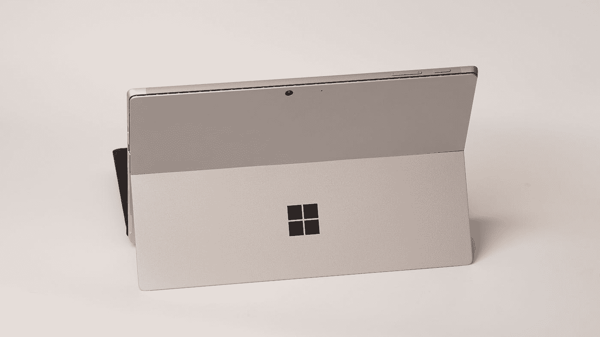

# 快 2023 年了，Windows 11 企业版使用情况如何

> 原文：<https://medium.com/codex/its-almost-2023-how-is-windows-11-enterprise-usage-8f7489022c44?source=collection_archive---------5----------------------->

在 [Unsplash](https://unsplash.com?utm_source=medium&utm_medium=referral) 上由 [Przemyslaw Marczynski](https://unsplash.com/@pemmax?utm_source=medium&utm_medium=referral) 拍摄的照片

最近，资产管理服务提供商 **Lansweeper** 发布的一份关于企业使用 Windows 11 的新报告揭示了真相。

# Windows 11 应用的状态

根据 IDC 的数据，Windows 11 将在明年成为 PC 行业增长前景最好的系统，因为越来越多的企业开始考虑更换老化的系统…