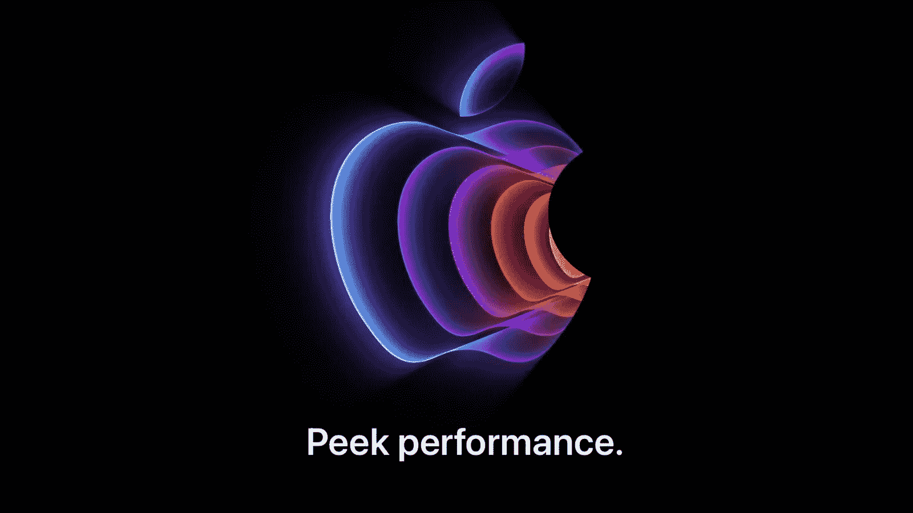
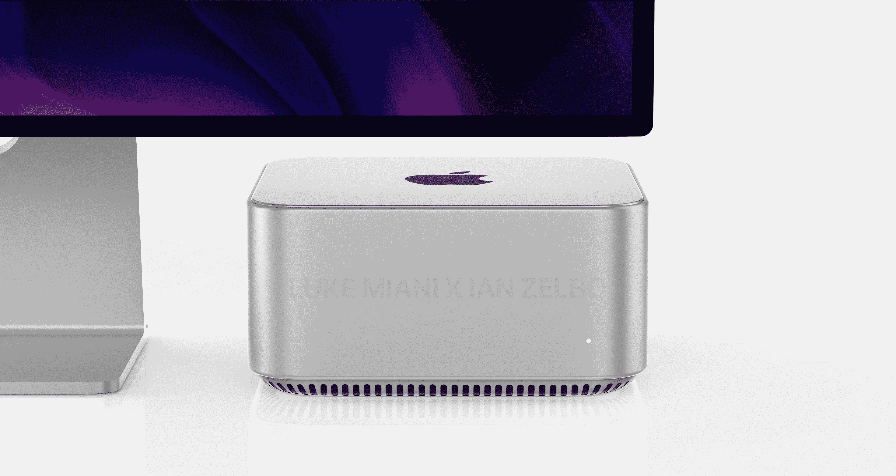
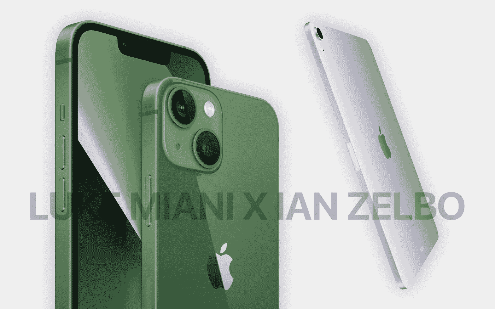
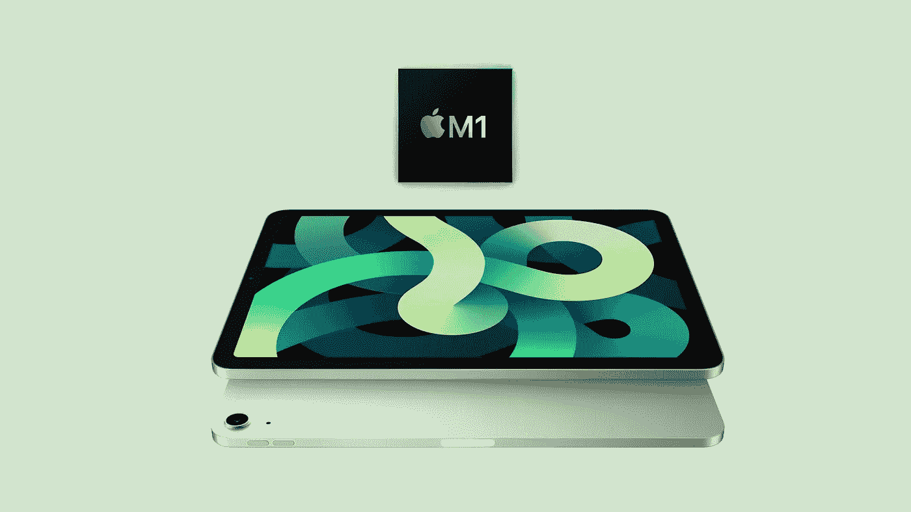
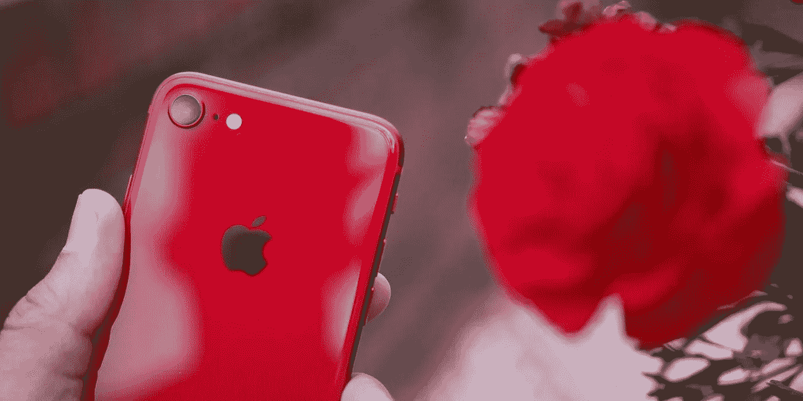
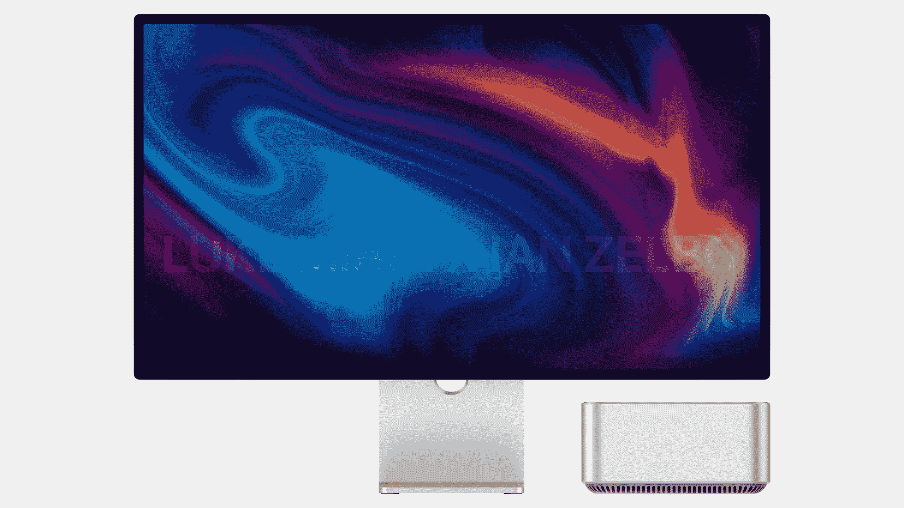

# 快到表演时间了

> 原文：<https://medium.com/codex/its-nearly-show-time-ef323d5cbbf?source=collection_archive---------15----------------------->

## 在 Peek Performance 开始之前写这篇文章——以及我们认为我们正在得到什么

等待是漫长的，技术干旱是严重的，但我们已经度过了黑暗的日子。蒂姆·库克(Tim Cook)和苹果(Apple)即将登上舞台中央(我保证，这不是双关语！)并带来一些期待已久的欢呼。

所以，准备好投身于谣言之下，让我们最后一次回顾一下我们认为我们很快就会得到的东西。

 [## 他们确实泄露了秘密

### 苹果的活动邀请，以及他们实际上意味着什么

medium.com](/codex/they-do-give-the-game-away-38cd06fad3b7) 

## 苹果工作室

显然，现在已经证实，这是 Mac 产品线中的全新系列，并且直接针对专业用户。Mac 本身比现有的 Mac mini 高，但实际占地面积相同。其他一些风格线索将取自最受欢迎的复古机器，如 Power Mac G4 Cube。它可能会有一个有机玻璃玻璃顶部，并将有幸与港口丰富。我们不确定内部结构，但我们可能会看到一个比目前的 M1 Max 更强大的苹果硅芯片。同样，价格和发布日期仍有待确认。

不过，这只是 Studio Mac 系列的一半。除了 pro Studio Mac，我们还将推出 27 英寸的 Studio 显示屏，我们相信它将采用 A 系列芯片。它被认为不是迷你 LED，但*将*来完成一个立场！今年晚些时候可能会有更多的监视器问世。

## iOS 颜色

iPhone 13 和 iPad Air 也将刷上一层新的油漆。iPhone 将展示可爱的非金属英国赛车或阿斯顿马丁绿色，iPad 将被包裹在葱郁的紫色中，这与当前 iPad Mini 上使用的紫色非常相似。

[https://medium . com/codex/apple-studio-is-a-thing-82848 E4 db 458](/codex/apple-studio-is-a-thing-82848e4db458)

## iPad Air 5

我们已经知道 iPad Air 将获得 5G，但我们没有想到内部会有这么大的变化。

但在几个小时前才开始浮出水面的传言中，苹果似乎热衷于弥合 Air 和 iPad Pro 之间的差距。现在看来，iPad Air 很可能会采用苹果在 2021 年款 iPad Pro 和第一代苹果硅 Mac 电脑(包括 24 英寸 iMac 和 2020 年款 MacBook Air)中使用的 M1 芯片。今年晚些时候，iPad Pro 将更新其芯片，提供比 M1 版本更好的性能。相机会有一个凸起，并会有中心舞台，但屏幕的显示分辨率将保持第四代。

 [## 它已经准备好了——苹果的全新外部显示器

### 甚至有可能在本周宣布！

medium.com](/codex/and-it-could-even-be-announced-this-week-fb801693a773) 

## iPhone SE 3

这是第三代“平价”iPhone。因此，苹果分析师预测，它可能会将多达 10 亿 Android 用户转化为 iPhone 用户。今年的 SE 将配备相同的 4.7 英寸液晶显示屏，并保留其他 iPhone 8 设计风格。处理器现在将是 A15 仿生芯片，与 iPhone 13 中的一样。如果苹果顺应潮流，iPhone SE 3 很可能会有一个接近 iPhone 12 或 iPhone 13 的摄像头，因为目前的 SE 型号有一个类似于 iPhone 11 的传感器。存储选项将保持在 64 GB、128 GB 或 256 GB。正如我们所知，它还将提供 5G 连接，但没有 MagSafe 功能。价格将保持在现有的 399 美元价位。

## M2 芯片

直到最近，我们还一直认为下一代苹果芯片——M2 将会在这次盛会上亮相。然而，现在，根据过去几天和我们听到的传言，宣布一款全新的、超级强大的 Studio Mac *和*也是一款新芯片似乎有些奇怪。当然，在今年晚些时候宣布这款芯片更有意义。在我写这篇文章的时候，M2 MAC 电脑正在接受 App Store 应用程序的测试，可能会在今年夏天上市。

## 谣言的来源？

许多谣言似乎来自一个名为 Naver 的韩国博客网站，来自一个名为 **yeux1122** 的用户。除了上面的故事，他们还泄露了 iPhone SE 将采用陶瓷保护罩和明显更好的电池寿命的信息。该账户于去年首次浮出水面，似乎是行业谣言和供应链来源的聚合器。

## 结论

这就是我们从现在开始大约 90 分钟后可以看到的。我和你一样渴望知道所有这些谣言是否成真。

不过，我有一个快速的想法，你认为这些是真的谣言，还是苹果公司自己在今年第一次活动前几个小时“泄露”出来的，以激起人们的兴趣？我天生是一个怀疑论者，但我忍不住想知道。

享受这次活动，一定要联系我，让我知道你最喜欢的是什么。更有趣的是，你点了什么吗？

Peek 表演后更多来自我！

## 在你走之前

## *你订阅《灵媒》了吗？*

我只是高端博客网站 Medium 的众多作者之一。它是如此物有所值，你可以在这里加入[https://medium.com/membership](https://medium.com/membership)

[**加入我的幕后邮件列表**](https://www.talkingtechandaudio.com)

**原载于 2022 年 3 月 8 日 https://www.talkingtechandaudio.com/blog******。****