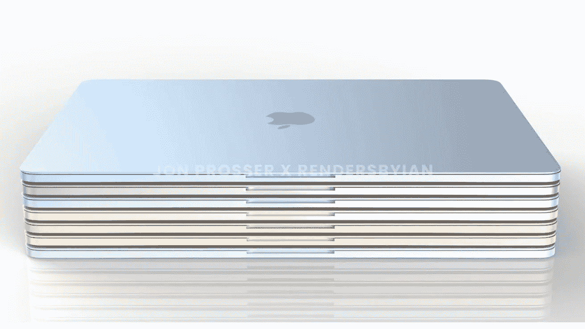
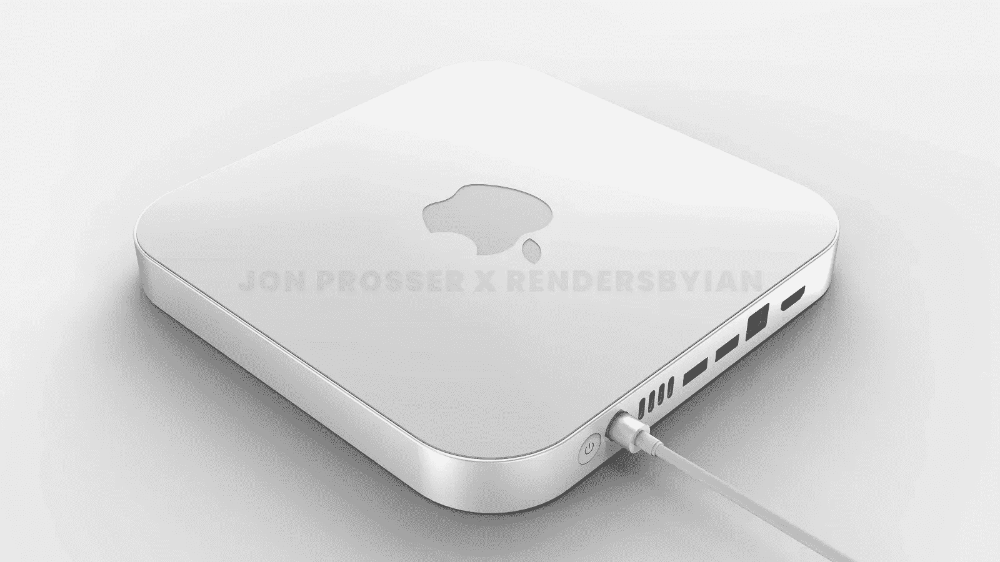
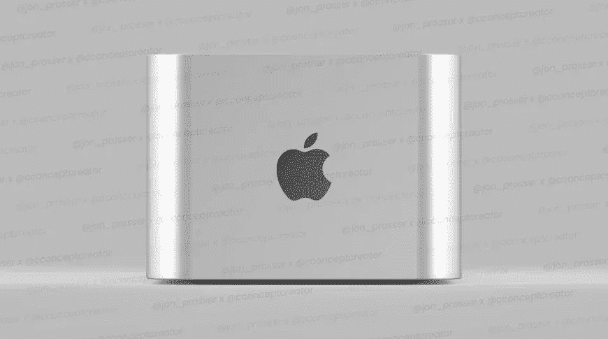

# 快到时间了

> 原文：<https://medium.com/codex/its-nearly-tim-time-3818a49056ee?source=collection_archive---------12----------------------->

## 离苹果今年的第一次活动已经不远了…让我们看看我们可能会得到什么

今天早上我不得不掐自己。你知道吗，距离我们上次的苹果活动已经快四个月了！没错，虽然很难相信，但 M1 Pro 和 M1 Max MacBook Pro 是在 2021 年的最后一场活动中宣布的，那是在 10 月 18 日。时间过得真快，真是疯狂，然而我们却处在另一个事件的边缘。在撰写本报告时，如果 3 月 8 日的传言属实，邀请函可能会在 24 小时内送达我们手中。因此，考虑到这一点，我认为拿出我的苹果污迹水晶球，乐观地展望未来，看看蒂姆叔叔的袖子里可能会有什么，这可能很有趣。

 [## 调制解调器、Safari、Siri 和键盘

### 苹果新闻综述

medium.com](/codex/modems-safari-siri-keyboards-d29943cf475d) 

## 快照中的 2022 年

如果我们暂时把今年将会看到的软件和 iOS 更新放在一边，就硬件而言，这看起来将会是繁忙的一年。这就是我们所想的，在这个阶段，我们将会看到；

*   iPad Air
*   5G iPhone SE
*   Apple Watch 系列 8
*   iPhone 14
*   iPad Pro
*   M1 Pro Mac mini
*   M2 Mac mini
*   13 英寸 M2 MacBook Pro
*   M2 iMac 24 英寸
*   M2 MacBook Air
*   M1 Pro 和 M1 Max iMacPro 27 英寸
*   苹果硅胶 Mac Pro
*   AR/VR 耳机

这是相当多的阵容，我相信你会同意，为了实现这一点，他们将不得不以军事精度(他们是这方面的专家)来制定各种版本的策略。让我们试着把这个列表拆开一点，看看我们是否能理解什么时候会发生什么。

 [## 我是苹果粉丝还是仅仅是逻辑上的？

### 看来我注定再也不会使用装有 Windows 系统的电脑了。为什么不呢，我想知道？

medium.com](/codex/am-i-an-apple-fanboy-or-just-logical-5bb91e895127) 

## 三月发布

当务之急必须是最终迁移到苹果硅胶，并抛弃与英特尔公司的任何剩余联系。2020 年 11 月，M1 版的 MacBook Pro、Mac mini 和 MacBook Air 揭开了这一过渡。当然，去年随着 M1 iMac 24 英寸、M1 Pro 和 M1 Max MacBook Pro 的发布，这一趋势继续发展。

今年 3 月的活动将重点关注 5G iPhone SE 和 iPad Air 的发布。然而，鉴于将于 2022 年发布的 Mac 数量，如果在这次活动中没有看到苹果硅胶 Mac 的一些基本变化，我会感到惊讶。最简单的升级是在最初发布的 M1 芯片机上植入 M2 芯片，即入门级的 MacBook Pro 和 Mac mini。我的猜测是，在即将到来的 3 月活动中，我们将获得 5G iPhone SE、iPad Air、M2 Mac mini 和 M2 MacBook。

## 然后去 WWDC

今年夏天，苹果将希望戏弄开发者，为超级功能的 Mac Pros 争取支持。如果他们在 WWDC 宣布这些机器，然后在秋天甚至 2023 年初发货，这将是完全有意义的。

 [## iCloud+完美的存储解决方案

### 如果您在 MAC 和 iOS 设备上工作，您是否利用了这种备份和存储解决方案？

medium.com](/codex/icloud-the-perfect-storage-solution-741e0c9e1bd4) 

## 今年的最后几轮

新设计的 MacBook Air 在今年晚些时候亮相是有意义的。凭借其丰富的颜色、M2 芯片、更薄的边框、改进的扬声器、惊人的便携性和方正的设计。这是一款完美的学生 Mac，也是大学使用的理想之选。所以，随着学生们在秋季重返校园，你可以看到我的想法，对吗？

今年晚些时候的三个事件不会让我感到惊讶，因为它们在未来几个月里必须峰会的议程非常庞大。

从历史上看，9 月是 iPhone 月，没有理由认为今年会有所改变。我们知道 iPhones 正在按计划进行，因为它们上周进行了生产前检查。随后，我们可能会在 10 月份看到更大的 iMac Pro 和 Mac mini pros。然后，在 11 月份举行今年的最后一场活动，并发布经过修订的 iPad Pro 和 Apple Watch Series 8，这两款产品都是完美的圣诞礼物。

别忘了，耳机也将成为现实。我最近写了苹果是如何渴望在一次面对面的活动中发布这款产品的。我认为，11 月的活动可能会有一个预告片，着眼于 2023 年由 Q2 发布。

## 介绍 M2 芯片

以上大部分依赖于新的 M2 内部，所以，我认为这可能是值得的概述一下我们所知道的这个新的苹果硅芯片。很可能，它们可能会比 M1 的图形处理器快一点，预计将从 7 或 8 个核心提高到 9 个甚至 10 个。该芯片几乎肯定会保留相同的八核架构。与当前趋势保持一致，M2 Pro & Max 版本将于 2023 年春季上市。M3 将紧随其后，然后旋转木马将重新开始。

至于 Mac Pro 芯片，嗯，它们将有两种主要配置。首先，将会有一个 M1 最大的两倍的能力，然后是四倍的能力！第一个芯片上预计有 20 个 CPU 内核和 64 个图形内核，第二个芯片上有 40 个 CPU 内核和 128 个图形内核。所以，这就是所有的大惊小怪！

## 在你走之前

## *你订阅《灵媒》了吗？*

我只是高端博客网站 Medium 的众多作者之一。这是如此好的价值，你可以在这里加入 https://medium.com/membership

[**加入我的幕后邮件列表**](https://www.talkingtechandaudio.com)

**原载于 2022 年 2 月 28 日 https://www.talkingtechandaudio.com/blog******。****

****

**查看并订阅我的负十六播客。每两周在 Spotify、苹果播客和谷歌播客上发布新剧集。[https://podcast . apple . com/GB/podcast/the-MINUS-16-podcast/id 1608899642？i=1000550310853](https://podcasts.apple.com/gb/podcast/the-minus-sixteen-podcast/id1608899642?i=1000550310853)**