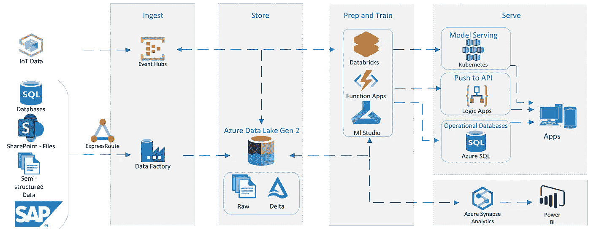

# 它不是用于数据分析的 Python VS SQL。他们处于恋爱关系中！

> 原文：<https://medium.com/codex/its-not-python-vs-sql-for-data-analysis-they-are-in-a-love-relationship-6e8d434a166b?source=collection_archive---------7----------------------->

[凯利·西克马](https://unsplash.com/@kellysikkema?utm_source=medium&utm_medium=referral)在[号航天飞机](https://unsplash.com?utm_source=medium&utm_medium=referral)上拍摄的照片

最终目标是使用最适合你工作的工具。但通常将一些工具(如 SQL 和 Python)结合使用是有意义的。两者在很多方面都有很大的不同(这也将在下面的文本中讨论)，但是这并不意味着您必须在两者之间进行选择来完成您的分析任务。恰恰相反，它们可以很好地相互补充。

但是，首先让我们快速了解一下关于数据分析任务的 Python 和 SQL。

## **蟒蛇**

Python 是一种通用编程语言。事实上，它将这一定义推向了极致。实际上，Python 在现实世界中被用于几乎所有的东西，包括数据分析。而且，Python 几乎可以在任何地方运行。在您的本地机器上，在服务器上，甚至在分布式系统上。

这可以通过可以导入的不同包来实现。出于数据分析的目的，最突出的一个无疑是熊猫，因为它为您提供了许多工具来处理基于表格格式的数据。这种方式也在其他各种包中实现，比如 veax。此外，数据分析的任务可以使用类似 PySpark 或 Dask 的工具分布到多个系统中。这使得 Python 也适用于大数据分析。

与 SQL 形成鲜明对比的是，Python 还能够使用 API、Web 废弃和其他方式来收集数据。因此，包含不同的数据源非常灵活。

## 结构化查询语言

SQL 是与关系数据库中的数据交互的查询语言。这是这种语言的唯一用例，但是它以一种非常有说服力的方式实现了它。它非常适合这个目的，40 多年来它一直是事实上的标准，这在计算机科学中是一个很长的时间。

但也有一些局限性。SQL 只能在数据库中使用，许多数据驱动的用例，如机器学习和复杂的统计，可以通过像 Python 这样的编程语言更好地实现。

另一个区别是，即使 SQL 运行在来自不同供应商的各种数据库系统上(它们可能有完全不同的用途，比如 OLTP 或 OLAP)，SQL 在任何地方看起来几乎都是相同的。当然，不同的供应商对 SQL 标准语法做了一些补充，但在任何地方都非常相似。这与事实有很大不同，Python 代码看起来可能非常不同，这取决于使用的是哪个包。这个事实使得 SQL 非常容易使用。

## 其中一个就足够了

所以在我的标题中，我陈述了 SQL 和 Python 除了它们所有的不同之外，还有一种爱的关系。但是有一些主题，它们中的每一个都可以自己很好地工作。

就像在现实世界中一样，在任何良好的关系中，你都应该为自己做一些你的伴侣不喜欢的事情。

对于 **SQL** ，例如:

*   数据仓库中的查询
*   为数据仓库中的分析准备数据

这个不完整列表的要点有什么共同点？每项任务都是在数据库中单独完成的。这就是 SQL 的闪光点，不需要额外的工具。

对于 **Python** 来说，列表是这样的:

*   对 csv 文件进行一次性分析
*   在不保存数据的情况下从 API 分析数据
*   从 csv 文件实现机器学习模型

同样，这些列表项有什么共同点？没有与持久层(数据库)的联系，因此不需要 SQL。

# 两者都需要对方

我想现在您已经知道这是怎么回事了——Python 需要帮助才能从数据库中获取数据并保存到数据库中。当 SQL 必须与它的数据库之外的东西交互时，它需要帮助。

即使你自己做一些事情，每段工作关系的基础是一起做你们都喜欢的事情。

## 他们是如何联系的

Python 作为两者之间的连接。有很多方法可以访问数据库中的数据。最常见的可能是使用 SQLAlchemy 包。pandas 可以直接使用这个 SQLAlachemy 连接将 SQL 查询中所有需要的数据接收到 dataframe 中。

通常数据库不会给你直接连接它们的可能性。它被抽象在一个 API 后面，这对 Python 连接到数据源来说仍然没有问题。

## 在 ETL/ELT 中最适合您的地方进行分析

从一个系统收集数据，并使用 ETL 管道将其加载到目标数据库中，这可能是每个数据工程师最常见的任务。这就是 Python 经常被用作源数据系统和目标系统之间的粘合剂的地方。从 API 和 Webscrapping 获取数据是由 Python 完成的。使用 PySpark 之类的工具对非常复杂的逻辑或大数据规模进行转换和分析也非常适合 Python。

以下架构模式是在 Azure 中构建的，但在不同的云提供商那里看起来非常相似。基本上，您可以在 Databricks(托管 spark 环境)中使用 Pyspark，或者在 Azure 函数(无服务器函数)中使用 pandas 来转换数据。然后可以将转换后的数据加载到 Synapse(数据仓库)或任何其他数据库中。

使用 Azure 堆栈的现代数据环境的架构

现在这就是伟大的关系出现的地方。您可以决定不同的分析任务在哪里最适合。通常，使用 Python，您应该进行复杂的统计。这些结果可以在进行其余的转换时生成。之后，您可以将数据(包括您的统计数据)加载到您的数据仓库中，以执行其他特别分析。

## **机器学习/数据科学**

训练/推理是另一项任务，两种工具可以很好地协同工作。您的 ML 解决方案中使用的数据通常由数据库提供。您可以简单地从数据库中查询所有需要的数据，并在 Python 代码中完成所有繁重的工作。

更好的方法是使用合适的 SQL 查询来获得您真正需要的数据。如前所述，SQL 是定义所需数据的一种非常有效的方式。事实上，如果您使用好的查询，其中可以利用索引，您可以提高整个解决方案的性能。

## 结论

我希望你喜欢这篇文章。我的主要目标是为您提供一些关于 SQL 和 Python 如何以有益的方式协同工作的想法。另外，要提醒你的是，每种工具都有它的优点和缺点。与指环王不同，没有一个工具可以统治所有的工具，通常最好是结合你的工具的优点来弥补它们的缺点。