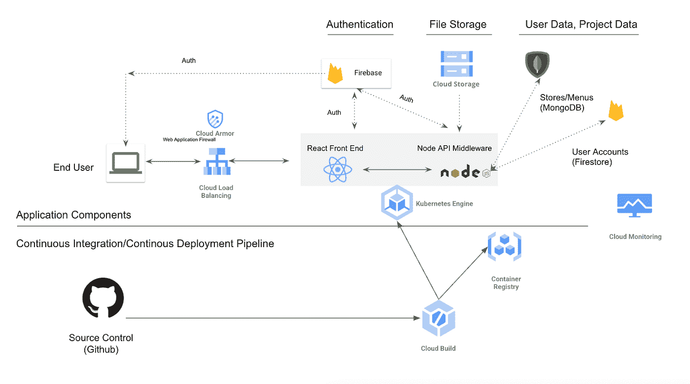
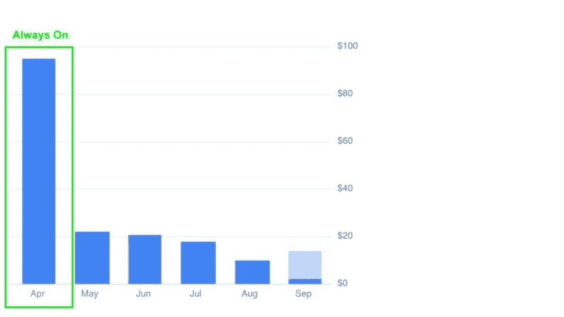

# 我看到了企业应用交付的下一个阶段

> 原文：<https://medium.com/codex/ive-seen-the-next-phase-of-enterprise-application-delivery-d3ad62ad09e3?source=collection_archive---------9----------------------->

在过去的 4-5 年里，我们都学到了很多关于容器的知识。技术专家已经接受了它们的可移植性、固有的安全性优势，以及容器编排带来的最棒的旋转、拆卸和伸缩能力。还有什么比这更好的呢？

在我回答这个问题之前，让我提供一些背景。我在疫情的爱好是为餐馆建立一个网络平台来创建二维码。我非常想帮助过渡到非接触式菜单，因为我一直对餐饮业固有的缩放问题感到焦虑。我几乎总是宁愿在网上订餐/通过电话付款，而不是等着有人来为我服务。现在让我们来看看这个应用程序:

应用架构

该设计由 React 前端、Node.js 中间件 API 服务器和 Mongo/Firestore 后端数据库组成。我开始使用的架构是基于 Kubernetes 的。我想创建一个架构，它允许我拥抱开源技术，同时提供如果这个产品成功了可以轻松扩展的方法。我创建了我的 CI/CD 工作流，以便在我的集群中自动发布新的容器，生成 SSL 证书，甚至托管我自己的 Mongo DB。延迟低，自动化程度高，一切都很好！

然而，还有一个问题，我没有顾客。运行这个演示系统每月花费我大约 100 美元，虽然这并不多，但是当我有 0 个用户时，这就有点烦人了。这促使我重新思考我的设置是如何架构的，如果你浏览这篇文章，这里是它变好的地方。我的应用程序只需要在特定的时间窗口内快速加载。它是为餐馆设计的，这些餐馆的营业时间很正常，而且顾客流量高峰期是可以预测的。我的应用程序没有理由需要在凌晨 4 点有低延迟。这让我想到了一种新技术，我坚信在不久的将来，世界将会使用这种新技术，在可预测的成本结构中，根据用户需求周期进一步调整应用交付。这项技术被称为[云运行](https://cloud.google.com/run)，基于谷歌开创的用于无服务器应用的开源 [Knative](https://knative.dev/docs/) 框架。

Cloud Run 允许我在通过我的站点 URL 收到请求时唤醒我的容器。这个容器可以有一个可配置的生命周期，允许它在缩减到 0 之前保持一段时间不被使用。我不再需要让某个东西一直运行。在一段时间的不活动之后，对我的站点的第一个请求可能会经历几秒钟的延迟，但是在此之后，后续的请求通常会从同一个容器得到响应。如果在指定的时间间隔内没有请求进入，容器将缩小到 0。如果发生相反的情况，它将水平扩展，就像启用了水平自动扩展的常规 Kubernetes 部署一样。使用云运行的托管版本将我的运营成本降低了约 90%,这对于我所处的引导模式来说是完美的。

# 这在企业环境中变得更加有趣

作为 Kubernetes 领域的产品经理，以及之前在该领域多年的销售工程师，我知道 Lambda(或云/Azure 功能)蔓延是一个问题。除了明显的 CI/CD 挑战之外，Lambda 型管道还会带来不可预测的成本问题。公司很少提前知道他们的无服务器功能要花多少钱，有时根据服务的不同，它可能不比其他选择便宜。这些问题的解决方案是在您已经付费的 Kubernetes 集群中部署无服务器应用程序或容器。这是应用交付的未来。

云运行可以在您的 GKE Kubernetes 集群中执行。这意味着，您可以限制 Kubernetes 集群的规模，以固定您的成本，同时利用该集群内您已经购买的额外计算能力，通过云运行中托管的容器构建无服务器应用程序或功能。您的 Kubernetes 部署规格将与您现在已经使用的类似，好处是当它们不活动时，pod 将扩展到 0。您可以通过 URL web hook 或消息总线触发器来唤醒这些 pod，更多方法正在开发中。

# **还不服气？**

这里有 3 个要点:

*   Cloud Run 允许容器扩展到 0，这意味着您可以使用现有的基于容器的 CI/CD 管道和 DevOps /DevSecOps 工具集来开始。
*   如果您在自己的 K8s 集群中使用 Cloud Run，您可以利用现有的容量和治理，更不用说按存储容量使用计费模式了。
*   Cloud Run 可以通过 [Anthos](https://cloud.google.com/anthos) 部署在 GKE 的 Prem、GCP、AWS 或 Azure 上，为您提供云内外的无服务器功能。
*   如果您的需求发生变化，您可以在同一个 Kubernetes 集群中转移到非无服务器模式，而无需重新架构您的应用程序。

# **终于**

我们正在竞相降低服务交付的边际成本。我们所做的一切都是为了优化和自动化。我认为，应用交付的下一个阶段是使用可预测和可控制的成本模型关闭应用并在需要时唤醒它们的概念。不要让您的交付决策成为您的下一个遗留瓶颈。

Cloud Run 是一项托管服务，或者是 GCP 上的 GKE 集群的一部分，或者是在 [AWS 和 Azure Q4 2021](https://cloud.google.com/anthos) 上。如果您正在 Kubernetes 上标准化，那么是时候在无服务器应用程序部署框架上标准化了。