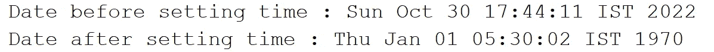

# Java 日期格式及示例

> 原文：<https://medium.com/codex/java-date-format-5a2515b07c2c?source=collection_archive---------5----------------------->


# java。util。日期

这在 Java 中用来表示日期和时间。该类用于保持协调世界时(UTC)。该类表示特定的时间瞬间，精度为毫秒。有许多构造函数和方法可以用来处理时间和日期。Date 类已经从可序列化、可克隆和可比较的接口中实现。这个类可以在 java.util 包中找到。日期对象是可变的。一旦我们初始化了它，我们就可以改变它的内部值。


引入 Calander 类后，一些构造函数和方法被弃用。可以参考下面一个日期类的模板类。

```
public class Date implements Serializable, Cloneable, Comparable<Date> {private static final BaseCalendar gcal;
    private static BaseCalendar jcal;
    private transient long fastTime;
    private transient BaseCalendar.Date cdate;
    private static int defaultCenturyStart;
    private static final long serialVersionUID = 7523967970034938905L;
    private static final String[] wtb;
    private static final int[] ttb;public Date() {}public Date(long l) {}@Deprecated
    public Date(int i, int i1, int i2) {}@Deprecated
    public Date(int i, int i1, int i2, int i3, int i4) {}@Deprecated
    public Date(int i, int i1, int i2, int i3, int i4, int i5) {}@Deprecated
    public Date(String string) {}public Object clone() {}@Deprecated
    public static long UTC(int i, int i1, int i2, int i3, int i4, int i5) {}@Deprecated
    public static long parse(String string) {}@Deprecated
    public int getYear() {}@Deprecated
    public void setYear(int i) {}@Deprecated
    public int getMonth() {}@Deprecated
    public void setMonth(int i) {}@Deprecated
    public int getDate() { }@Deprecated
    public void setDate(int i) {}@Deprecated
    public int getDay() {}@Deprecated
    public int getHours() {}@Deprecated
    public void setHours(int i) { }@Deprecated
    public int getMinutes() {}@Deprecated
    public void setMinutes(int i) {}@Deprecated
    public int getSeconds() { }@Deprecated
    public void setSeconds(int i) {}public long getTime() {}private final long getTimeImpl() {}public void setTime(long l) { }public boolean before(Date date) {}public boolean after(Date date) {}public boolean equals(Object o) {}static final long getMillisOf(Date date) {}public int compareTo(Date date) {}public int hashCode() {}public String toString() {}private static final StringBuilder convertToAbbr(StringBuilder sb, String string) {}@Deprecated
    public String toLocaleString() {}@Deprecated
    public String toGMTString() {}@Deprecated
    public int getTimezoneOffset() {}private final BaseCalendar.Date getCalendarDate() {}private final BaseCalendar.Date normalize() { }private final BaseCalendar.Date normalize(BaseCalendar.Date date) {}private static final BaseCalendar getCalendarSystem(int i) {}private static final BaseCalendar getCalendarSystem(long l) { }private static final BaseCalendar getCalendarSystem(BaseCalendar.Date date) { }private static final synchronized BaseCalendar getJulianCalendar() {}private void writeObject(ObjectOutputStream stream) throws IOException {}private void readObject(ObjectInputStream stream) throws IOException, ClassNotFoundException {}public static Date from(Instant instnt) {}public Instant toInstant() {}
}
```

让我们了解一下在 util 中可以找到的方法和构造函数。日期类。但是我不打算讨论不赞成使用的方法和构造函数。

**构造函数**

*   *日期(){}*

此构造函数用当前日期和时间初始化并分配 Date 对象。它从你的本地机器或服务器获取时间。

```
import java.util.Date;public class A {public static void main(String[] args) {Date date = new Date();
        System.out.println(date);
    }
}
```

输出:


这是当我的本地机器使用下面的时区时的输出。


我改变了我的时区如下。


然后输出被改变。


*   *日期(长 l) {}*

这是一个构造函数，它为自 1970 年 1 月 1 日 00:00:00 GMT 以来的给定毫秒创建一个 date 对象。

## 方法

*   *public long getTime(){}*

此方法返回由 Date 对象表示的自 1970 年 1 月 1 日 00:00:00 GMT 以来的毫秒数。它返回一个长整型值。

```
public class A {public static void main(String[] args) {Date d=new Date();  
        long time=d.getTime();
        System.out.println(d);  

    }
}
```

输出:


*   公共 void 设置时间(长 l){}

此方法将 date 对象设置为表示一个时间点，即 1970 年 1 月 1 日 00:00:00 GMT 之后的时间毫秒。

```
public class A {public static void main(String[] args) {Date d=new Date(); 
        System.out.println("Date before setting time : "+d);
        d.setTime(2000);
        System.out.println("Date after setting time : "+d);  

    }
}
```

输出:



*   *public boolean before(Date Date){ }*

此方法检查一个给定的日期是否在另一个给定的指定日期之前。这将返回一个布尔值。

**！** Date d1=new Date(int 1，int 2，int 3) →这是一个不推荐使用的构造函数，编码时不要使用。这只是用来给出一个想法。

```
public class A {public static void main(String[] args) { Date d1=new Date(2022,10,30); 
        Date d2=new Date(2022,11,21);  

        boolean result=d1.before(d2);

        System.out.println("2022/10/30 Date before 2022/11/21 :      "+result);

    }
}
```

输出:


*   *(Date Date)之后的公共布尔{}*

这与之前的方法相反。此方法检查一个给定的日期是否在另一个给定的指定日期之后。这将返回一个布尔值。

```
public class A {public static void main(String[] args) { Date d1 = new Date(2022, 10, 30);
        Date d2 = new Date(2022, 11, 21);boolean result = d1.after(d2);System.out.println("2022/10/30 Date after 2022/11/21 : " + result);}
}
```

输出:


这些是 util 中最常用的构造函数和方法。日期类。

# SQLDate

这位于 java.sql 包中。这也是一个帮助用 java 表示日期的类。它继承了 java.util.Date 类。如果你正在处理基于 SQL 的数据库，你可以使用 SQLite。一个毫秒值周围的薄薄的包装允许 JDBC 将它识别为一个 SQL 日期值。毫秒值表示自 1970 年 1 月 1 日 00:00:00.000 GMT 以来经过的毫秒数。这不会保留任何关于时区的信息。它也使用服务器或本地时间。

这是由 util 继承的。日期类。


随着 Java 8 的引入，一些构造函数和方法被弃用了。

```
public class Date extends java.util.Date {static final long serialVersionUID = 1511598038487230103L;@Deprecated
    public Date(int i, int i1, int i2) {}public Date(long l) {}public void setTime(long l) {}public static Date valueOf(String string) {}public String toString() {}@Deprecated
    public int getHours() {}@Deprecated
    public int getMinutes() {}@Deprecated
    public int getSeconds() {}@Deprecated
    public void setHours(int i) {}@Deprecated
    public void setMinutes(int i) {}@Deprecated
    public void setSeconds(int i) { }public static Date valueOf(LocalDate ld) {}public LocalDate toLocalDate() {}public Instant toInstant() {}
}
```

让我们了解一下 sql 中的方法和构造函数。日期类。但是我不打算讨论不赞成使用的方法和构造函数。

*   *公开日期(长 l){}*

这是一个使用给定的毫秒时间值构建日期对象的构造函数。如果不传递长整型值，就无法创建 sql。日期对象。

```
import java.sql.Date;public class A {public static void main(String[] args) {Date d = new Date(0);
        System.out.println(0);}
}
```

输出:


*   公共 void 设置时间(长 l){}

这是使用给定的毫秒时间值设置现有 Date 对象的方法。

```
import java.sql.Date;public class A {public static void main(String[] args) {Date d = new Date(0);
        System.out.println("Date before setting : "+d);
        d.setTime(1111111111);
        System.out.println("Date after setting : "+d);}
}
```

输出:


*   公共 LocalDate toLocalDate(){}

此方法用于将 SQL 日期对象转换为本地日期对象。

```
import java.sql.Date;
import java.time.LocalDate;public class A {public static void main(String[] args) {Date d = new Date(0);

        System.out.println(d.getClass());
        LocalDate l= d.toLocalDate();
        System.out.println(l.getClass());}
}
```

输出:


*   公共静态日期值 Of(String string){}

这是一个用于返回给定字符串的 SQL 日期对象的方法。

```
import java.sql.Date;public class A {public static void main(String[] args) {String stringDate = "2022-10-31";
        Date date = Date.valueOf(stringDate);
        System.out.println("Date :" + date);
        System.out.println(date.getClass());}
}
```

输出:


*   (本地日期 id){}的公共静态日期值

这是一种用于返回给定本地日期对象的 SQL 日期对象的方法。

```
import java.sql.Date;
import java.time.LocalDate;public class A {public static void main(String[] args) {LocalDate ldate = LocalDate.now();
        Date date = Date.valueOf(ldate);
        System.out.println("Date :" + date);
        System.out.println(date.getClass());}
}
```

输出:


# Java 日期时间 API

在 Java 8 中，oracle 决定引入新的类来管理日期和时间，以解决 java.util.Date 和 java.util.Calendar 中存在的问题。

在迁移新的 Java 日期时间 API 之前，我们应该对现有的日期时间 API 存在的问题有所了解。

*   线程安全——日历和日期类不是线程安全的。然后，开发人员必须添加处理线程安全的代码。调试并发问题非常复杂。为了解决这些问题，oracle 在 Java 8 新的日期和时间 API 中增加了线程安全性和不变性。
*   API 设计和易于理解——日期和日历 API 的设计很差，没有足够的方法来执行日常操作。新的日期/时间 API 是以 ISO 为中心的，并遵循一致的日期、时间、持续时间和周期的域模型。有各种各样的实用方法支持最常见的操作。
*   时区日期和时间——使用旧的 API，开发人员必须实现额外的逻辑来管理时区。但是 oracle 引入了新的本地和时区日期/时间 API 来管理时区问题。

让我们了解一下新的日期和时间 API 中常用的类。

## Java 本地日期

这个类可以在 java.time 包中找到。这是一个不可变的类。它用默认的 ISO 格式 yyyy-mm-dd(年-月-日)表示日期。这个类是用 final 修饰符修改的。当不需要在上下文中显式指定时区时，使用此类。


我不期望讨论 LocalDate 类中的所有方法。我将主要关注作为一名软件工程师你可能知道的最常用和最有用的方法。

这是用于获取当前日期的方法。这使用本地主机日期。

*   LocalDate.now()

```
import java.time.LocalDate;public class A {public static void main(String[] args) {LocalDate date = LocalDate.now();
        System.out.println("Current Date: "+date);}
}
```

输出:


*   getMonth()、getDayOfMonth() & getDayOfWeek()

getMonth →这是一个用于获取当前月份的实例方法。

getDaysOfMonth →这是一个实例方法，用于获取当前月份的日期。

getDayOfWeek →这也是一个实例方法，用于获取一周中的某一天。这将返回 DayOfWeek 对象。所以您应该使用 toString 方法将其转换为字符串。

```
import java.time.LocalDate;import java.time.LocalDate;public class A {public static void main(String[] args) {LocalDate date = LocalDate.now();
        String month = date.getMonth().toString();
        String weekday = date.getDayOfWeek().toString();
        int days = date.getDayOfMonth();
        System.out.println("Days for " + month + " : " + days + " & It is :" + weekday);}
}
```

输出:


*   ()的 LocalDate.of

这是一个静态方法，我们可以通过使用方法的 LocalDate .来获取代表特定日、月、年的LocalDate。

```
import java.time.LocalDate;
import java.time.Month;
public class A {public static void main(String[] args) {LocalDate date = LocalDate.of(1998, Month.NOVEMBER, 21);
        String week = date.getDayOfWeek().toString();
        System.out.println(date + " & It is : " + week);
    }
}
```

输出:


*   isLeapYear()

寻找闰年是开发人员面临的最常见的问题。所以我们必须写一个额外的代码来找到它。但是在 Java 8 中，他们包含了一个解决这个问题的方法。这是一个返回布尔值的实例方法。此方法根据 ISO 预测日历系统规则检查当前年份是否是闰年。

```
import java.time.LocalDate;public class A {public static void main(String[] args) {LocalDate date = LocalDate.now();
        boolean result = date.isLeapYear();
        System.out.println(date.getYear() + "  is Leap year : " + result);
    }
}
```

输出:


*   多日(长 l)和少日(长 l)

这些也是返回 LocalDate 的实例方法。这些方法用于获取即将到来的日期和以前的日期。

```
import java.time.LocalDate;public class A {public static void main(String[] args) {LocalDate date = LocalDate.now();
        LocalDate tomoorow = date.plusDays(1);
        System.out.println("Tommorow is : " + tomoorow);LocalDate yesterday = date.minusDays(1);
        System.out.println("Yesterday is : " + yesterday);
    }
}
```


如上所述，你可以加上或减去一周、一月或一年，得到下一周、一月、一年，以及上一周、一月和一年。

```
import java.time.LocalDate;public class A {public static void main(String[] args) {LocalDate date = LocalDate.now();
        LocalDate nextweek = date.plusWeeks(1);
        LocalDate nextmonth = date.plusMonths(1);
         LocalDate nextyear = date.plusYears(1);
        System.out.println("next week is : " + nextweek);
        System.out.println("next month is : " + nextmonth);
        System.out.println("next year is : " + nextyear);

        LocalDate previousweek = date.minusWeeks(1);
        LocalDate previousmonth = date.minusMonths(1);
         LocalDate previousyear = date.minusYears(1);
        System.out.println("previous week is : " + previousweek);
        System.out.println("previous month is : " + previousmonth);
        System.out.println("previous year is : " + previousyear);
    }
}
```

输出:


*   isBefore()

此方法检查一个给定的日期是否在另一个给定的指定日期之前。这将返回一个布尔值。

```
import java.time.LocalDate;
import java.time.Month;public class A {public static void main(String[] args) { LocalDate date1 = LocalDate.of(2022, Month.OCTOBER, 30);
        LocalDate date2 = LocalDate.of(2023, Month.MARCH, 10);
        boolean result = date1.isBefore(date2);System.out.println(date1 + " is before " + date2 + " : " + result);}
}
```

*   isAfter()

```
import java.time.LocalDate;
import java.time.Month;public class A {public static void main(String[] args) {LocalDate date1 = LocalDate.of(2022, Month.OCTOBER, 30);
        LocalDate date2 = LocalDate.of(2023, Month.MARCH, 10);
        boolean result = date1.isAfter(date2);System.out.println(date1 + " is after " + date2 + " : " + result);}
}
```

输出:


在 LocalDate 类中可以找到很多方法。所以可以参考其他方法作为作业。

# 当地时间

这个类可以在 java.time 包中找到。这是一个不可变的类。它表示时间，默认格式为 hh-MM-ss(小时-分钟-秒)。这个类是用 final 修饰符修改的。这类似于 LocalDate 类。


您可以从系统时钟创建一个当前本地时间的实例。

```
import java.time.LocalTime;public class A {public static void main(String[] args) {LocalTime localTime = LocalTime.now();
        System.out.println(localTime);}
}
```

输出:


*   LocalTime.of(int 1，int 2，int 3)

这是一个静态方法，我们可以通过使用方法的 LocalTime .来获取代表特定小时、分钟和秒的LocalTime。

```
import java.time.LocalTime;public class A {public static void main(String[] args) {LocalTime localTime = LocalTime.of(05, 30, 20);
        System.out.println(localTime);}
}
```

输出:


*   plusHour(长 l)和 plusMinutes

这用于计算几小时和几分钟后的时间。

```
import java.time.LocalTime;public class A {public static void main(String[] args) {LocalTime localTime = LocalTime.now();
        LocalTime hour = localTime.plusHours(1);
        LocalTime minute = localTime.plusMinutes(30);System.out.println("Time After a Hour : " + hour);
        System.out.println("Time After 30 minutes : " + minute);}
}
```

输出:


*   minusHour(长 l)和 minusMinutes(长 l)

这用于计算几小时和几分钟之前的时间。

```
import java.time.LocalTime;public class A {public static void main(String[] args) {LocalTime localTime = LocalTime.now();
        LocalTime hour = localTime.minusHours(1);
        LocalTime minute = localTime.minusMinutes(30);System.out.println("Time before a Hour : " + hour);
        System.out.println("Time before 30 minutes : " + minute);}
}
```

# 本地日期时间

这个类可以在 java.time 包中找到。这是一个不可变的类。它表示日期和时间，默认格式为 yyyy-MM-dd-HH-mm-ss.zzz(年-月-日-小时-分钟-秒)。这个类是用 final 修饰符修改的。当不需要在上下文中显式指定时区时，使用此类。


可以从类似于 LocalDate 和 LocalTime 的系统时钟中获得 LocalDateTime 的实例。

```
import java.time.LocalDateTime;public class A {public static void main(String[] args) {LocalDateTime dateTime=LocalDateTime.now();
        System.out.println(dateTime);
    }
}
```

输出:


*   LocalDateTime of(int i，Month month，int i1，int i2，int i3)

这是一个静态方法，我们可以通过使用 LocalDateTime.of 方法得到代表特定的日、月、年、小时和分钟的LocalDateTime。

```
import java.time.LocalDateTime;
import java.time.Month;public class A {public static void main(String[] args) {LocalDateTime dateTime = LocalDateTime.of(2022, Month.NOVEMBER, 21, 10, 19);
        System.out.println(dateTime);
    }
}
```

输出:


您可以使用格式化程序来格式化日期。

*   datetime formatter dtf = datetime formatter . of pattern(" yyyy-MM-DD hh:MM ")；

```
import java.time.LocalDateTime;
import java.time.Month;
import java.time.format.DateTimeFormatter;public class A {public static void main(String[] args) {DateTimeFormatter dtf = DateTimeFormatter.ofPattern("yyyy-MM-dd hh:mm");
        LocalDateTime dateTime = LocalDateTime.of(2022, Month.NOVEMBER, 21, 10, 19);
        String i = dateTime.format(dtf);
        System.out.println(i);}
}
```

输出:


*   添加月份、年份、日期、小时或分钟

```
import java.time.LocalDateTime;
import java.time.Month;
import java.time.format.DateTimeFormatter;public class A {public static void main(String[] args) {DateTimeFormatter dtf = DateTimeFormatter.ofPattern("yyyy-MM-dd hh:mm");
        LocalDateTime dateTime = LocalDateTime.of(2022, Month.NOVEMBER, 21, 10, 19, 22).plusDays(2);
        String i = dateTime.format(dtf);
        System.out.println("After adding two days : " + i);LocalDateTime ph = LocalDateTime.of(2022, Month.NOVEMBER, 21, 10, 19, 22).plusHours(2);
        String i1 = ph.format(dtf);
        System.out.println("After adding two hours : " + i1);LocalDateTime py = LocalDateTime.of(2022, Month.NOVEMBER, 21, 10, 19, 22).plusYears(2);
        String i2 = py.format(dtf);
        System.out.println("After adding two years : " + i2);LocalDateTime pm = LocalDateTime.of(2022, Month.NOVEMBER, 21, 10, 19, 22).plusMinutes(30);
        String i3 = pm.format(dtf);
        System.out.println("After adding 30 minutes : " + i3);}
}
```

输出:


*   getMinute()、getHour()、getDayOfWeek()、getMonthValue()、getMonth()、getDayOfMonth()、getYear()、getDayOfYear()

```
import java.time.LocalDateTime;public class A {public static void main(String[] args) {LocalDateTime dateTime = LocalDateTime.now();
        int minutes = dateTime.getMinute();
        System.out.println("minutes pass in current hour : " + minutes);int hour = dateTime.getHour();
        System.out.println("Hour : " + hour);String week = dateTime.getDayOfWeek().toString();
        System.out.println("day of the week : " + week);int monthValue = dateTime.getMonthValue();
        String month = dateTime.getMonth().toString();
        int daycountmonth = dateTime.getDayOfMonth();
        System.out.println("This is : " + month + " & value is : " + monthValue + " contains days " + daycountmonth);int year = dateTime.getYear();
        int daycountyear = dateTime.getDayOfYear();
        System.out.println("year : " + year + "is contains " + daycountyear + " days");}
}
```

输出:


这些是 LocalDateTime 类中最常用的方法。有很多方法可以处理不同类型的与任务相关的日期和时间。

# ZonedDateTime API

Java ZonedDateTime 类是带有时区的日期时间的不可变表示。当我们需要处理特定时区的日期和时间时，我们可以使用 ZonedDateTime API。这个类是用 final 修饰符修改的。


*   ZonedDateTime.now()

这是一个静态方法，它返回 ZonedDateTime 对象，并从默认时区的系统时钟中获取当前日期时间。

```
import java.time.ZonedDateTime;public class A {public static void main(String[] args) {ZonedDateTime zdt = ZonedDateTime.now();
        System.out.println(zdt);}
}
```

输出:


您可以根据需要使用 ZoneId 类创建一个时区。

```
import java.time.ZoneId;
import java.time.ZonedDateTime;public class A {public static void main(String[] args) { ZoneId zoneId = ZoneId.of("Europe/Paris");
        System.out.println(zoneId);}
}
```

使用下面的链接，您可以找到可用的时区。

[https://docs . Oracle . com/middleware/1221/wcs/tag-ref/MISC/time zones . html](https://docs.oracle.com/middleware/1221/wcs/tag-ref/MISC/TimeZones.html)

你也可以使用下面的代码来生成时区 id。

```
import java.time.ZoneId;
import java.util.Set;public class A {public static void main(String[] args) {Set<String> allZoneIds = ZoneId.getAvailableZoneIds();for (String allZoneId : allZoneIds) {
            System.out.println("time zone : " + allZoneId);
        }}
}
```

在创建一个 ZoneID 对象后，使用它作为一个参数，现在，这个方法在 ZoneDateTime.now()方法中。然后，您可以获得与您作为参数传递的时区相关的时间和日期。

```
import java.time.ZoneId;
import java.time.ZonedDateTime;public class A {public static void main(String[] args) {ZoneId zoneId = ZoneId.of("Europe/Paris");
        ZonedDateTime time = ZonedDateTime.now(zoneId);
        System.out.println(time);}
}
```

输出:


*   getZone()

这是根据 ZoneDateTime 对象返回时区的方法。

```
import java.time.ZonedDateTime;public class A {public static void main(String[] args) {ZonedDateTime zdt=ZonedDateTime.now();
        String zone=zdt.getZone().toString();
        System.out.println(zone);
    }
}
```

输出:


*   减号()和加号()

```
import java.time.Period;
import java.time.ZonedDateTime;public class A {public static void main(String[] args) {ZonedDateTime zdt = ZonedDateTime.now();
        String plus = zdt.plus(Period.ofMonths(1)).toString();
        String minus = zdt.minus(Period.ofMonths(1)).toString();
    }
}
```

这些是 ZoneDateTime 类中最常用的方法。

# Joda-Time

Joda-Time API 由 Joda org 开发。在 Java 8 发布之前，Joda-Time 是最常用的日期和时间处理库。它的目的是为处理日期和时间提供一个直观的 API，并解决 Java 日期/时间 API 中存在的设计问题。这是 Java 8 随 Java 附带的。时间包。Joda-Time 使用不可变的类来处理日期和时间。所以对象是线程安全的。

它支持 7 种日历系统，如佛教，科普特语，埃塞俄比亚语，公历，公历，伊斯兰教和儒略历。

您可以将它集成到您的项目中。您可以将 Joda-Time 库作为 Maven central 的依赖项添加到项目中。

```
<dependency>    
  <groupId>joda-time</groupId>     
  <artifactId>joda-time</artifactId>     
  <version>2.10</version> 
</dependency>
```

使用 Joda-Time 有很多好处

*   跨多个 Java 平台的类似用法。
*   elf-报告了更好的性能。
*   支持额外的日历，如佛教和埃塞俄比亚。

## 谢谢大家！