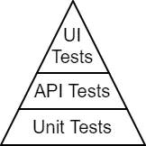
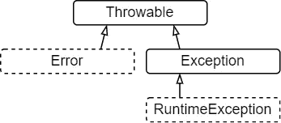

# Java 异常实际上很棒

> 原文：<https://medium.com/codex/java-exceptions-are-actually-awesome-1360e19be896?source=collection_archive---------11----------------------->

或者至少被低估了。让我们看看我是否能赢得他们的赞赏。


Artem Sapegin 在 [Unsplash](https://unsplash.com?utm_source=medium&utm_medium=referral) 上拍摄的照片

错误处理是一门科学，从这个意义上来说，正确地处理它涉及到如此多的因素和考虑，以至于有整本书都在讨论它，但仅仅触及皮毛。我想说，这也是一门艺术，在某种意义上说，有很多方法可以正确地做这件事，尤其是如果你对它有一种“感觉”，而这种感觉大多来自于经验。

当谈到[异常处理](https://en.wikipedia.org/wiki/Exception_handling)时，一种主流语言对软件的这一方面有着独特的严格和结构化的方法:Java。这可能是其中最有争议的元素之一，人们喜欢它，[讨厌它](https://phauer.com/2015/checked-exceptions-are-evil/)，我要说有些误解，主要是来自其他语言的人，他们看起来很相似，觉得它很烦人。

## 在这篇文章中，我将做到以下几点:

1.  解释 Java 异常的基础知识。
2.  尝试理解**为什么**事情会这样运作。
3.  证明这实际上是一种很好的编程方法，也是 Java 最大的优势之一。

然而，我将**而不是**给出任何关于何时真正创建异常的建议(除了一个特定的情况)，或者你是否应该以这种方式控制你的程序流，或者你的整个错误处理策略基于此，而不是使用返回值、单子、事件或其他方法。然而，这并不能改变这样一个事实，即异常是任何 Java 应用程序不可避免的、合法的一部分。

**免责声明**:本文的原理和原因分析是*我对甲骨文相当简洁的[教程的](https://docs.oracle.com/javase/tutorial/essential/exceptions/runtime.html)*解读和延伸，大部分是基于我自己的经验和对题目的理解。

# 如何保证代码质量

一个相当宽泛的问题，嗯？我相信你们中的很多人都遇到过测试金字塔，大概是这样的:



级别越低，它就越“宽”，单元测试在最底层，这意味着它们是我们代码的最大(也是第一道)防线。但是，我认为还有一个更低更广的层次:**编译**。

我们的代码充满了抽象和接口。针对 bug 的第一道防线不是在测试中(或之后)捕捉它们，而是使任何给定的接口**难以被误用**——在编译层面上(当然，如果编译是你的语言中的一件事情的话)。如果您是一名功能开发人员，这一点应该会对您有所帮助。

你可能已经看到我在这里得到的例外。如果一个给定函数的行为方面是我们应该解决的，那么尽可能多的将它们合并到它的签名中会有很大的好处。是的，这也包括例外。

# 可抛出类型

Java 中的异常在`Throwable`继承树下。以下是其中的重要类:



马上，我们将区分两种主要类型的可投掷对象:**选中的**(实线)和**未选中的**(虚线)。他们非常不同。

“已检查”是什么意思？编译器**强迫你**处理 throwable，这意味着你必须或者*用一个 try-catch 块捕获*它，或者让函数*声明*它抛出那个 throwable 类型——强迫它的所有调用者做出相同的选择。自然，未检查的可抛出对象两者都不需要。

## 为什么有些可扔的东西没有被检查

*   `**Error**`它的实现意味着一个我们可能无法安全恢复的严重环境问题，比如达到堆栈或内存限制，二进制文件丢失或不匹配。
*   `**RuntimeException**`它的实现意味着一个我们在编译时无法预测的基本错误(通常是一个 bug)，比如使用空引用或者不存在的数组索引。

这两种类型的未检查抛出基本上可以发生在任何地方，并不一定与代码本身相关。换句话说，如果我们决定让它们被检查，我们代码中的每个函数都会声明它们，这是没有意义的。

**那么，我们还剩下什么？**

# 检查异常

忽略`Throwable` *，我们只剩下所有非`RuntimeException`的`Exception`实现。考虑到前面所说的`Error`和`RuntimeException`，被检查的`Exception`不是:

*   严重的环境问题。
*   一个 bug，或者一个我们在编译时无法预测的状态。

一些例子:IO 问题，如丢失文件或权限、网络或数据库连接问题、受控线程中断、配置或序列化错误……基本上，事情与应用程序本身的业务有关，应用程序必须能够处理这些问题。

Java 中的检查异常是我们为准备好的*函数的行为。它们是其标志的一部分。不是注释，或者是我们在使用它的任何地方都应该记住的东西。我们*有*以 Java 提供的两种方式之一来处理它。*

**现在，剩下的就是回答这些大问题了:**

1.  那么我们应该如何处理异常呢？抓还是扔？
2.  这有什么帮助呢？
3.  它如何适合那些看起来不适合的地方，比如流和其他已经*没有*声明异常的接口？

# 异常处理

好的异常处理通常归结为*在哪里捕获异常*，并且取决于许多因素和本地需求。然而，考虑到所说的一切，我的经验法则是，异常是合法的 API，默认情况下应该抛出。

> 仅在您知道如何处理的情况下处理异常。

指定扔就行了，不用担心。真的，别担心了。相关的业务逻辑应该决定在这种情况下做什么——忽略、中止流程、返回错误状态等。这不是你的小功能的关注。

如果您决定捕捉异常，但不知道如何处理它(除了打印它或用运行时异常包装它)，您可能应该允许抛出它。这应该可以澄清人们又爱又恨的臭名昭著的 IO 例子:

```
public void writeContent(OutputStream output, byte[] content) {
  OutputStreamWriter writer = null;
  try {
    writer = new OutputStreamWriter(output);
    writer.write(content);
  } catch (IOException e) {
    // Oh no, I'm shy
    throw new RuntimeException(e);
  } finally {
    if (writer != null) {
      try {
        writer.close();
      } catch (IOException e) {
        // I don't know what to do...
        e.printStackTrace();
      }
    }
  }
}
```

长得丑，而且似乎问出了我们无法回答的问题。那我们该怎么办？除了我们可以使用 try-with-resource 语句这一事实之外，现在我们知道我们不应该在非业务函数中捕获异常，比如一开始就这样**:

```
public void writeContent(OutputStream output, byte[] content)
  throws IOException {
  try (var writer = new OutputStreamWriter(output)) {
    writer.write(content);
  }
}
```

别担心。说真的。

# 利益

所有这些因素、考虑和“感觉”…然后是 Java，编译器给你一个更简单的选择，有效地要求你少思考，而不是多思考。

是的，抛出检查异常会迫使使用这些函数的人考虑指定的异常。但是，另一种选择是要么异常被“包含”起来，产生不想要的行为，以某种其他(混乱的)方式表现出来，要么是一个“隐藏的”异常，我们必须*知道在哪里以及如何处理。这就是检查异常的目的——让每个人*知道*他们是被期望的，并强制行为的定义，它可以是宽泛的，也可以是选择性的。无需记忆、猜测或反应。*

> 这是一条编译防线——这是最好的了。

## 例外是一种向善的力量？

而且，你也有这种能力:如果一个坏的状态或操作失败是*预期的*，你可以通过创建你自己的检查异常类型来支持它，作为你的代码 API 的一部分，强迫所有用户专门处理它。请注意，正如我所说的，你是否想这样做，或者做一些完全不同的事情，完全取决于你自己。我会说你应该小心——不是所有的*都值得*检查例外。请阅读最后一节，了解原因。

但是，有时有一个非常好的理由来定义您的自定义检查异常:添加异常声明的一个可能问题是在一个否则通用的接口中公开实现细节，可能有几个实现。在这种情况下，将单个异常作为原因包装在您自己的(已检查的)异常中是有意义的。

```
public interface RemoteClient<T> {
  void send(String target, T value) throws RemoteClientException;
}

public class RemoteClientException extends Exception {...}

public class RESTClient<T> implements RemoteClient<T> {
  @Override
  public void send(String target, T value) throws RemoteClientException {
    try {
      // REST implementation...
    } catch (RESTException e) {
      throw new RemoteClientException(e);
    }
  }
}

public class MQClient<T> implements RemoteClient<T> {
  @Override
  public void send(String target, T value) throws RemoteClientException {
    try {
      // MQ implementation...
    } catch (MQException e) {
      throw new RemoteClientException(e);
    }
  }
}
```

## 当能量被浪费时

问题是，通常情况下，定制异常会不加思索地扩展`RuntimeException` ，只是为了不弄乱签名。关于我们遇到的内置(或已经定义的)检查异常，我能想到的唯一一次签名投诉有效的时候，是当声明它将创建一个大的重构时，也许会影响其他团队，这可能是我们现在无法承受的。这种情况有两种可能的结果:

1.  当你仔细想想，这可能是错误的地点或错误的方式去做你想做的事情。由于某种原因，相关接口可能不会指定异常。我们会找到原因的。
2.  这确实是正确的地方和正确的事情，你只是不能改变界面。那也行，这叫技术债。您用一个未检查的异常来包装异常(或者使用 [Lombok](https://projectlombok.org/features/SneakyThrows) 将其标记为“偷偷摸摸的”,如果可用的话),知道您违反了异常处理的规则，并将必要的重构留到以后的任务中。不舒服，但至少这种语言让你知道界面之间潜在的沟通错误。

**我想此时你会想到一些事情…**

# 功能接口和流


由[杰斯温·托马斯](https://unsplash.com/es/@jeswinthomas?utm_source=medium&utm_medium=referral)在 [Unsplash](https://unsplash.com?utm_source=medium&utm_medium=referral) 上拍摄的照片

如你所知，Java [Streams](https://www.baeldung.com/java-8-streams) 在`java.util.function`下有一堆内置的函数接口，所有这些接口都有一个共同点:它们不声明异常。顺便说一下，它们不能声明除了`Exception`之外的任何东西(就像`Callable`所做的那样)，因为这是唯一包含所有检查过的异常的类型，然而，它们没有。这使得调用任何抛出异常的对象成为一种已知的痛苦。我们都经历过:

```
// read() throws Exception, Function doesn't - compilation error
list.stream().map(Item::read)...

// Let's wrap it then
list.stream().map(item -> {
  try {
    return item.read();
  } catch (Exception e) {
    // No choice?
    throw new RuntimeException(e);
  }
})...
```

你说得对，这是一种痛苦，但这是你应该意识到的一点:这个`Throwable`树实际上是经过深思熟虑的。你看，关于函数式编程，我们可以说所有那些被检查的异常:它们几乎总是副作用[的结果](https://en.wikipedia.org/wiki/Side_effect_(computer_science))。

> 检查异常和未检查异常意味着完全不同的东西。

当然，副作用没什么不好。它们基本上就是应用程序*实际上*做的事情。但是有人会说，因为函数有效地声明了副作用，所以它在函数表达式中没有位置。

同样值得注意的是，流，尤其是并行流，并不意味着*阻塞*任务(通常是抛出检查异常的任务)，它们是用于*计算*任务的——隔离且安全的任务。最好是纯函数。

它在 Java 中的基本意思是:不要仅仅因为流看起来比常规的`for`循环更光滑就试图把所有东西都推到流中。当然，这是可能的，只需付出相对较少的努力。但同样，它让我们不舒服的事实暗示我们可能正在违反规则。

剩下的唯一真正的问题是检查例外情况，即*并不意味着*有副作用。它们应该是**罕见的**(因为它是错误的，也是粗鲁的)，但是确实存在于 URI/XML/JSON 验证之类的东西中，通常存在于外部库***，或者永远存在于你的系统代码中，这也是你不一定想要修改的。我同意——他们不合群。我们可以处理上述“电源浪费时”一节中描述的情况:

```
private <T> T parseJson(String json, Class<T> type) {
  try {
    // Some library with bad API
    return jsonParser.parse(json, type);
  } catch (JsonFormatException e) {
    // Some checked exception - shouldn't have been
    throw new IllegalArgumentException(e);
  }
}

public List<Item> parseItems(List<String> itemJsons) {
  return itemJsons.parallelStream().map(itemJson ->
         parseJson(itemJson, Item.class)).toList();
}
```

我敢打赌，现在您几乎可以猜测任何给定的异常类型(假设您理解它的含义)是否应该被检查，最重要的是为什么。

# 最后的想法

当谈到任何技术时，不管它有多简单或多复杂，我相信理解它背后的一些推理会使它变得更简单、更容易理解、更有用。

不过，要理解这一点并不容易，本文的存在就证明了这一点，事实上 Java 的方法并没有在其他语言中流行起来。所以，如果我没能让你相信 Java 异常很棒，那也没关系。我希望我至少让他们看起来不那么奇怪了。

*尽管直接创建一个 throwable 扩展`Throwable`是可能的，但我忽略了这种情况，因为它没有内置的实现，我也没有使用它的合理例子。

**请忽略我关闭了一个没有打开的流。这种类型的例子通常可以追溯到更早的 Java 版本，那时你还没有像`Files.write(…)`这样的东西。输出流用于更复杂的情况。

***公平地说，外部库通常在它们的 API 中考虑检查异常和未检查异常。 *Gson* 是 Java 最流行的 JSON 库，它的`JsonParseException`确实是未经检查的。 *Jackson* ，另一个流行的库，基本上所有的异常类型都扩展了`JacksonException`，后者扩展了`IOException`，这个错误被[修复了](https://github.com/FasterXML/jackson-databind/issues/2177)。